# 语义分割问题

## 概念

### 什么是语义分割

语义分割是一种典型的计算机视觉问题，其涉及将一些原始数据（例如，平面图像）作为输入并将它们转换为具有突出显示的感兴趣区域的掩模。许多人使用术语全像素语义分割（full-pixel semantic segmentation）来表述它，其中图像中的每个像素根据其所属的感兴趣对象被分配类别ID。
早期的计算机视觉问题只发现边缘（线条和曲线）或渐变等元素，但它们从未完全按照人类感知的方式提供像素级别的图像理解。语义分割将属于同一目标的图像部分聚集在一起来解决这个问题，从而扩展了其应用领域。
注意，与其他基于图像的任务相比，语义分割是完全不同的且先进的，例如，

- 图像分类：识别图像中存在的内容。
- 物体识别和检测 ：识别图像中的内容和位置（通过边界框）。
- 语义分割：识别图像中存在的内容以及位置（通过查找属于它的所有像素）。

你设计的机器学习模型是否需要识别输入原始平面图像中的每个像素？在这种情况下，全像素语义分割标注是机器学习模型的关键。全像素语义分割根据其所属的感兴趣对象分配图像中的每个像素具有的类别ID。

### 语义分割的类型

- **标准语义分割（standard semantic segmentation）**也称为全像素语义分割，它是将每个像素分类为属于对象类的过程；
- **实例感知语义分割（instance aware semantic segmentation）**是标准语义分割或全像素语义分割的子类型，它将每个像素分类为属于对象类以及该类的实体ID。

### 语义分割的特征

为了理解[图像分割](https://www.zhihu.com/search?q=图像分割&search_source=Entity&hybrid_search_source=Entity&hybrid_search_extra={"sourceType"%3A"article"%2C"sourceId"%3A"46200875"})的特征，我们还要与其他常见的图像分类技术相比较。

**1.图像分类**    

这类技术主要是识别图像。例如，例如分类数字手写体，例如“手写一个数字，这个数字是0~9中的哪一个数字”。最初从亚马逊发布的[Amazon Rekognition](https://link.zhihu.com/?target=https%3A//aws.amazon.com/jp/rekognition/)也属于此图像分类，需要反区分“杯子、智能手机和瓶子”等，但现在，亚马逊Rekognition已经将杯子和咖啡杯作为整个图像的标签，这样处理后，它将不能用于分类图像中有多个物体的场景。在这种情况下，应该将使用“[图像检测](https://www.zhihu.com/search?q=图像检测&search_source=Entity&hybrid_search_source=Entity&hybrid_search_extra={"sourceType"%3A"article"%2C"sourceId"%3A"46200875"})”技术。

**2.图像检测**

这类技术主要是识别图像中“有什么”和“它在哪里”。

**3.图像分割**

这类技术主要是识别图像区域。称为语义分割的图像分割标记由每个像素的像素指示的含义，而不是检测整个图像或图像的一部分。

### 语义分割的应用

- **1.地质检测——土地使用**

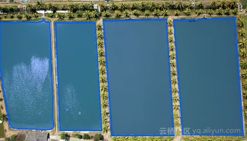

​       语义分割问题也可以被认为是分类问题，其中每个像素被分类为来自一系列对象类中的某一个。因此一个使用案例是利用土地的卫星影像制图。土地覆盖信息是重要的各种应用，如监测地区的[森林砍伐](https://www.zhihu.com/search?q=森林砍伐&search_source=Entity&hybrid_search_source=Entity&hybrid_search_extra={"sourceType"%3A"article"%2C"sourceId"%3A"46200875"})和城市化等。

​       为了识别卫星图像上每个像素的土地覆盖类型（例如，城市、农业、水等区域），土地覆盖分类可以被视为多级语义分割任务。道路和建筑物检测也是交通管理，城市规划和道路监测的重要研究课题。

​       目前，几乎没有大规模公开可用的数据集（例如：SpaceNet），数据标记始终是分割任务的瓶颈。

- **2.用于自动驾驶**

​       自动驾驶是一项复杂的机器人任务，需要在不断变化的环境中进行感知、规划和执行。由于其安全性至关重要，因此还需要以最高精度执行此任务。语义分割提供有关道路上自由空间的信息，以及[检测车](https://www.zhihu.com/search?q=检测车&search_source=Entity&hybrid_search_source=Entity&hybrid_search_extra={"sourceType"%3A"article"%2C"sourceId"%3A"46200875"})道标记和[交通标志](https://www.zhihu.com/search?q=交通标志&search_source=Entity&hybrid_search_source=Entity&hybrid_search_extra={"sourceType"%3A"article"%2C"sourceId"%3A"46200875"})等信息。

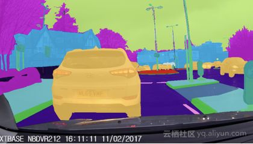

- **3.用于面部分割**

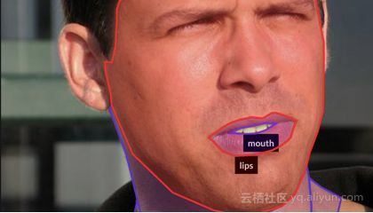

​       面部的语义分割通常涉及诸如皮肤、头发、眼睛、鼻子、嘴巴和背景等的分类。面部分割在计算机视觉的许多面部应用中是有用的，例如性别、表情、年龄和种族的估计。影响人脸分割数据集和模型开发的显著因素是光照条件、面部表情、面部朝向、遮挡和图像分辨率的变化等。

- **4.时尚——分类服装**

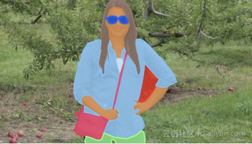

​       由于服装数量众多，服装解析与其他服务相比是一项非常复杂的任务。这与一般的物体或场景分割问题不同，因为细粒度的衣物分类需要基于衣服的语义、人体姿势的可变性和潜在的大量类别的更高级别判断。服装解析在视觉领域中得到了积极的研究，因为它在现实世界的应用程序即电子商务中具有巨大的价值。Fashionista和CFPD数据集等一些公开的数据集促进了服装领域的语义分割研究。

- **5.[精准农业](https://www.zhihu.com/search?q=精准农业&search_source=Entity&hybrid_search_source=Entity&hybrid_search_extra={"sourceType"%3A"article"%2C"sourceId"%3A"46200875"})**

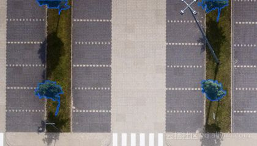

​       [精确农业](https://www.zhihu.com/search?q=精确农业&search_source=Entity&hybrid_search_source=Entity&hybrid_search_extra={"sourceType"%3A"article"%2C"sourceId"%3A"46200875"})机器人可以减少需要在田间喷洒的除草剂的数量，作物和杂草的语义分割可以帮助他们实时触发除草行为，这种先进的农业图像视觉技术可以减少对农业的人工监测，提高农业效率和降低生产成本。

### 语义分割流程和常用数据集

语义分割有着三个流程，即训练、验证和测试。具体过程如下图所示：

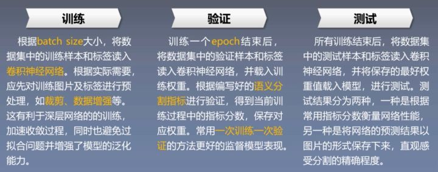

​	总结就是，通过训练，先进行图片的预处理，然后放入网络进行训练。然后利用训练结果，测试网络在验证集的表现，通过语义分割的指标来观察分割效果，进而保存对应权重w值。其实这一步也可以更加训练反馈，进行图像标注修正（当使用自己标注的[原始数据](https://www.zhihu.com/search?q=原始数据&search_source=Entity&hybrid_search_source=Entity&hybrid_search_extra={"sourceType"%3A"article"%2C"sourceId"%3A"361243823"})集时）。最后，取出效果最好的权重进行测试。在其他图像任务或者其他深度学习任务也可以利用这三步进行操作。

​	语义分割有一些常用的数据集，这些数据集在各种论文中常作为算法优劣性的一个验证（其中SUNRGBD是四维的，它还有利用深度学习相机得到了一个Deep维度，Depth类似于[灰度图像](https://www.zhihu.com/search?q=灰度图像&search_source=Entity&hybrid_search_source=Entity&hybrid_search_extra={"sourceType"%3A"article"%2C"sourceId"%3A"361243823"})，只是它的每个像素值是传感器距离物体的实际距离）：

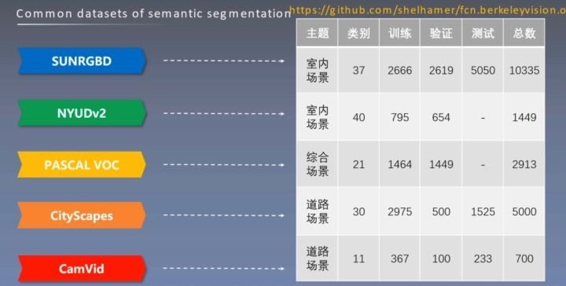

### 语义分割的常用指标

- **像素准确率（PA）：**正确分类的像素数量与所有像素数量的比值。

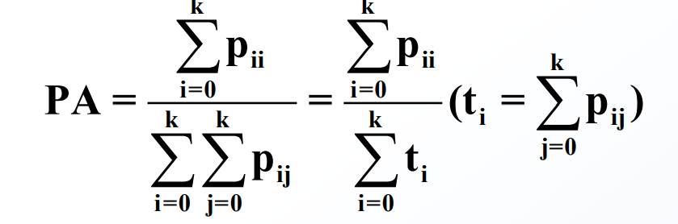

*PA计算公式*

- **像素准确率平均值（MPA）：**PA的变体，每个类内正确分类的像素数量和该类的所有像素点数 （Ground truth）的比值，之后求所有类的平均。

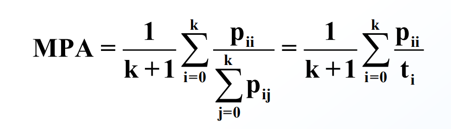

*MPA计算公式*

- **[平均交并比](https://www.zhihu.com/search?q=平均交并比&search_source=Entity&hybrid_search_source=Entity&hybrid_search_extra={"sourceType"%3A"article"%2C"sourceId"%3A"361243823"})（MIoU）：**检验语义分割效果最重要的指标。计算两个集合的交并比，两个集合分别是真实值（Ground truth）和预测值（predicted segmentation），是一个交集与[并集](https://www.zhihu.com/search?q=并集&search_source=Entity&hybrid_search_source=Entity&hybrid_search_extra={"sourceType"%3A"article"%2C"sourceId"%3A"361243823"})的比值。平均交并比为对各类的交并比进行平均。

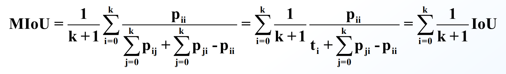

*MIOU计算公式*

## CNN面临的问题

### CNN的局限性

[基于CNN的结构大多都遵循编码器-解码器的框架](https://link.zhihu.com/?target=https%3A//www.cv-foundation.org/openaccess/content_cvpr_2015/papers/Long_Fully_Convolutional_Networks_2015_CVPR_paper.pdf)。编码器中CNN用于[特征提取](https://www.zhihu.com/search?q=特征提取&search_source=Entity&hybrid_search_source=Entity&hybrid_search_extra={"sourceType"%3A"article"%2C"sourceId"%3A"538050231"})，它在逐渐降低特征图分辨率的同时使得特征图富含[语义信息](https://www.zhihu.com/search?q=语义信息&search_source=Entity&hybrid_search_source=Entity&hybrid_search_extra={"sourceType"%3A"article"%2C"sourceId"%3A"538050231"})。随后解码器中的CNN利用编码器编码特征作为输入，解码出最后的分割预测结果。

当然，这种最为基础的框架，存在很多的问题。比如语义分割任务除了语义信息还需要细节信息，因此UNet等论文给出了解决方案。比如语义分割任务需要上下文信息，因此PSPNet、Deeplab系列、基于自注意力机制的一系列方法（Non-Local、DANet、CCNet等）等被提出来获取局部、多尺度乃至全局上下文。又比如语义分割框架对于物体边缘处的分割效果不理想，因此Gated-SCNN等一些方法也在着力解决这些问题。这些问题在以上这些方法的支撑下得到了极大的缓解。

然而，除了上述的点之外，CNN的方法本质上存在着一个巨大的桎梏，就是图像初始阶段输入到网络之时，由于CNN的卷积核不会太大，所以模型只能利用局部信息理解输入图像，这难免有些一叶障目，从而影响编码器最后提取的特征的可区分性。这是只要使用CNN就逃脱不了的缺陷。当然，有人会说基于[自注意力机制](https://www.zhihu.com/search?q=自注意力机制&search_source=Entity&hybrid_search_source=Entity&hybrid_search_extra={"sourceType"%3A"article"%2C"sourceId"%3A"538050231"})的一些即插即用的模块插入到编码器和解码器之间，就能获取到全局上下文，使得模型从全局的角度理解图像进而改善特征。但是，模型如果一开始因为一叶障目获取了错误的特征，在后续利用全局上下文是否能够纠正的过来是存在一个很大的疑问的。

### 标注数据的局限性

我们知道，语义分割任务是像素级别的分类。因此，一张512 * 512的图像在进行分割任务标注时，所需的标注次数理论上是图像分类任务的512 * 512倍。正因为如此，分割的输入获取是需要很大的资源投入的，简言之就是要烧很多的钱的。

### 模型的泛化能力

这不仅是分割任务上存在的问题，只要基于深度学习的任务就难免面临这么样一个窘境。我辛辛苦苦训练好了一个模型，在换了一个场景的图像输入到模型之后，模型的性能往往出现一个很大的下降。这个问题在实际中太常见了。以遥感图像语义分割为例，我在上海采集的城市数据集上训练好模型，在对来自成都的影像进行分割时，往往效果与随机预测的无异。这太尴尬了，要按传统方式解决这一问题的话，各个地区的测绘局都得采集一遍数据，然后标注好，才能无缝对国内所有城市的进行语义分割。这工作量，想想就很难。

## 近年来的探索

### Transformer

CNN的模型不能在一开始就从全局理解输入图像的问题。对于这一点，所给出的答案最好的当然还是基于Transformer的方案，它将输入的图像Token化，然后利用自注意力机制就能在模型的一开始使得模型能够以全局的角度去理解图片。这里顺着发展脉络，给出语义分割任务上使用Transformer必须要了解的几篇文章：

1）用Transformer就不能不看VIT，他是将Transformer用于视觉任务的开山之作，主要思想可以看如下解读：

[ICLR2021-谷歌大脑团队Vision Transformer：AN IMAGE IS WORTH 16X16 WORDS](https://link.zhihu.com/?target=https%3A//mp.weixin.qq.com/s%3F__biz%3DMjM5MjgwNzcxOA%3D%3D%26mid%3D2247485876%26idx%3D1%26sn%3Dcf979abfc021c76f1d6979db68c072c7%26chksm%3Da6a1e7fd91d66eebd50491adfbfa34c2c4b548a6220a3f5e515af98a9aa29b1f9e5830b623e9%23rd)

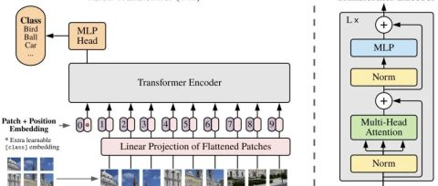

2）在VIT的基础上尝试使用Transformer解决分割任务的几个方法值得一看，有针对Transformer解码器改进的、有针对Transformer编码器改进的，也有结合CNN与Transformer的。这些方法本质上仍然还是属于编码器解码器的基础框架，但是已经打破了CNN的桎梏：

* [SETR与TransUNet — 使用Transformer时解码器的设计](https://link.zhihu.com/?target=https%3A//mp.weixin.qq.com/s%3F__biz%3DMjM5MjgwNzcxOA%3D%3D%26mid%3D2247485884%26idx%3D1%26sn%3D8b87e265d04f8c2ac829c21dfb16dda8%26chksm%3Da6a1e7f591d66ee3ac5d22cc945ff86ca81b033203ffeb7c6c20c4268eaebf1e0586d1103729%26token%3D1826759119%26lang%3Dzh_CN%23rd)
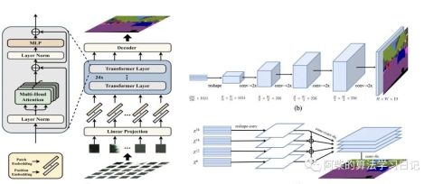

* [SegFormer — 简单有效的语义分割新思路](https://link.zhihu.com/?target=https%3A//mp.weixin.qq.com/s%3F__biz%3DMjM5MjgwNzcxOA%3D%3D%26mid%3D2247485895%26idx%3D1%26sn%3Dcd619bd847a6ff8ff8e6b8086ead9fb2%26chksm%3Da6a1e78e91d66e98e45300a7a612aea9bc1b0df2ad5951b9856a9ba7074b2c5b4d6223410df5%23rd)
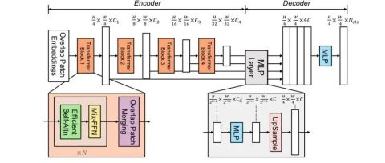

* [PVT — 用于密集预测任务的金字塔 Vision Transformer](https://link.zhihu.com/?target=https%3A//mp.weixin.qq.com/s%3F__biz%3DMjM5MjgwNzcxOA%3D%3D%26mid%3D2247485934%26idx%3D1%26sn%3D77f12e4c2cbdeefbee1311898a9d06ae%26chksm%3Da6a1e7a791d66eb109e2a2202c6c2496d706a4990ea9520b7f0bc555d6d5476a5324206ea5d3%23rd)
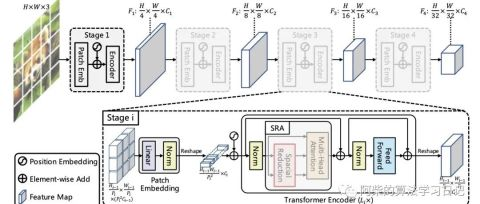

3）经典之作Swin Transformer系列不可不看，就像基于编码器-解码器结构要为任务选择一个合适的编码器backnbone一样，基于Transformer结构的编码器也是需要精益求精的，而Swin Transformer显然是一个比较优秀的选项：

[Swin v1arxiv.org/abs/2103.14030v1?ref=hackernoon.com](https://link.zhihu.com/?target=https%3A//arxiv.org/abs/2103.14030v1%3Fref%3Dhackernoon.com)

Swin v1中利用[滑动窗口](https://www.zhihu.com/search?q=滑动窗口&search_source=Entity&hybrid_search_source=Entity&hybrid_search_extra={"sourceType"%3A"article"%2C"sourceId"%3A"538050231"})和分层结构的设计使得Swin Transformer成为了CV领域新的SOTA Backbone，在图像分类、目标检测、语义分割等多种机器视觉任务中达到了SOTA水平。

[Swin v2arxiv.org/abs/2111.09883](https://link.zhihu.com/?target=https%3A//arxiv.org/abs/2111.09883)

Swin v2中提出了post-norm and cosine similarity、Continuous relative position bias 和 Log-spaced coordinates来分别解决模型不够大和不能适配不同分辨率的图片和不同尺寸的窗口的问题。

当然，最近也有新的[backbone](https://www.zhihu.com/search?q=backbone&search_source=Entity&hybrid_search_source=Entity&hybrid_search_extra={"sourceType"%3A"article"%2C"sourceId"%3A"538050231"})在论文中report的精度超过了SWIN，感兴趣也可多看看，比如：

[CVPR2022 Oral - Shunted Transformer：全新多尺度视觉 Transformer 主干网络](https://link.zhihu.com/?target=https%3A//mp.weixin.qq.com/s%3F__biz%3DMjM5MjgwNzcxOA%3D%3D%26mid%3D2247486261%26idx%3D1%26sn%3D27528c03d91dcfe2c665bc585dd6edb7%26chksm%3Da6a1e57c91d66c6a22755f6452abcef7171ce0bed536c8a06ceafc2af8b46e9fde8fa03b5327%26token%3D1826759119%26lang%3Dzh_CN%23rd)
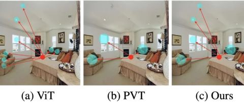

4）最近新出的一些用于分割的Transformer也值得一看，他们的思想源于NLP预训练中会使用CLS这个Token去表征语义，在这些方法中也用到了[随机初始化](https://www.zhihu.com/search?q=随机初始化&search_source=Entity&hybrid_search_source=Entity&hybrid_search_extra={"sourceType"%3A"article"%2C"sourceId"%3A"538050231"})去构建的Token，在学习过程中逐渐富有了想表征的语义：

[Segmenterarxiv.org/abs/2105.05633](https://link.zhihu.com/?target=https%3A//arxiv.org/abs/2105.05633)

Segmenter 在解码阶段使用一系列与语义类别对应的可学习token，与图像自身解码的特征进行交互，从而实现最终分割预测。

还有一系列语Segmeter相同思想的文章，他们都用到了可学习token去表征他们想要表征的语义。

[MaskFormerarxiv.org/abs/2107.06278](https://link.zhihu.com/?target=https%3A//arxiv.org/abs/2107.06278)

[语义分割新范式：上海 AI Lab 联合北邮、商汤提出 StructToken](https://link.zhihu.com/?target=https%3A//mp.weixin.qq.com/s%3F__biz%3DMjM5MjgwNzcxOA%3D%3D%26mid%3D2247486417%26idx%3D1%26sn%3Dc54ad74eb790d1382342e4e42a2d4c98%26chksm%3Da6a1e59891d66c8e438924e367c957ac0656cb0b8d73a77081dfd4b8af73204d7c15992636d7%26token%3D1826759119%26lang%3Dzh_CN%23rd)
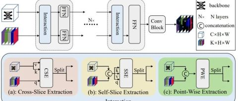

然而，诚然打破CNN桎梏的Transformer是的模型可以在一开始就从全局的角度去理解图像。但是这样是否获取到了真正的全局信息呢？答案是多数情况下是不行的。为什么？我们知道真实的图片往往是分辨率比较大的，直接输入到模型中，显卡是扛不动的，因此一张图像我们需要裁剪成多个小图才能使得送到模型中。这一裁剪，先天就使得模型只能看到完整大图中的一部分内容。因此，此时的全局角度并不是完整的全局，而只是裁剪后对于小图的全局。显然这是会影响模型的性能的。那么怎么解决呢？可以看看以下文章的解决方案：

[CVPR2021-MagNet与ICCV2021-FCtl：如何提高超高分辨率图像的语义分割准确性](https://link.zhihu.com/?target=https%3A//mp.weixin.qq.com/s%3F__biz%3DMjM5MjgwNzcxOA%3D%3D%26mid%3D2247485950%26idx%3D1%26sn%3De69cf0219ad8386a5d6e6e33b049ebe9%26chksm%3Da6a1e7b791d66ea1cfb04e8d4208aab96b13d5d2069e374094c697d1c3fd40bfbb40fe558bb3%23rd)
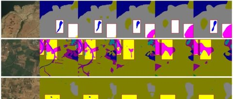

### 弱监督、无监督

对于标注数据不好获取，显然结合弱监督、无监督的思想来做语义分割是比较好的解决方案。我对[无监督语义分割](https://www.zhihu.com/search?q=无监督语义分割&search_source=Entity&hybrid_search_source=Entity&hybrid_search_extra={"sourceType"%3A"article"%2C"sourceId"%3A"538050231"})了解的甚少，因为我认为暂时CV领域还做不到像NLP领域那样巧妙设计无监督任务的程度，因此无监督语义分割暂时应该是达不到一个能看的精度。所以这里主要介绍弱监督语义分割。

首先可以先了解一下弱监督分割的简要概念与做法：

[弱监督语义分割综述](https://link.zhihu.com/?target=https%3A//mp.weixin.qq.com/s%3F__biz%3DMjM5MjgwNzcxOA%3D%3D%26mid%3D2247483709%26idx%3D1%26sn%3Db7ff5fd12945d0626370abec6821bb3c%26chksm%3Da6a1ef7491d66662c6b0f7e1783e77924f4c85941f7f1452d43649c6bd63ad0fe7b766227b4b%26token%3D1826759119%26lang%3Dzh_CN%23rd)

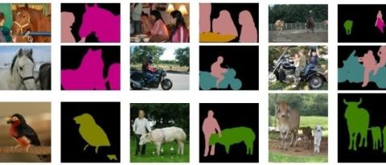

[处理pascal voc2012及其增强数据集以用于弱监督语义分割](https://link.zhihu.com/?target=https%3A//mp.weixin.qq.com/s%3F__biz%3DMjM5MjgwNzcxOA%3D%3D%26mid%3D2247483723%26idx%3D1%26sn%3De710b109b1299544a758b5123461492b%26chksm%3Da6a1ef0291d666141f02bce662ae7ff994583eb677b9a3c0e0a7a724644229cb0ccd72bf8e83%23rd)

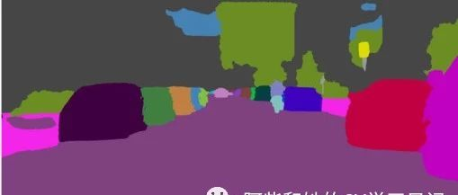

[弱监督语义分割截止2020年论文汇总、简要解读](https://link.zhihu.com/?target=https%3A//mp.weixin.qq.com/s%3F__biz%3DMjM5MjgwNzcxOA%3D%3D%26mid%3D2247483841%26idx%3D1%26sn%3Db7afd4101aa4939e40d1f358a809693c%26chksm%3Da6a1ef8891d6669e1e0dac3c626ade72bb2851a3f6694d587cd51a1873c25ed4c1c89c4f8a21%23rd)

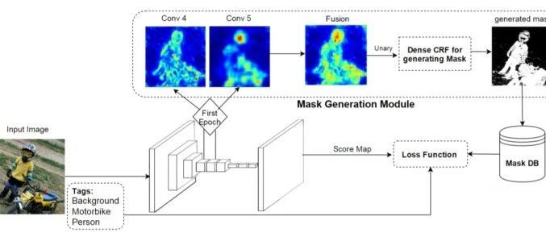

总的来说，弱监督语义分割就是使用比像素级标签更容易获取的标签，比如图像分类标签来训练分割模型。目前而言，使用图像分类标签训练的分割模型已经开始可以逐渐全监督语义分割的精度，比如：

[文章1](https://link.zhihu.com/?target=https%3A//mp.weixin.qq.com/s%3F__biz%3DMjM5MjgwNzcxOA%3D%3D%26mid%3D2247486185%26idx%3D1%26sn%3D1af2452dc2600cde9cf782d9534c7856%26chksm%3Da6a1e4a091d66db62bc0d1bb0fdb58b927bad5059c6b6dff7cd96858e0ee18f9393873a82796%23rd)，[文章2](https://link.zhihu.com/?target=https%3A//mp.weixin.qq.com/s%3F__biz%3DMjM5MjgwNzcxOA%3D%3D%26mid%3D2247486200%26idx%3D1%26sn%3Dc26214e8317ba6ab007b6d953a99c3b8%26chksm%3Da6a1e4b191d66da7c8d6170453b58d25486ee36eddd744b7e81b8c04aa3a18636df0f7780c62%23rd)它们能够在PASCAL VOC2012的数据集上达到72以上的miou，可以说十分惊艳。当然出了图像分类的标签，还可以使用其他的容易获取的标签，他们的精度能够达到更高，不过相应的能够标签获取难度会上升一点，比如：

[CVPR2022-Tree Energy Loss：能够扩展弱监督语义分割中稀疏真值标签的新方法](https://link.zhihu.com/?target=https%3A//mp.weixin.qq.com/s%3F__biz%3DMjM5MjgwNzcxOA%3D%3D%26mid%3D2247486245%26idx%3D1%26sn%3D85b4abcd1121431447d10ec65a09c769%26chksm%3Da6a1e56c91d66c7a458a0ba90f758b1f7a14888bda8028c74f3ed4e5734ece9a640139f68d4b%23rd)

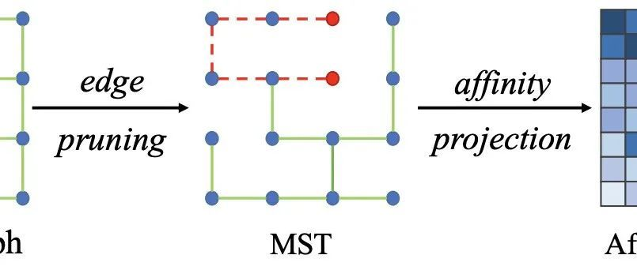

### 数据增强、正则化

增强模型的泛化能力其实有很多基础的方法，比如等等。但是它们起到的效果是有限的。这里我们分为两种情况来讨论如何增加模型的泛化能力：

#### 测试集数据不可获取：

那此事就只能从模型本身出发，迫使模型能够学习到更为鲁棒的特征，具体这一篇文章值得一看：

[CVPR2022 Oral-即插即用！感知语义的域泛化语义分割模型 (SAN & SAW)](https://link.zhihu.com/?target=https%3A//mp.weixin.qq.com/s%3F__biz%3DMjM5MjgwNzcxOA%3D%3D%26mid%3D2247486291%26idx%3D1%26sn%3D3305feb2f88c58f3406473b321476c71%26chksm%3Da6a1e51a91d66c0cf75ae5717b42032598135446905c658e3170d7ee5f8baf3f6a5292d146a1%23rd)

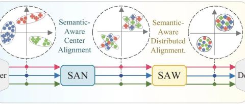

#### 测试集数据可获取（没有标签）：

这显然就是无监督域适应的范围了。无监督域适应语义分割主要分为三个研究方向：

1. 基于对抗学习：这一类的方法出发点在于目标域与源域在同一Encoder后编码的特征能够尽量相似。主要在FCAN与ADVENT的基础上寻求突破与创新。以下链接深入的讲了基于对抗学习的无监督域自适应语义分割的原理：[文章](https://link.zhihu.com/?target=https%3A//mp.weixin.qq.com/s%3F__biz%3DMjM5MjgwNzcxOA%3D%3D%26mid%3D2247484999%26idx%3D1%26sn%3Dca1d84fcf15934c92fae9bd551f8a674%26chksm%3Da6a1e80e91d6611848ea2d92ea20c6afc315d5a3c198458cc5e21769159b20f348733dbfe3d7%23rd)
2. [风格迁移](https://www.zhihu.com/search?q=风格迁移&search_source=Entity&hybrid_search_source=Entity&hybrid_search_extra={"sourceType"%3A"article"%2C"sourceId"%3A"538050231"})：这一类的方法出发点在于转换源域图片的风格使得其与目标域相似。代表方法有CycleGAN。
3. 自监督学习：在目标域上形成伪标签来训练模型。

这些方向上方向上值得一看的论文有：

[ICCV2021-语义分割无监督域适应：Dual Path Learning（DPL）](https://link.zhihu.com/?target=https%3A//mp.weixin.qq.com/s%3F__biz%3DMjM5MjgwNzcxOA%3D%3D%26mid%3D2247485817%26idx%3D1%26sn%3Da48c843985aaf559b94c6847e699ca02%26chksm%3Da6a1e73091d66e261587ff197091c33d6033f1e6daeb4354b55af27915c970993eff424d683e%23rd)

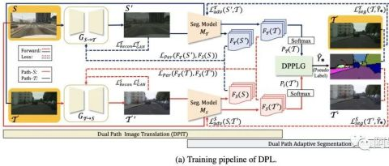

[CVPR2021语义分割无监督域适应：Self-supervised Augmentation Consistency（SAC）](https://link.zhihu.com/?target=https%3A//mp.weixin.qq.com/s%3F__biz%3DMjM5MjgwNzcxOA%3D%3D%26mid%3D2247485797%26idx%3D1%26sn%3D6cf1e62f90c447c58755b2dba910becc%26chksm%3Da6a1e72c91d66e3a4cd7d4eef2050426341e7271c3b58e0095d138fc89d42ce6d66f9a53ab03%23rd)

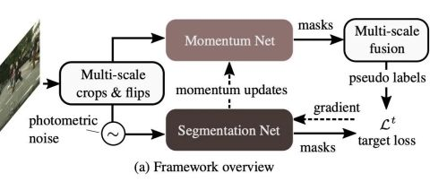

[使用GAN的思想进行遥感图像语义分割的域适应](https://link.zhihu.com/?target=https%3A//mp.weixin.qq.com/s%3F__biz%3DMjM5MjgwNzcxOA%3D%3D%26mid%3D2247485848%26idx%3D1%26sn%3D23368592be45ff702bab6102bca0cfee%26chksm%3Da6a1e7d191d66ec75a138a854c8387599938cef6a8f350083d56947cfab46f8a579f3f9d95e1%23rd)

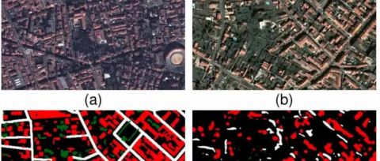

## 语义信息

语义一般指的是图像每个像素点的类别归属，语义信息可以理解为与类别划分有关的信息。对于一个深度神经网络模型来讲，网络的前端学习的是高维特征的知识，即如何进行分类的知识，在后端根据学到的知识产生预测信息。所以语义信息是网络前端通过非线性变换，对图像内容中纹理，几何，颜色等信息的表达，这种表达会使网络后端对类别归属做出正确的预测。

语义信息也可分为高级语义信息和低级语义信息：

* 低级语义信息也叫视觉层，是对浅层特征的表达（如颜色，几何，纹理等特征）；其主要产生在网络的前几层。
* 高级语义信息是高层特征的表达，其对分类产生重要的影响；其主要产生在网络的靠后层。

图像的语义信息又可以分为视觉层、对象层和概念层：

* 视觉层轮廓、边缘、颜色、纹理和形状特征。 边缘和轮廓能反映图像内容；如果能对边缘和关键点进行可靠提取的话，很多视觉问题就基本上得到了解决。图像的低层的特征语义信息比较少，但是目标位置准确；这些特征都被称为低层语义信息；
* 对象层即中间层，通常包含了属性特征等，就是某一对象在某一时刻的状态；
* 概念层是高层，是图像表达出的最接近人类理解的东西。比如对一张人脸提取低层特征我们可以提取到连的轮廓、鼻子、眼睛之类的，那么高层的特征就显示为一张人脸。高层的特征语义信息比较丰富，但是目标位置比较粗略。 愈深层特征包含的高层[语义性](https://www.zhihu.com/search?q=语义性&search_source=Entity&hybrid_search_source=Entity&hybrid_search_extra={"sourceType"%3A"article"%2C"sourceId"%3A"456060833"})愈强、分辨能力也愈强。我们把图像的视觉特征称为视觉空间 (visual space)，把种类的语义信息称为语义空间 (semantic space)。通俗点说，比如一张图上有沙子，蓝天，海水等，视觉层是一块块的区分，对象层是沙子、蓝天和海水这些，概念层就是海滩，这是这张图表现出的语义。  

### 为什么深层地特征图具备更加丰富的语义信息呢？

我们可以搭建一个识别猫猫的模型，通过一个简单的多层卷积就可以轻松实现，假设我们的神经网络已经训练好了。我们现在来识别这只可爱的英短：

**我们是如何通过神经网络来判别这是一只猫的？**

训练好的神经网络会在复杂运算后得到关于一张图片的响应值（可以是实数，也可以是实向量），我们会根据这个响应值按照预先设置的先验规则来得到最终的判别值。比如我们的规则是这个值大于0.5就判别为猫，小于0.5就判别为非猫。我们的网络得到0.8，所以判别为猫。

**响应值是如何计算出的？**

那么关键就在于最后的神经网络的响应值是如何得到的？请允许锦恢进行一段潦草的说明。

由于[卷积神经网络](https://www.zhihu.com/search?q=卷积神经网络&search_source=Entity&hybrid_search_source=Entity&hybrid_search_extra={"sourceType"%3A"answer"%2C"sourceId"%3A"2377983951"})每一个卷积核在单层中只能计算相邻区域的像素点的响应，所以，在第一层中，我们的网络只能计算出每一个小的像素区域的响应值，比如，第一层的某个卷积核就只能计算下图中蓝框框出来的区域中的所有像素的响应值：

这片单个卷积核在原图上能够计算的响应区域被我们称为该卷积的**[感受野](https://www.zhihu.com/search?q=感受野&search_source=Entity&hybrid_search_source=Entity&hybrid_search_extra={"sourceType"%3A"answer"%2C"sourceId"%3A"2377983951"})**。很明显，第一层的卷积核的感受野很小，这么小的感受野对应的像素点是什么？石灰？沙发？如此小的感受野区域是极难得到关于这个像素是什么这样的信息的，讲得认真点，**小感受野对应区域的[特征空间](https://www.zhihu.com/search?q=特征空间&search_source=Entity&hybrid_search_source=Entity&hybrid_search_extra={"sourceType"%3A"answer"%2C"sourceId"%3A"2377983951"})太小啦，小到无法与标签空间构成满射**。事实上，这就是我们所说的图像的[语义信息](https://www.zhihu.com/search?q=语义信息&search_source=Entity&hybrid_search_source=Entity&hybrid_search_extra={"sourceType"%3A"answer"%2C"sourceId"%3A"2377983951"})，因此小的像素区域是难以得到关于图像的高阶语义信息的，因为感受野太小了。

我们继续，进入卷积层的第二层：

第二层基于第一层卷积进行卷积，很明显，它对应的感受野会比第一层卷积核的感受野大，能够计算原图更大区域对应区域的响应值，比如下图中橙色区域对应的区域。

事实上，第一层的卷积核在提取区域的同时，还会对所提取区域的色彩，纹理模式等信息进行计算，这种计算可以看成一种临时的隐性编码。因此，到第二层卷积层时，卷积核得到的不仅是一组像素点在更大的原图区域上的响应，还有颜色，纹理等编码信息，用于分类猫猫的特征空间变大了。在这一层中，网络可能得到了原图的轮廓信息，梯度信息等等。

待神经网络运行到了最后一层时，卷积核的感受野已经能够几乎覆盖原图所有区域，而且每层传递的隐性的编码信息已经将原本的特征空间张得很大了，此时便可以很方便得使用[线性分类器](https://www.zhihu.com/search?q=线性分类器&search_source=Entity&hybrid_search_source=Entity&hybrid_search_extra={"sourceType"%3A"answer"%2C"sourceId"%3A"2377983951"})来区分了。
$$
f(x)=\begin{cases}猫 &x>0.5\\非猫&x\le 0.5\end{cases}
$$

因此，不科学地讲，为什么深层地特征图具备更加丰富的语义信息呢？我认为主要有两点：

- [深层网络](https://www.zhihu.com/search?q=深层网络&search_source=Entity&hybrid_search_source=Entity&hybrid_search_extra={"sourceType"%3A"answer"%2C"sourceId"%3A"2377983951"})的感受野更大，大感受野下才存在一定的高阶语义。
- 深层网络所积累的特征空间更大。

## 参考资料

[*语义分割*综述：截止2022，*语义分割*总结与展望](https://zhuanlan.zhihu.com/p/538050231)

[*语义分割*-概念、问题和指标](https://zhuanlan.zhihu.com/p/361243823)

[*语义分割*概念及应用介绍](https://zhuanlan.zhihu.com/p/46200875)

[对图像中*语义信息*、高层和底层特征的理解](https://zhuanlan.zhihu.com/p/456060833)

[为什么越深层的特征图具备更丰富的*语义信息*?](https://www.zhihu.com/question/520213676/answer/2377983951)
