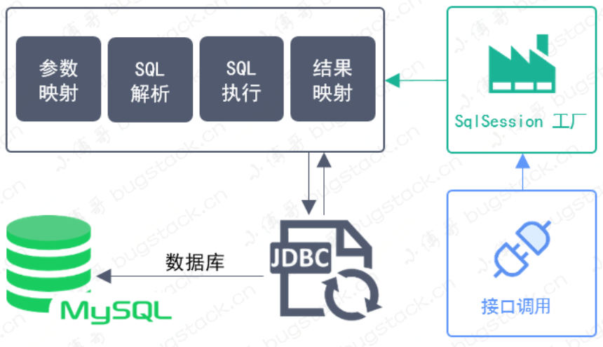
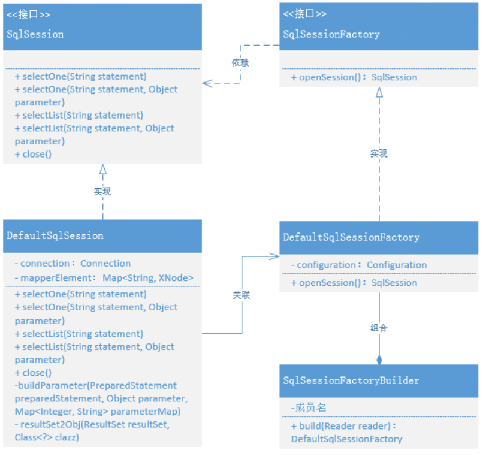

# ORM 框架

## 概念

对象关系映射(Object Relational Mapping, ORM)是一种程序设计技术，用于实现面向对象编程语言里不同类型系统的数据之间的转换，让我们更方便的使用数据库。它属于数据访问中间件。

Java中JDBC、Mybatis、Hibernate就是ORM组件的具体实现。接下来我们介绍如何用Java实现一个ORM组件。

## 方案设计

### XML 方式实现数据库配置

应用程序访问数据库的过程，我们可以抽象成参数映射、SQL解析、SQL执行，结果映射、对数据库的操作这几个过程。我们用图来表示整个访问流程。



由此设计出UML类图：



```java
// TODO
```

* 数据处理流程：加载配置文件、对配置文件(XML)解析、获取数据库会话(Session)、操作数据库并返回结果、关闭数据库。
* 数据处理操作：获取一条数据(selectOne)、获取多条数据(selectList)

### 与Spring整合

我们做Java开发并不是仅仅使用Java语言本身，还会用到许多第三方框架，其中Spring框架就是最常用的Java框架，我们将ORM框架与Spring整合，使其参与到Spring的事务管理中，创建映射器mapper和SqlSession并注入到Spring容器中，做到应用程序与框架分离，减少程序耦合。

### 与SpringBoot整合实现自动配置

