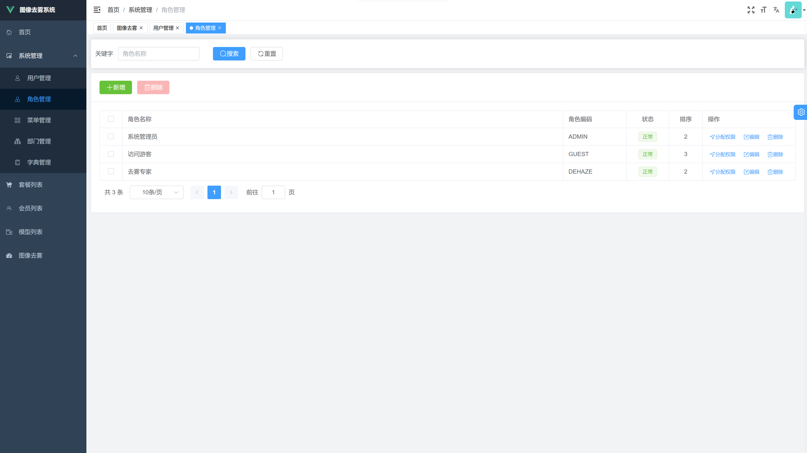

# 用户手册
## 登录到系统
用户可以通过用户名和密码登陆进本系统

## 系统首页
使用管理员账号登录后，系统默认会显示首页数据分析模块，展示了当前系统的总访问次数、去雾模型个数、系统累计进行图像去雾的张树、累计评估去雾效果的数量。以及可视化图标界面。

## 去雾模块
去雾模块是本系统的核心，任何已登录用户都可以进入去雾页面使用本系统进行去雾。但是不同的用户具有不同的去雾权益，详见-VIP及支付模块。

用户在该界面选择合适的去雾模型，然后点击左侧 + 号方框上传有雾图像，等到上传完成后，点击右上角蓝色“开始去雾”按钮去雾。去雾后的结果将展示在右侧的方框中，用户可以右键保存去雾后的图片。

如果用户希望评估去雾效果，并且具有有雾图像对应的无雾基准图像，则可以点击“评估效果”按钮，打开新的对话框。在该对话框中上传基准无雾图像，然后点击开始评估。系统会计算出当前模型去雾后的图像和基准无雾图像之间的峰值信噪比（Peak Signal to Noise Ratio，PSNR）和结构相似度（Structural SIMilarity，SSIM）。并且做出评价。

用户在每次操作之后，都会在系统中留下历史记录，用户如果需要查看和获取之前的去雾结果，则可以点击“历史记录”按钮获取之前的操作记录。对于不同VIP级别的用户，系统保留的记录数量不定。

## VIP及支付模块
普通已登录用户使用本系统具有一定的限制，如下表所展示。但是用户可以通过付费购买VIP来解锁更多的权益。

用户可以通过主动购买VIP来获得对应的权益，如果当前用户去雾次数/评估次数已达上限，则会自动跳转到VIP购买页面。如果用户选择购买，则会跳转到支付界面进行支付，支付完成后，则可以继续使用本系统。

| 项目       | 普通用户  | VIP1   | VIP2   | SVIP    | 
|----------|-------|--------|--------|---------|
| 去雾次数     | 每月20次 | 每月100次 | 每月500次 | 每月3000次 |
| 评估次数     | 每月20次 | 每月100次 | 每月500次 | 每月3000次 |
| 历史记录保留条数 | 10条   | 50条    | 100条   | 500条    |
| 包月价格     | 免费    | 10元/月  | 20元/月  | 50元/月   |

更多VIP权益敬请期待

## 会员管理模块
系统管理员对于付费用户，系统专门开发了对应的管理模块，用来对会员用户进行管理。该模块可以展示会员的ID、名称、会员等级、剩余去雾次数、剩余评估次数、会员开通时间、会员到期时间等。方便对VIP用户针对性的管理。

## 模型管理模块
系统管理员可以通过模型管理来对系统存在的所有去雾模型进行浏览。去雾模型展示的信息有去雾模型的ID（唯一标识一个去雾模型）、模型名称（模型所属的神经网络名称）、针对方向（针对去除哪种类型的雾霾）、模型的参数量、模型大小、模型描述、添加时间、是否启用等信息。

## 套餐管理模块
针对不同的VIP套餐，系统设置了套餐管理模块。用来调整不同VIP的权益。系统最初数据库中是没有任何VIP套餐的，系统管理员可以通过手动添加套餐来实现VIP以及支付模块表格中对应的VIP权益。

添加套餐，管理员可以通过输入套餐名（如VIP1）、套餐包含的去雾次数、评估次数、历史记录保留条数、包月价格来完成套餐的添加。同时管理员还可以删除套餐、启用停用套餐、查看套餐当前使用人数等。

## 订单管理模块
管理员功能。当用户购买对应的VIP套餐后，系统就会生成一个订单，显示了用户的购买情况。具体的内容有用户ID、用户昵称、购买套餐种类、订单状态、支付类型、订单创建时间、支付时间、购买时长等。

## 用户管理模块
系统管理员可以对当前系统中存在的用户进行管理，如启用/禁用某用户，删除某用户、重置用户密码、编辑用户信息等。

点击绿色按钮可以打开新增用户窗口

## 角色管理模块
系统管理员可以对当前系统存在的角色进行管理，不同的角色具有不同的权限。管理员可以使用角色管理来清晰划分每一位用户以及其他管理员应当具有的权限。避免越权操作。

针对某一具体角色，可以点击分配权限对该角色分配相应的权限，注意到角色编码为ROOT的超级管理员具有系统的任何权限。而其他角色则需要手动分配才能获取相应的权限。具有分配权限的用户则可以分配任意权限给任意用户，需要谨慎赋权。

具有新增角色的管理员可以通过按钮新增角色，新增加的角色可以通过用户管理分配给某一具体用户，使某个用户具有该角色的所有权限。每个用户可以具有多个角色。用户的权限为多个角色权限之和。

## 菜单管理模块
系统管理员可以对当前系统界面中的左侧菜单栏进行管理。前端的页面在写好之后，并不会自动添加进左侧的菜单栏中，而是需要通过新增菜单按钮来手动新增。菜单类型一共分为四种。目录、菜单、按钮、外链。

目录和菜单的关系类似于文件夹和文件的关系。目录将多个菜单聚合起来方便管理。菜单则指定了页面的路由地址、页面文件地址、控制左侧对应菜单栏的显示和隐藏等。按钮则是某个具体的菜单页面内部的某些按钮。可以通过添加按钮并赋予按钮权限来控制该按钮。实现不同用户、不同角色权限精细到按钮层面。外链则是系统外部的链接，可以通过添加外链再左侧菜单栏与外部系统整合，直接访问外部系统。

用户可以通过新增按钮新转增菜单，通过输入菜单名称、排序等操作新增。

## 部门管理模块
系统中所有用户都从属于某个部门，这里的部门可以是公司内部根据职责划分的不同的部门，也可以是使用系统的其他用户。通过部门管理可以很好的对不同的用户进行划分。

可以通过新增部门按钮来新增不同的部门

## 字典管理模块
字典指的是系统内部设置的可选择项。通过字典来建立选择项和相应代码之间的映射管理，从而更好的实现数据存储。

## 系统界面以及设置
使用系统的所有用户都可以通过界面设置来调整自己的使用习惯。具体来说，可以调整为明亮模式或暗黑模式，也可以更换系统主题，调整系统页面布局。包括是否开启系统内部标签栏（Tags-View），是否固定头部标签。是否开启侧边菜单栏的Logo图像。

