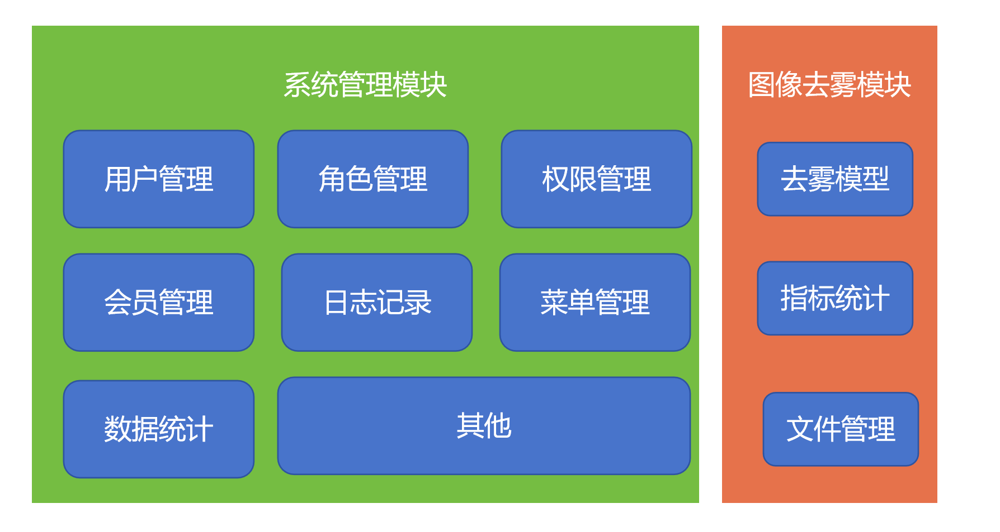
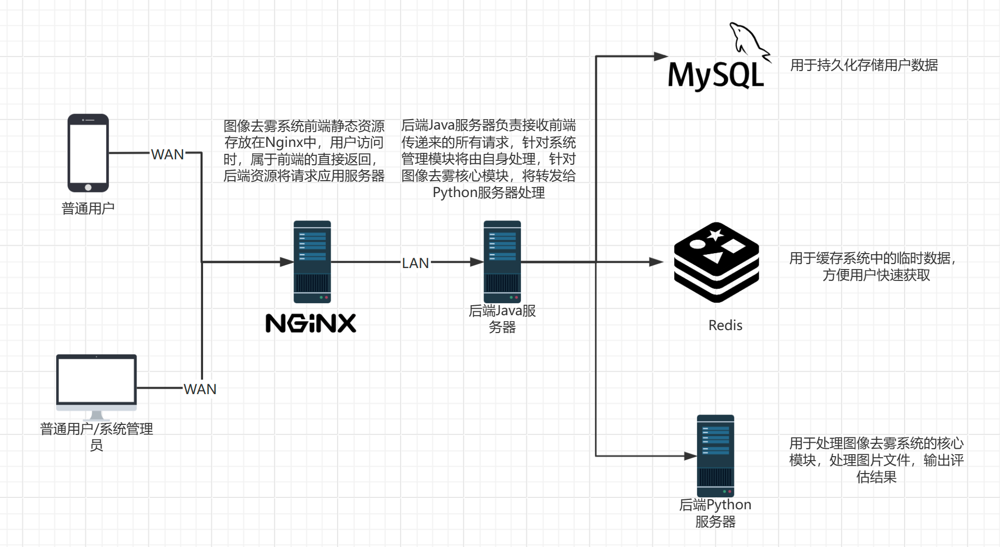

# 系统设计
## 系统架构设计
### 业务架构
业务架构主要考虑到软件的功能需求，进行问题域的划分和领域建模等工作。架构模式如下：

### 代码架构
在代码层面上，系统主要分为3块。

第一部分是前端，前端是图像去雾系统的前台部分，运行在PC端，移动端等浏览器上展现给用户浏览的网页。随着互联网技术的发展，HTML5，CSS3，前端框架的应用，跨平台响应式网页设计能够适应各种屏幕分辨率，完美的动效设计，给用户带来极高的用户体验。本系统主要依靠前端网页和用户进行交互。

第二部分是JAVA后端，运行在Java Web服务器Tomcat上，采用SpringBoot Java Web技术进行开发。java后端主要用作系统的基础管理如用户管理、角色管理、会员管理和日志记录上。由于Java在网页开发上的优势，本系统后端的绝大部分内容采用Java来开发。

第三部分是Python后端，由于深度学习技术主要基于Python、pytorch框架执行。因此系统最核心的部分采用Python进行编写，同时向外提供API接口以供Java后端调用。

### 部署架构

## 技术栈
### 前端
| 环境 | 版本 |
| -- | -- |

### JAVA后端
| 环境 | 版本 |
| -- | -- |

### Python后端
| 环境 | 版本 |
| -- | -- |

## 功能模块设计

### 去雾模块
去雾模块是整个系统中最核心的模块，根据需求分析，该模块一共分为图片上传、图片下载、指标评价和去雾处理四个功能。

用户在本系统进行去雾操作时需要先选择系统中现有的去雾模型，不同的模型针对的去雾场景不同，去雾效果也有所差别。在选好去雾模型后上传有雾图像到系统中，随后点击按钮开始去雾。系统将会把请求发送给后端进行处理。随后将去雾结果返还给前端。此时前端系统会自动根据结果选择从后端获取模型去雾后的图像，或者是出现错误，将错误原因通知前端。

用户如果想要评估该模型的去雾效果，则需要提前准备好与有雾图像尺寸大小对应的无雾图像，点击效果评估按钮，将无雾图像上传至系统后系统就会调用评价算法评估模型去雾后的图像和真实无雾图像之间的相似度，并且针对去雾效果给出客观评价。

#### 图片上传

#### 图片下载

#### 指标评价

#### 去雾处理

#### 历史记录

### 用户模块

#### 操作记录

### 菜单模块

### 权限模块

### 角色模块

### 数据分析模块

