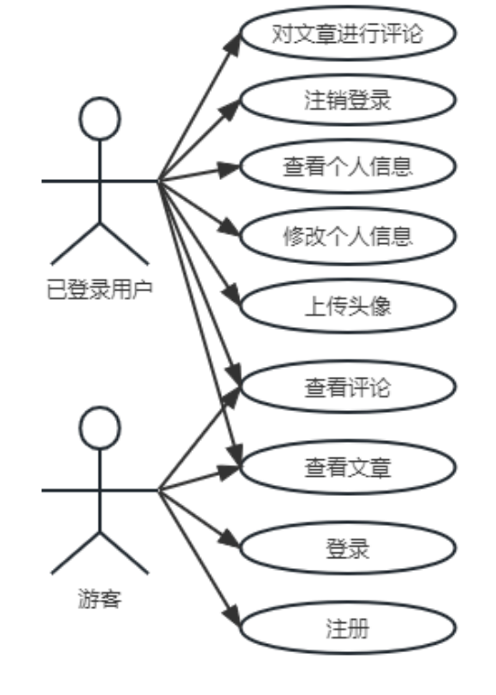

# 系统需求分析

## 功能需求

图：已登录用户和游客用例图

1.  **文章管理**

文章管理时个人博客系统中的重要组成部分，这里的文章指的是博客作者写的各种随笔、生活纪录、知识分享等类型的文章。

**文章状态：**一种是已发布状态，此时所有访问本系统的用户都可以查看；一种是草稿状态，本意是作者还没有编辑完成，此时只有作者本人可以查看。

**文章置顶：**为了区分文章的重要程度，需要系统能够对文章设置置顶功能，置顶后的文章会显示在网站的头部，排在所有文章的前面。更容易被访问网站的用户看到。在整个系统中，被置顶文章是有限制的，最多3篇。

**文章分类：**为了更好对文章进行管理，简要的区分文章的内容。需要对文章进行分类管理。每篇文章属于一种类别。用户可以根据类别名称查询到对应类别下的所有文章。

**文章浏览量：**为了方便统计文章的受欢迎程度，需要统计文章的浏览量数据。每当有用户点击并查看该文章，文章的浏览量会加1。在展示文章时，浏览量高的文章会优先展示，但会排在置顶文章的后面。

**热门文章：**热门文章指的是文章浏览量排行前十的文章（文章总数不足10篇的话是所有文章，相同浏览量的文章按照时间从晚到早进行排序）这些文章会在网站中单独抽取出来一个板块放置，便于用户查看。

2.  **评论管理**

在每篇文章的最后面应该有一个评论区，这里可以供已登录用户发表对该文章的各种看法。评论的内容不仅可以是文字，还可以是系统内部提供的表情。

评论文章：已登录用户可以对开启评论功能的文章进行评论，评论的内容会在文章下面展示。

回复评论：已登录的用户可以对评论进行回复，回复的内容会在该条评论下方展示。

3.  **文件管理**

文件管理功能的用途是保存已登录用户上传到本系统的各种文件。并在需要的时候在系统中进行展示，并且允许用户再次下载回本地。系统应该支持文件上传和文件下载功能。

**文件上传：**已登录用户至少可以上传图片到系统中，系统应予以保存。目前情况下应该只能支持非私密文件的上传。比如用户头像，可以被所有人访问。

**文件下载：**上传到本系统中的文件应该可以被所有用户通过正确的途径访问到。

4.  **用户管理**

本系统用户管理方面需求拟分为两个阶段来完成，第一阶段拟将用户分为登录用户和游客两种。

**游客：**指的是登录已经失效的用户或者从未访问过本网站的用户。未登录用户可以访问本网站，浏览并查看个人博客中的文章，查看文章的评论，进行登录和注册。

**已登录用户：**指的是已经进行登录操作的用户或者是之前已经登录过，并且登录状态未失效的用户。已登录用户能够进行未登录用户的所有操作（登录和注册除外），还能够具有评论文章，对其他人的评论进行回复，查看用户信息，修改用户信息，更换用户头像，注销登录操作。

接下来是用户管理系统应具备的功能说明。

**注册：**游客可以在访问本系统时找到系统注册窗口进行注册，注册需要提供用户名和密码，其中用户名不能和系统中已经存在的用户相同。注册成功后便可以使用相同用户名密码进行登录。

**登录：**游客在访问本系统时找到系统登录窗口，提供用户名和密码进行登录。当系统核对用户名和密码正确时登录成功。进入用户管理界面。

**查看用户信息：**已登录用户可以查看自己的用户信息。具体用户信息有用户头像、用户名、昵称、邮箱、手机号、性别等信息。

**修改用户信息：**已登录用户可以修改自己的用户信息，包括用户名、密码、昵称、邮箱、手机号、性别等信息。

**更换用户头像：**已登录用户可以选择更换自定义的用户头像。使用文件管理中的文件上传功能上传用户图像到本系统中。

**注销登录：**已登录用户可以选择注销本次登录状态，注销后用户身份变为游客。

## 非功能需求

1.  **性能需求：**

    - 访问速度：尽量保证页面在用户访问时的响应速度。国内用户普通增删改查操作的响应时间应维持在在1\~2秒内。

    - 并发要求：系统应该支持至少50人同时访问不崩溃。在并发数为20的情况下不受过多影响。

2.  **系统易于维护：**

    - 系统本身在设计之初应该考虑到后期功能拓展的需求，建立完善的文档和版本控制要求。在代码层面注释应该简洁明了，遵循统一的代码规范。并在整个开发过程中坚持如一。

3.  **安全性需求：**

    - 关于系统数据库中的数据直接访问需要密码维护，并且数据库系统所在硬件和应用系统硬件环境在物理上进行隔离。数据库和应用系统之间的交互通过内部局域网进行，进一步保证数据安全。

4.  **易用性需求：**

    - 在系统和前端页面进行交互是，API设计应该事先制定好完整的规则，对用户传来的增删改查需求使用RestFul风格的API接口进行统一管理，并且建立API文档做到实时更新。

5.  **容错性需求：**

    - 对于前端传来的数据不能够完全信任，后端在进行处理之前应该再次校验，以防出错，并且在数据错误时给前端返回清晰完整的错误提示，有助于改善错误的用户输入。
