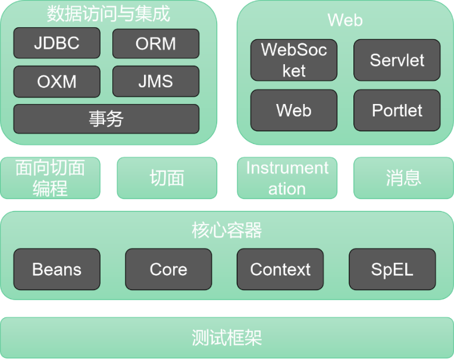

# 背景分析

## 选题背景

博客是一个在网络平台上展示自己，与他人进行互动交流的空间，本次选题为基于B/S（浏览器和服务器）模式的个人博客服务端系统，采用完全的面向对象思想设计，前后端分离的开发方式，并且着重于后端开发，使用JAVA语言SpringBoot框架，后台数据库采用MySql。

前后端分离是目前热门的开发方式，能够在一定程度上解决开发过程复杂、web页面和服务器处理逻辑混杂在一起的情况。前端只需要独立编写客户端代码，后端也只需要独立编写服务端代码提供数据接口即可。

## 本文主要工作

本文在开始着手撰写之前，首先查阅目前市面上现有的各类网站，总结了目前博客网站的特点，抽取该类网站最基础的功能，根据现有知识进行需求分析，进而完成了个人博客系统的架构设计、数据库系统设计和具体的功能设计，并且进行了代码实现。采用前后端分离的开发思想，使用Java搭建后端，使用Vue搭建前端页面。建立了合理的数据表，最终实现了个人博客网站的部署，并且对网站进行了基础测试，证明该系统可用。

## 相关技术介绍
### SpringBoot——Java企业开发框架

Spring是Java企业开发的一个框架，它最大的目的就是使Java开发变得更加容易。它提供了一个更加完善的开发环境。从Spring框架的特点来看：

- 非侵入式：基于Spring开发的应用中的对象可以不依赖于SpringAPI

- 控制反转：将对象的创建权交给Spring，并且由Spring来管理Java中的对象。

- 依赖注入：Java对象中所依赖的其他对象不需要我们手动的为其赋值，而是由Spring通过配置赋值。

- 面向切面的编程：切面即一些非核心、但又必要的逻辑在运行期间自动的织入核心逻辑中。

- 容器：Spring框架我们可以将其看作一个Java对象的容器，它包含并且管理我们应用程序中产生的对象。

- 一站式：Spring框架为我们整合了各种企业应用优秀的开源框架和优秀的第三方库。可以解决重复造轮子的时间。

Spring框架中由许多的组件，这些组件提供了应用程序需要的不同功能，组件彼此之间是松耦合的，我们可以根据自身的需要来选择自己应用需要的组件。Spring框架中包含的组件如下图所示。

本系统中主要使用了Spring框架的以下特性：

**核心容器：**Spring的核心容器是其他模块建立的基础，由Bean模块、Core核心模块、Context上下文模块和SpEL表达式语言模块组成。

- Beans模块：提供框架基础，包括控制反转和依赖注入。

- Core模块：封装Spring底层，包括资源访问、类型转换、常用工具类

- Context 上下文模块：建立在 Core 和 Beans 模块的基础之上，集成 Beans 模块功能并添加资源绑定、数据验证、国际化、Java EE 支持、容器生命周期、事件传播等。ApplicationContext 接口是上下文模块的焦点。

- SpEL 模块：提供了强大的表达式语言支持，支持访问和修改属性值，方法调用，支持访问及修改数组、容器和索引器，命名变量，支持算数和逻辑运算，支持从 Spring 容器获取 Bean，它也支持列表投影、选择和一般的列表聚合等。

**数据访问与集成：**JDBC模块是Java数据库连接API，Spring提供了JDBC的样例模板。ORM模块将“对象-关系”映射框架集成起来。事务模块提供了编程和声明式的对数据库进行事务管理。

**Web：**Web模块提供了基本的网页开发功能，如多文件上传、使用Servlet监听器、Web应用上下文。

### MySql——关系型数据库

MySQL是一个关系型数据库管理系统。这种数据库是建立在关系模型基础上的数据库，借用结合代数等数学概念和方法来处理数据库中的数据。它具有如下的特点：

- 数据以表格的形式出现

- 每行为各种记录名称

- 每列为记录名称对应的数据域

- 许多行和列组成一张表格

- 若干张表格组成数据库

MySQL的存储引擎有两种，分别是InnoDB和MyISAM。

第一种是InnoDB，它是MySQL默认的事务性存储引擎，实现了四个标准的隔离级别。默认级别是可重复读。主索引是聚簇索引，在索引中保存了数据从而避免了直接读取磁盘，因此对查询性能有很大的提升，内部有各种优化，包括从磁盘读取数据时采用的可预测性读，能够加快读操作并且自动创建的自适应哈希索引，能加速插入操作的插入缓冲区等。

第二种是MyISAM，设计简单，数据以紧密格式存储，但是不支持事务，不支持行级锁，只能对整表进行加锁。

本系统中默认采用引擎是InnoDB。

### Redis——缓存数据库

Redis(Remote DIctionary Server)远程数据服务，使用C语言编写，是一款内存高速缓存数据库，支持键值对等多种数据结构的存储，可以用于缓存、事件发布、订阅、高速队列这些场景。

Redis的使用场景主要有以下五个方面：

1.  热点数据的缓存

2.  限时业务的应用

3.  计数器相关

4.  分布式锁

5.  延时操作

在本系统中Redis的主要应用是上述的第一个方面，系统中文章访问量在每次访问文章时都会发生改变，因此是本系统中的热点数据，我们使用Redis对该数据进行缓存从而提高系统的性能。
