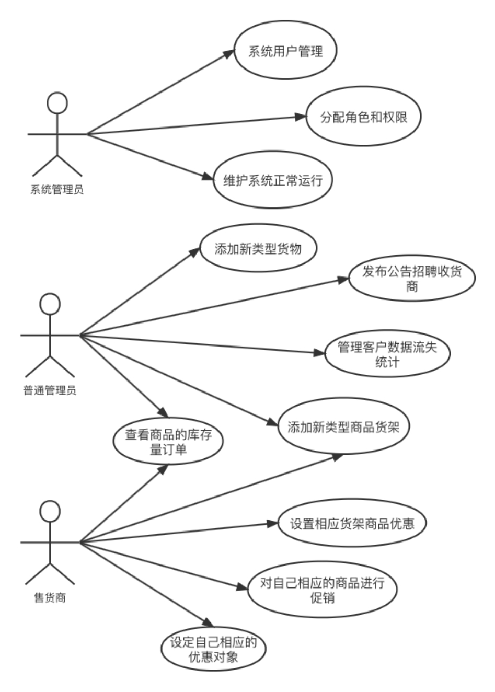
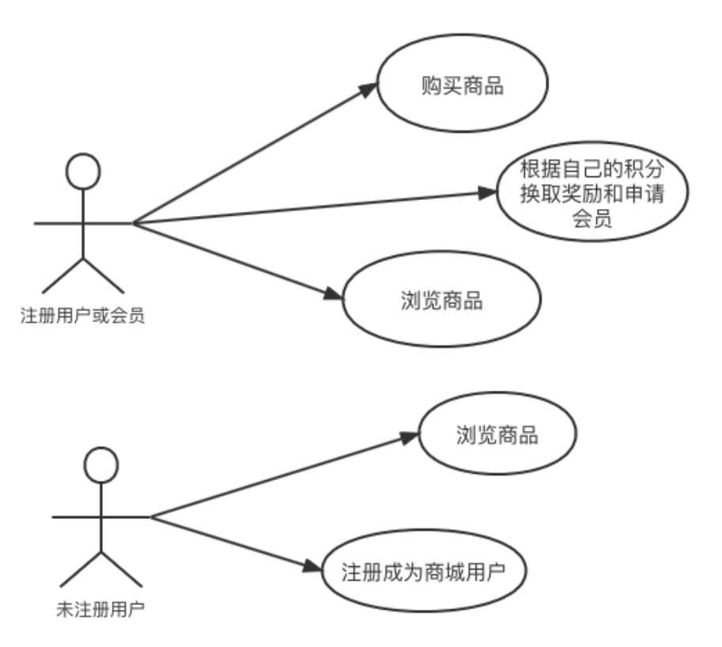
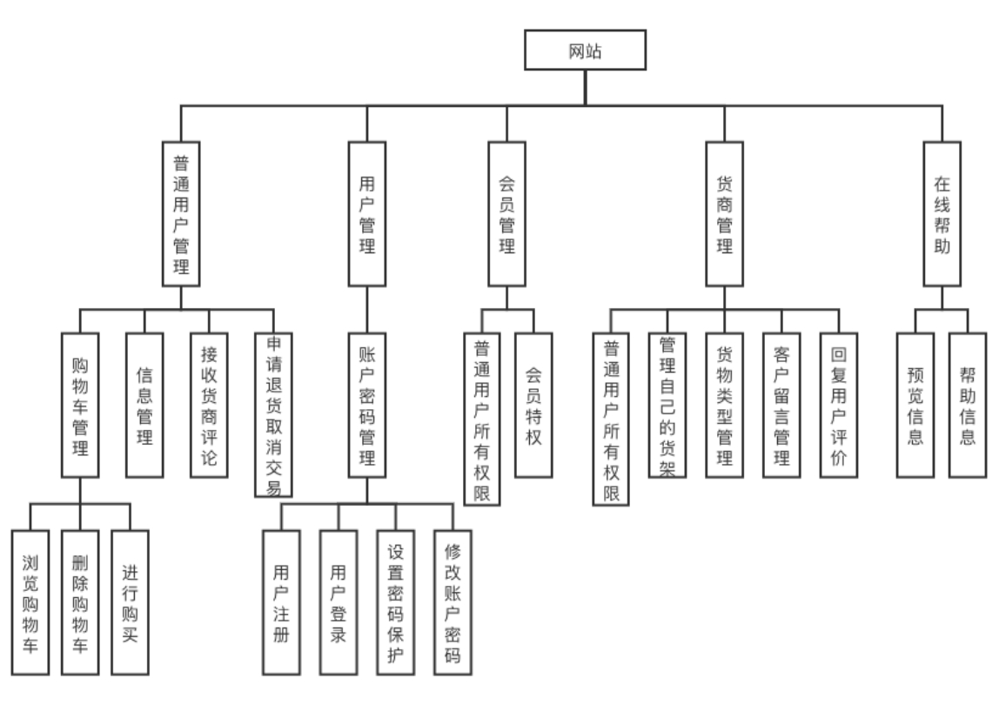
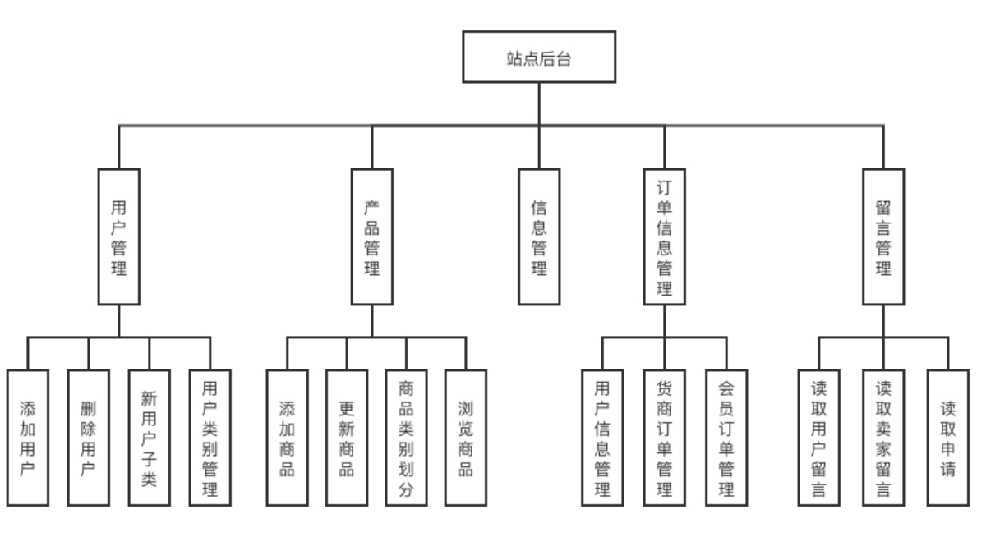

# 需求分析报告

## 概述

### 目的

随着社会发展，越来越多的人接触到网络，人们的生活节奏逐渐加快，大家的大部分时间都在忙碌的任务中渡过。大部分的下班族都没有时间去商场购物，为了给大家提供一个方便快捷的购物平台，我们开发这个网站的初衷。

土味商城主要以商城的广阔用户为基本，设有丰厚的商品展销货架，为商城的用户提供商品丰厚、廉价的购物平台。让商城的用户可以方便快捷、用最少的钱购置到用户满意的商品。

### 范围

本站点分为前台和后台两个管理层面。

后台设有管理员对买家、卖家、会员以及商品的管理，管理员可以统筹的对卖家、买家、会员以及商品停止添加、删除以及修正的操作，这样就可以更好确实保一切的用户信息的完整和平安。

前台设有用户注册、用户登录、在线购物、在线浏览商城商品、成为会员等方便广阔下班族有闲暇时间轻松购物的功能。可以让广阔的用户足不出户就可以购置到自己中意的喜欢的商品，为用户节省了少量的时间。

## 需求分析

### 系统需求分析

土味商城的系统用例图见下图：

 

图 5 土味商城系统管理员，普通管理员，售货商用例图

 

图 6 注册用户或会员，未注册用户用例图

### 用户需求分析

在生活节奏逐渐加快的今天，人们渴望拥有一个集方便、快捷、实惠为一体的网络商城，在节约时间成本的同时，购买到自己想要的商品，带来良好的购物体验。土味商城拥有成熟的设计，具备成熟的网络商城的各个模块，可以完全满足用户的这一需求。

### 功能需求分析

土味商城的功能模块图如图所示：

 

图 7 土味商城前台功能模块图

 

图 8 土味商城后台功能模块图

a) 后台管理

1．可以依据用户的请求指定某一用户成为商城的卖家；
2. 可以依据卖家的诚信度或许某个会员的诚信度和会员积分来指定他为某一个货架的管理员；
3. 可以取消诚信渡过低的卖家的售货资历；
4. 可以将卖家货架上不合格的商品下架并扣除对应的售货商的诚信度；
5. 暂时接受买家的付款〔不可支取〕。

注：假定买家10日内没有确定收到货物或向管理员请求退款，那么视为买卖成功，货款汇入卖家账户用户得不到货款返还；假定用户请求退款〔3日内〕缘由3日是发货期，那么3日后会自动扣除相应的邮寄费用。

b) 商城卖家

1. 可以向站点管理员请求添加出售货物的类型；
2. 依据货物的剩余量适时的向货架上添加货物；
3. 可以将持久没有出售的货物下架；
4. 可以检查买家或游客给我的留言以及买家或游客相应的回复；
5. 向站点管理员留言〔提交请求〕并检查守理员的回复；
6. 从管理员接纳货款。

c) 商城买家

***\*已注册普通用户\****

1. 阅读一切的商品；
2. 拥有自己的购物车；
3. 拥有自己的充值账户；
4. 将自己中意的商品添加到购物车，在购物车中确定购置；
5. 结算〔买家的账户会自动扣除相应的总货款金额〕；
6. 可以向站点管理员提出请求成为商城卖家；
7. 搜索商品或售货商〔可以用不同的检索方式停止搜索〕。

***\*已注册会员用户\****

1. 具有普通用户的一切功用；
2. 可以购置会员特价商品；
3. 会员优先获知商城的新商品以及优先购置商城的限量版商品。

d) 商城游客

1. 注册成为商城用户；
2. 阅读商城的一切商品〔不可购置、不可留言〕。

### 非功能需求分析

土味商城的非功能需求分析如下：

a) 性能需求：

1. 数据的选择上，除了思索产品关于网站系统在运转效率、数据处置才干等方面的支持功用外，重要的是选择适宜整个开发队伍技术才干的系统。在数据库结构设计方面，着重思索数据平安、查询速度、数据整理效率等。此外，合理限制数据库的操作权限可以满足一定的数据平安要求。
2. 普通操作的照应时间应在1~2秒内，我们应保证系统的速度，运用户操作在可接受的时间内完成。

b) 易用性需求：

系统界面设计简洁，使用方法方便易懂，每个操作按键的分配都与使用者的使用习惯相符。

c) 容错性需求：

用户输错数据都有提示信息，具有较好的容错功用。

d) 安全性需求：

关于系统的重要数据都有密码维护，具有一定的平安性。
