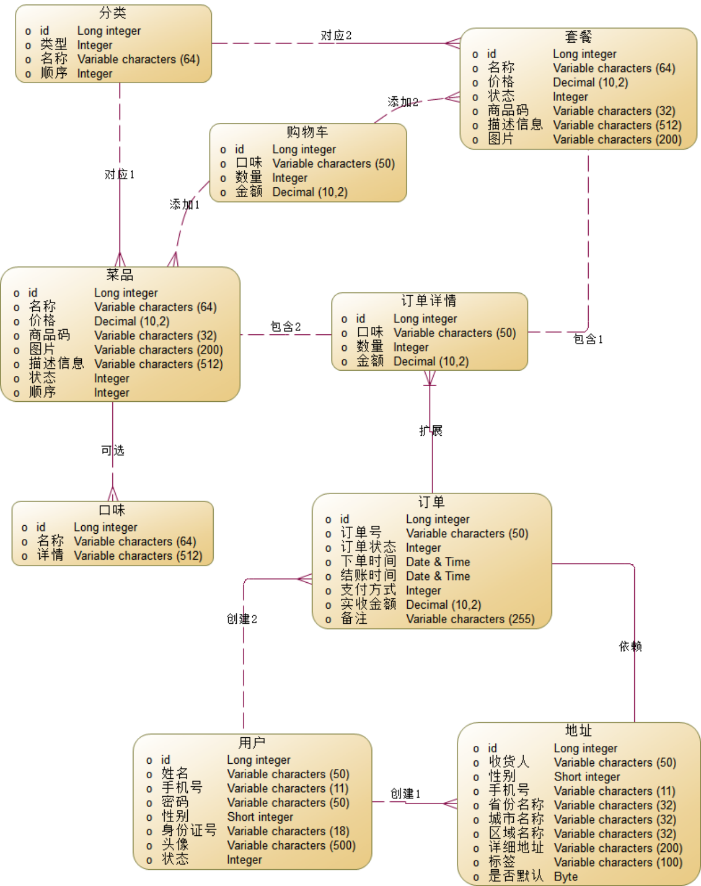

# 数据库设计

## E-R图

图 数据库E-R图

本数据库一共分为9张表，其中每张数据库表公共字段为创建时间（create_time datetime）、修改时间（update_time datetime），逻辑删除（is_delete, byte)，保留这三个字段是为了数据库的安全性以及可追溯性。

根据前面分析得到的实体类，结合3.2和3.3的详细设计，使用抽象、演绎、推理等方法，按照数据库设计原理进一步分析，得到数据库表结构。

此处数据库设计，一般重点关注以下几点：

（1）每个table使用一个与业务无关的ID为主键；

（2）每个table的表名以“t_”开头，索引名以“idx_”开头；

（3）每个table的唯一索引，根据约束进行设置；

（4）每个table的其他索引，需要根据用例的查询业务进行分析后设置；

（5）每个table的字段类型、长度需要仔细考虑，是否为空根据用例的约束来设计。

## 用户表结构设计

表 t_user表结构

| **序号** | **列名** | **含义**         | **数据类型** | **空值** | **主外键** |
| -------- | -------- | ---------------- | ------------ | -------- | ---------- |
| 1        | id       | 主键             | bigint       | 否       | 主键       |
| 2        | name     | 用户名           | varchar(50)  | 否       | 索引       |
| 3        | password | 密码             | varchar(50)  | 否       |            |
| 4        | sex      | 性别（0女，1男） | tinyint      | 是       |            |
| 5        | phone    | 手机号           | varchar(11)  | 是       |            |
| 6        | avatar   | 头像             | varchar(500) | 是       |            |
| 7        | status   | 用户状态         | int          | 否       |            |

## 地址表结构设计

表 t_address表结构

| **序号** | **列名**      | **含义**         | **数据类型** | **空值** | **主外键** |
| -------- | ------------- | ---------------- | ------------ | -------- | ---------- |
| 1        | id            | 主键             | bigint       | 否       | 主键       |
| 2        | user_id       | 用户id           | bigint       | 否       | 外键       |
| 3        | consignee     | 收货人           | varchar(50)  | 否       |            |
| 4        | sex           | 性别（0女，1男） | tinyint      | 否       |            |
| 5        | phone         | 手机号           | varchar(11)  | 否       |            |
| 6        | province_name | 省级名称         | varchar(32)  | 否       |            |
| 7        | city_name     | 市级名称         | varchar(32)  | 否       |            |
| 8        | district_name | 区级名称         | varchar(32)  | 否       |            |
| 9        | detail        | 详细地址         | varchar(200) | 否       |            |

## 菜品表结构设计

表 t_dish表结构

| **序号** | **列名**    | **含义** | **数据类型**  | **空值** | **主外键** |
| -------- | ----------- | -------- | ------------- | -------- | ---------- |
| 1        | id          | 菜品id   | bigint        | 否       | 主键       |
| 2        | name        | 菜品名称 | varchar(64)   | 否       | 索引       |
| 3        | category_id | 分类id   | bigint        | 否       | 外键       |
| 4        | price       | 价格     | decimal(10,2) | 否       |            |
| 5        | image       | 图片链接 | varchar(500)  | 否       |            |
| 6        | description | 详细描述 | varchar(500)  | 否       |            |
| 7        | status      | 状态     | int           | 否       |            |
| 8        | sort        | 排序     | int           | 是       |            |

## 菜品口味表结构设计

表 t_dish_flavor表结构

| **序号** | **列名** | **含义**       | **数据类型** | **空值** | **主外键** |
| -------- | -------- | -------------- | ------------ | -------- | ---------- |
| 1        | id       | 口味id         | bigint       | 否       | 主键       |
| 2        | name     | 口味名称       | varchar(64)  | 否       | 索引       |
| 3        | dish_id  | 菜品id         | bigint       | 否       | 外键       |
| 4        | value    | 口味详情(JSON) | varchar(500) | 否       |            |

## 订单详情表结构设计

表 t_order_detail表结构

| **序号** | **列名**    | **含义**                  | **数据类型**  | **空值** | **主外键** |
| -------- | ----------- | ------------------------- | ------------- | -------- | ---------- |
| 1        | id          | 订单详情id                | bigint        | 否       | 主键       |
| 2        | order_id    | 订单id                    | bigint        | 否       | 外键       |
| 3        | dish_id     | 菜品id(和套餐id二选一)    | bigint        | 是       | 外键       |
| 4        | setmeal_id  | 套餐id(和菜品id二选一)    | bigint        | 是       | 外键       |
| 5        | name        | 商品名称(冗余字段)        | varchar(32)   | 否       |            |
| 6        | image       | 商品图片(冗余字段)        | varchar(500)  | 否       |            |
| 7        | dish_flavor | 菜品口味(仅当dish_id非空) | varchar(500)  | 是       |            |
| 8        | number      | 商品数量                  | int           | 否       |            |
| 9        | amount      | 商品价格                  | decimal(10,2) | 否       |            |

## 订单表结构设计

表 t_order表结构

| **序号** | **列名**        | **含义**                         | **数据类型**  | **空值** | **主外键** |
| -------- | --------------- | -------------------------------- | ------------- | -------- | ---------- |
| 1        | id              | 订单id(数据库自增)               | bigint        | 否       | 主键       |
| 2        | number          | 订单编号(随机生成)               | bigint        | 否       | 索引       |
| 3        | status          | 订单状态(未支付、已支付、已完成) | int           | 否       |            |
| 4        | user_id         | 用户id                           | bigint        | 否       | 外键       |
| 5        | address_book_id | 地址id                           | bigint        | 否       | 外键       |
| 6        | order_time      | 下单时间                         | datetime      | 否       | 索引       |
| 7        | checkout_time   | 付款时间                         | datetime      | 是       | 索引       |
| 8        | finish_time     | 完成时间                         | datetime      | 是       | 索引       |
| 9        | amount          | 订单总价                         | decimal(10,2) | 否       |            |
| 10       | remark          | 备注                             | varchar(500)  | 是       |            |
| 11       | phone           | 收货电话(冗余字段)               | varchar(11)   | 是       |            |
| 12       | address         | 收货地址(冗余字段)               | varchar(500)  | 是       |            |
| 13       | username        | 用户名(冗余字段)                 | varchar(32)   | 是       |            |
| 14       | consignee       | 收货人(冗余字段)                 | varchar(32)   | 是       |            |

## 套餐表结构设计

表 t_setmeal表结构

| **序号** | **列名**    | **含义** | **数据类型**  | **空值** | **主外键** |
| -------- | ----------- | -------- | ------------- | -------- | ---------- |
| 1        | id          | 套餐id   | bigint        | 否       | 主键       |
| 2        | name        | 套餐名称 | varchar(64)   | 否       | 索引       |
| 3        | category_id | 分类id   | bigint        | 否       | 外键       |
| 4        | price       | 价格     | decimal(10,2) | 否       |            |
| 5        | image       | 图片链接 | varchar(500)  | 否       |            |
| 6        | description | 详细描述 | varchar(500)  | 否       |            |
| 7        | status      | 状态     | int           | 否       |            |
| 8        | sort        | 排序     | int           | 是       |            |

## 套餐菜品关联表结构设计

表 t_setmeal_dish表结构

| **序号** | **列名**   | **含义**           | **数据类型**  | **空值** | **主外键** |
| -------- | ---------- | ------------------ | ------------- | -------- | ---------- |
| 1        | id         | 套餐菜品关联id     | bigint        | 否       | 主键       |
| 2        | dish_id    | 菜品id             | bigint        | 否       | 外键       |
| 3        | setmeal_id | 套餐id             | bigint        | 否       | 外键       |
| 4        | name       | 菜品名称(冗余字段) | varchar(64)   | 否       |            |
| 5        | price      | 价格               | decimal(10,2) | 否       |            |
| 6        | copies     | 份数               | varchar(500)  | 否       |            |
| 7        | sort       | 排序               | int           | 是       |            |

## 购物车表结构设计

表 t_shopping_cart表结构

| **序号** | **列名**    | **含义**                  | **数据类型**  | **空值** | **主外键** |
| -------- | ----------- | ------------------------- | ------------- | -------- | ---------- |
| 1        | id          | 购物车id                  | bigint        | 否       | 主键       |
| 2        | user_id     | 用户id                    | bigint        | 否       | 外键       |
| 3        | dish_id     | 菜品id(和套餐id二选一)    | bigint        | 是       | 外键       |
| 4        | setmeal_id  | 套餐id(和菜品id二选一)    | bigint        | 是       | 外键       |
| 5        | name        | 商品名称(冗余字段)        | varchar(32)   | 否       |            |
| 6        | image       | 商品图片(冗余字段)        | varchar(500)  | 否       |            |
| 7        | dish_flavor | 菜品口味(仅当dish_id非空) | varchar(500)  | 是       |            |
| 8        | number      | 商品数量                  | int           | 否       |            |
| 9        | amount      | 商品价格                  | decimal(10,2) | 否       |            |
