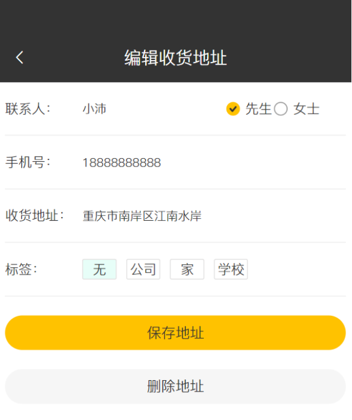

# 系统实现

经过前两章系统分析和设计，我们已经对系统所需要的功能和具体的实现方式有了大致的了解，本章开始基于Java语言开始实现本系统，本系统后端采用SpringBoot作为系统框架，MyBastis、MyBatis Plus作为系统与数据库交互的中间件、MySQL为本系统的数据库，Redis缓存系统中最常用的数据。前端采用Vue作为框架，利用开源UI组件ElementUI简化系统开发。由于系统代码量较多，本篇中主要给出系统后端核心代码实现，同时给出简要描述。

## 技术栈介绍

表 后端主要技术栈


| **框架**                                                                                                                                                                                                                                | **说明**              | **版本**   |
| --------------------------------------------------------------------------------------------------------------------------------------------------------------------------------------------------------------------------------------- | --------------------- | ---------- |
| [Spring Boot](https://gitee.com/link?target=https://spring.io/projects/spring-boot "https://gitee.com/link?target=https://spring.io/projects/spring-boot")                                                                              | 应用开发框架          | 2.7.11     |
| [Spring MVC](https://gitee.com/link?target=https://github.com/spring-projects/spring-framework/tree/master/spring-webmvc "https://gitee.com/link?target=https://github.com/spring-projects/spring-framework/tree/master/spring-webmvc") | MVC 框架              | 5.3.24     |
| [MySQL](https://gitee.com/link?target=https://www.mysql.com/cn/ "https://gitee.com/link?target=https://www.mysql.com/cn/")                                                                                                              | 数据库服务器          | 5.7 / 8.0+ |
| [Redis](https://gitee.com/link?target=https://redis.io/ "https://gitee.com/link?target=https://redis.io/")                                                                                                                              | key-value 数据库      | 5.0 / 6.0  |
| [Druid](https://gitee.com/link?target=https://github.com/alibaba/druid "https://gitee.com/link?target=https://github.com/alibaba/druid")                                                                                                | JDBC 连接池、监控组件 | 1.2.16     |
| MyBatis                                                                                                                                                                                                                                 | 基于Java的持久层框架  |            |
| [MyBatis Plus](https://gitee.com/link?target=https://mp.baomidou.com/ "https://gitee.com/link?target=https://mp.baomidou.com/")                                                                                                         | MyBatis 增强工具包    | 3.5.3.1    |
| [Hibernate Validator](https://gitee.com/link?target=https://github.com/hibernate/hibernate-validator "https://gitee.com/link?target=https://github.com/hibernate/hibernate-validator")                                                  | 参数校验组件          | 6.2.5      |
| [Jackson](https://gitee.com/link?target=https://github.com/FasterXML/jackson "https://gitee.com/link?target=https://github.com/FasterXML/jackson")                                                                                      | JSON 工具库           | 2.13.3     |
| [Lombok](https://gitee.com/link?target=https://projectlombok.org/ "https://gitee.com/link?target=https://projectlombok.org/")                                                                                                           | 消除冗长的 Java 代码  | 1.18.26    |

表 前端主要技术栈


| **技术栈**   | **描述**                               | **官网**                                                                                                                                                |
| ------------ | -------------------------------------- | ------------------------------------------------------------------------------------------------------------------------------------------------------- |
| Vue3         | 渐进式 JavaScript 框架                 | [https://v3.cn.vuejs.org/](https://gitee.com/link?target=https://v3.cn.vuejs.org/ "https://gitee.com/link?target=https://v3.cn.vuejs.org/")             |
| TypeScript   | JavaScript 的一个超集                  | [https://www.tslang.cn/](https://gitee.com/link?target=https://www.tslang.cn/ "https://gitee.com/link?target=https://www.tslang.cn/")                   |
| Vite         | 前端开发与构建工具                     | [https://cn.vitejs.dev/](https://gitee.com/link?target=https://cn.vitejs.dev/ "https://gitee.com/link?target=https://cn.vitejs.dev/")                   |
| Element Plus | 基于 Vue 3，面向设计师和开发者的组件库 | [https://element-plus.gitee.io/zh-CN/](https://element-plus.gitee.io/zh-CN/ "https://element-plus.gitee.io/zh-CN/")                                     |
| Pinia        | 新一代状态管理工具                     | [https://pinia.vuejs.org/](https://gitee.com/link?target=https://pinia.vuejs.org/ "https://gitee.com/link?target=https://pinia.vuejs.org/")             |
| Vue Router   | Vue.js 的官方路由                      | [https://router.vuejs.org/zh/](https://gitee.com/link?target=https://router.vuejs.org/zh/ "https://gitee.com/link?target=https://router.vuejs.org/zh/") |

## 通用功能实现

本系统中存在大量的图片资源，有图片上传下载，发送邮件验证码等等需求，这些是系统通用的功能，具体的实现代码如下所示。

上传文件代码：
```java
    // 生成新的文件名，获取uuid，获取旧文件名后缀。
    String uuid = UUID.randomUUID().toString();
    String originalFilename = file.getOriginalFilename();
    assert originalFilename != null;
    String suffix = originalFilename.substring(originalFilename.lastIndexOf("."));
    String newFileName = uuid + suffix;
    // 判断是否存在当前存放文件的目录，如果不存在则创建一个
    File dir = new File(basePath);
    if (!dir.exists()) {
        boolean isMk = dir.mkdirs();
        log.info("{}创建目录{}", isMk ? "成功" : "失败", basePath);
    }
    // 存储文件到指定目录
    try {
        file.transferTo(new File(basePath + newFileName));
        return R.success(newFileName);
    } catch (IOException e) {
        return new R<>(HttpCodeEnum.FILE\_STORE\_ERROR);
    }
```
发送邮件验证码代码：
```java
if(StringUtils.isNotEmpty(email)){
        String code = ValidateCodeUtils.generateValidateCode(4).toString();
        // 将验证码存入redis
        redisTemplate.opsForValue().set(user.getPhone(),code,5, TimeUnit.MINUTES);
        // 发送验证码
        sendEmailUtils.sendAuthCodeEmail(email, code);
        log.info("邮箱为{}的验证码是{}", email, code);
        return R.success("成功发送验证码");
    }
```
## 用户登录功能实现

本系统分为前台用户端和后台商家端，用户端仅支持手机访问，商家端可以用电脑访问。商家通过输入账号名和密码进入后台管理系统。前台用户未登录状态可以通过点击用户头像、主动进入登录界面、将菜品、套餐添加至购物车等操作跳转到登陆页面并通过输入用户名和密码登录到本系统。


图 后台管理系统登录界面


图 前台用户点餐登录界面

核心代码如下：

```java
// 对用户密码进行md5加密
String password = employee.getPassword();
password = DigestUtils.md5DigestAsHex(password.getBytes());
// 查询数据库中是否有该用户名
LambdaQueryWrapper<Employee> queryWrapper = new LambdaQueryWrapper<>();
queryWrapper.eq(Employee::getUsername, employee.getUsername());
Employee one = getOne(queryWrapper);
// 判断用户名查询结果
if (one == null) {
  throw new LoginException("用户名不存在！");
}
// 判断密码比对是否一致
if (!one.getPassword().equals(password)) {
  throw new LoginException("密码错误");
}
// 查询员工状态
if (one.getStatus() == 0) {
  throw new LoginException("账户已禁用");
}
```

## 用户退出功能实现

用户在已登录状态下通过点击右上角“关闭”图标注销当前的登录。


图 商家退出界面示意图


图 用户退出界面示意图

核心代码如下：

```java
request.getSession().removeAttribute("user");
```


## 管理收货地址功能实现

用户可以管理自己的收货地址，用户在自己的个人主页中点击收货地址既可以查看自己当前所设置的所有收货地址，也可以点击页面最下方添加收货地址新增收货地址。也可以在地址管理中将某个地址设为默认地址，在用户选好菜品下订单中默认会采用该地址作为收货地址，当然也可以更换收货地址。

商家端无法看到用户的收货地址，管理收货地址的功能仅用户端可见，商家可以在订单中看到用户这笔订单的收货地址。


图 新增收货地址界面示意图（左侧）


图 添加收货地址界面示意图（右侧）



图 编辑收货地址界面示意图

核心代码如下：

```java
// 列出当前用户的所有收货地址
LambdaQueryWrapper<AddressBook> queryWrapper = new LambdaQueryWrapper<>();
queryWrapper.eq(AddressBook::getUserId, BaseContext.getCurrentId());
queryWrapper.orderByDesc(AddressBook::getUpdateTime);
List<AddressBook> addressBooks = addressBookService.list(queryWrapper);
// 设置默认的收货地址
LambdaUpdateWrapper<AddressBook> updateWrapper = new LambdaUpdateWrapper<>();
updateWrapper.eq(AddressBook::getUserId, BaseContext.getCurrentId())
        .eq(AddressBook::getIsDefault, IS_DEFAULT);
updateWrapper.set(AddressBook::getIsDefault, NOT_DEFAULT);
addressBookService.update(updateWrapper);
addressBook.setIsDefault(IS_DEFAULT);
addressBookService.updateById(addressBook);
```


## 管理购物车功能实现

用户在点击菜品的添加按钮后，即可将相应的菜品添加到购物车界面中，用户可以同时将多个菜品添加进购物车。在购物车界面中，用户也可以点击减少菜品按钮，来将相应的菜品从购物车中移除出去。若操作失败，则返回操作失败的提示，告知用户“购物车中不存在该菜品”。


图 结算订单界面示意图

核心代码如下：

```java
// 添加菜品进入购物车
ShoppingCart one = this.getOneByUserAndDSId(shoppingCart);
if(one != null) {
    one.setNumber(one.getNumber() + 1);
    shoppingCartService.updateById(one);
    return R.success(one);
} else {
    shoppingCart.setNumber(1);
    shoppingCartService.save(shoppingCart);
    return R.success(shoppingCart);
}
// 购物车中减少菜品
ShoppingCart one = this.getOneByUserAndDSId(shoppingCart);
if (one != null) {
    Integer currentNum = one.getNumber();
    if (currentNum > 1) {
        one.setNumber(currentNum - 1);
        shoppingCartService.updateById(one);
    } else {
        one.setNumber(0);
        shoppingCartService.removeById(one.getId());
    }
    return R.success(one);
}
return R.error("购物车中不存在该菜品数据");
```


## 创建订单功能实现

当购物车中存在菜品时，用户可以点击下单按钮来创建订单。订单里包含部分用户信息，菜品信息以及收货地址等信息。


图 创建订单界面示意图


图 下单成功界面示意图

核心代码如下：

```java
this.updateById(dishDto);
LambdaQueryWrapper<DishFlavor> queryWrapper = new LambdaQueryWrapper<>();
queryWrapper.eq(DishFlavor::getDishId, dishDto.getId());
dishFlavorService.remove(queryWrapper);
```


## 查看订单功能实现

商家可以在后台管理系统中分页查看所有的订单。在订单明细页面中，可以看到订单的订单号、订单状态、用户、手机号、地址、下单时间，实收金额和相应操作。商家也可以对订单进行增删管理，可以通过订单号，订单开始时间与结束时间来查找相应订单。通过分页功能，商家可以更为方便直观地查看用户创建的订单。


图 查看订单界面示意图

核心代码如下：

```java
if(username.equals("user")&&pwd.equals("user123"))
{
        session.setAttribute("username",username);
        session.setAttribute("pwd",pwd);  
    response.sendRedirect("sucess.jsp");
}
```


## 管理分类功能实现

商家可以进行分类管理。商家在主界面点击分类管理就可以进行分类管理，分类管理包含菜品分类和套餐分类两个功能模块。商家可以管理自己的菜品分类和套餐分类，菜品分类主要是对菜品进行菜系和种类的划分，套餐分类是对套餐的种类进行分类。商家也可以对分类的显示顺序进行排序来决定哪个分类显示在前面。商家可以对菜品分类和套餐分类进行新增和修改。


图 管理分类界面示意图


图 修改分类界面示意图


图 新增菜品分类界面示意图


图 新增套餐分类界面示意图

核心代码如下：

```java
// 分页查询菜品分类信息
Page<Category> pageInfo = new Page<>(page, pageSize);
LambdaQueryWrapper<Category> queryWrapper = new LambdaQueryWrapper<>();
queryWrapper.orderByAsc(Category::getSort);
categoryService.page(pageInfo, queryWrapper);
```


# 管理菜品功能实现

商家可以对菜品进行管理。商家在主界面点击菜品管理就可以进行菜品管理，菜品管理包含对菜品的新增，删除，查找，修改和已有菜品的起售和停售。商家可以单个菜品进行操作也可以批量对菜品进行操作。点击新建菜品之后可以输入菜品的名字，菜品的售价，选择菜品的分类，选择菜品的口味，输入菜品的描述和插入菜品的图片。


图 管理菜品界面示意图


图 添加菜品界面示意图


图 用户查看菜品示意图


图 用户添加菜品示意图

核心代码如下：

```java
// 保存菜品基本信息到菜品表，会过滤掉不属于菜品表信息的字段
this.save(dishDto);
// 获取菜品id，然后将id插入对应口味表中，存入数据库
Long id = dishDto.getId();
List<DishFlavor> flavors = dishDto.getFlavors();
// 通过Stream流的形式遍历出列表中的每一个元素，并对每一个元素添加上id并返回。
// 重新收集这些元素并返回为对应列表
flavors = flavors.stream().peek(
        (item) -> item.setDishId(id)
        ).collect(Collectors.toList());
dishFlavorService.saveBatch(flavors);
// 新增菜品之后需要清理缓存
String key = "dish_" + dishDto.getCategoryId() +"_" + dishDto.getStatus();
redisTemplate.delete(key);
// 更新菜品
this.updateById(dishDto);
LambdaQueryWrapper<DishFlavor> queryWrapper = new LambdaQueryWrapper<>();
queryWrapper.eq(DishFlavor::getDishId, dishDto.getId());
dishFlavorService.remove(queryWrapper);
List<DishFlavor> flavors = dishDto.getFlavors();
flavors = flavors.stream().peek(
        (item) -> item.setDishId(dishDto.getId())
).collect(Collectors.toList());
dishFlavorService.saveBatch(flavors);
// 更新菜品之后需要清理缓存
String key = "dish_" + dishDto.getCategoryId() +"_" + dishDto.getStatus();
redisTemplate.delete(key);
```


## 管理套餐功能实现

商家可以对套餐进行管理。商家在主界面点击套餐管理就可以进行套餐管理，套餐管理包含对套餐的新增，删除，查找，修改和已有套餐的起售和停售。商家可以单个套餐进行操作也可以批量对套餐进行操作。点击新建套餐之后可以输入套餐的名字，套餐的售价，选择套餐的分类，往套餐中新增菜品，添加套餐的描述和插入套餐的图片。


图 管理套餐界面示意图


图 新增套餐界面示意图


图 用户添加套餐示意图

核心代码如下：

```java
// 步骤1：从套餐表中查询到相应的分页信息
Page<Setmeal> pageInfo = new Page<>(page, pageSize);
LambdaQueryWrapper<Setmeal> queryWrapper = new LambdaQueryWrapper<>();
queryWrapper.like(StringUtils.isNotEmpty(name), Setmeal::getName, name);
queryWrapper.orderByDesc(Setmeal::getUpdateTime);
setmealService.page(pageInfo, queryWrapper);
// 步骤2：在分页信息中抽取记录，获取套餐对应的分类名称整合到DTO中
List<Setmeal> setmealList = pageInfo.getRecords();
List<SetmealDto> setmealDtos = setmealList.stream().map((item) -> {
    // 获取套餐分类名称
    Category category = categoryService.getById(item.getCategoryId());
    // 创建DTO对象，将套餐信息拷贝进去
    SetmealDto setmealDto = new SetmealDto();
    BeanUtils.copyProperties(item, setmealDto);
    setmealDto.setCategoryName(category.getName());
    return setmealDto;
}).collect(Collectors.toList());
// 将DTO对象整合到分页器中
Page<SetmealDto> setmealDtoPage = new Page<>();
BeanUtils.copyProperties(pageInfo, setmealDtoPage, "records");
setmealDtoPage.setRecords(setmealDtos);
```

