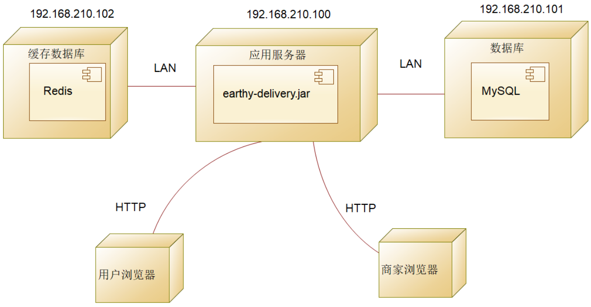
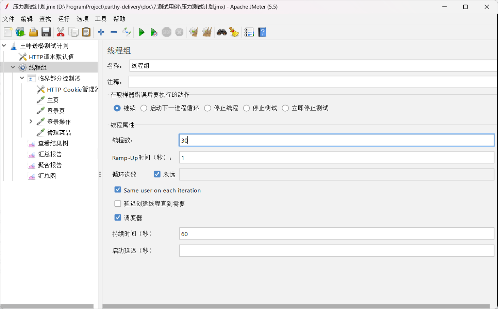
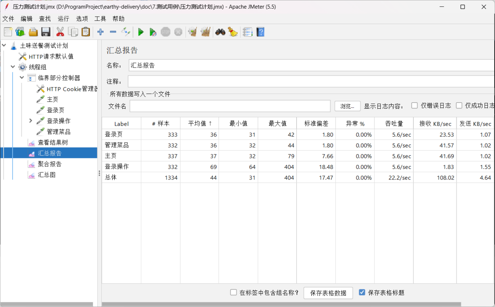

# 系统测试

在经过需求分析、系统设计、系统实现三个流程，我们的土味送餐系统已经具备完整的功能形态了。但是它目前还不能算是成品，系统中可能还存在许多我们未曾考虑到的地方，不小心留下的错误等。因此在系统拿给用户使用之前，我们还需要经过详细的测试，检测整个系统的功能是否齐全、性能是否强大，是否完成了需求分析阶段提出的要求。

本章总共分为七个小节，第一小节说明本项目测试的目的，第二小节给出测试的软硬件环境，第三小节给出测试的简要结论，第四小节到第七小节是本次测试的详细用例。

## 测试目的

本系统测试的目的是为了让系统正常运作，完成之前拟定的功能。

* 系统的Bug率应该在5%以下。

* 确定核心业务功能的系统吞吐量。

* 对业务流程（多接口组合）进行压测。

* 系统能在实际系统运行压力的情况下，稳定运行24小时。

## 测试环境

表 测试硬软件配置


| 设备类型                | 数量 | 硬件配置                                                         | 操作系统 | 网络环境                                                  |
| ----------------------- | ---- | ---------------------------------------------------------------- | -------- | --------------------------------------------------------- |
| 笔记本电脑1             | 1    | 处理器：英特尔酷睿 i5-10600U处理器内存：8G DDR4 硬盘：256G SSD   | windows  | 校园局域网                                                |
| 笔记本电脑2             | 1    | 处理器：英特尔酷睿 i7-7700HQ处理器内存：16G DDR4 硬盘：1000G SSD | windows  | 校园局域网                                                |
| 笔记本电脑3             | 1    | 处理器：英特尔酷睿 i5-12600H处理器内存：32G DDR4 硬盘：512G SSD  | windows  | 校园局域网                                                |
| 虚拟机(基于笔记本电脑3) | 3    | 处理器：2核内存：8G硬盘：100G                                    | Liunx    | IP：192.168.210.100IP：192.168.210.101IP：192.168.210.102 |

给出本次测试环境的部署图。



图 测试环境部署图

## 系统测试结论

本次系统测试总共有118个测试用例，通过112个，未通过6个。在系统测试中，我们发现了许多我们在之前未曾发现的问题，如代码在设计上未曾考虑到的问题，没有对用户的输入做出更严格的校验，在代码的编写上没有考虑到之后的扩展性，等等许多问题。在测试当中我们积极的面对这些问题，并努力尝试解决，经过不屑的努力，大部分错误都能够良好的解决。并且通过测试，我们了解了团队合作的重要性，能够发现错误很重要，解决错误才是最重要的。
以下表格是我们系统测试的详细结果。

表 系统测试结论表


| **序号** | **测试项目**       | **测试数** | **成功数** | **失败数** | **成功率** |
| -------- | ------------------ | ---------- | ---------- | ---------- | ---------- |
| 1        | 登录退出功能测试   | 5          | 5          | 0          | 100%       |
| 2        | 管理收货地址       | 4          | 3          | 1          | 75%        |
| 3        | 管理购物车功能测试 | 4          | 4          | 0          | 100%       |
| 4        | 管理分类功能测试   | 5          | 5          | 0          | 100%       |
| 5        | 管理菜品功能测试   | 5          | 5          | 0          | 100%       |
| 6        | 管理套餐功能测试   | 6          | 6          | 0          | 100%       |
| 7        | 创建订单功能测试   | 1          | 1          | 0          | 100%       |
| 8        | 删除订单功能测试   | 2          | 2          | 0          | 100%       |
| 9        | 通用测试           | 82         | 77         | 5          | 93%        |
| 10       | 自动化测试         | 2          | 2          | 0          | 100%       |
| 11       | 性能测试           | 2          | 2          | 0          | 100%       |
| 12       | 合计               | 118        | 112        | 6          | 94%        |

## 功能测试用例

功能测试采用的方法为手工测试方法，人工打开浏览器，选择合适的测试用例并且测试对应功能是否符合用例预期，用于详细的测试系统的各项功能在任何输入下的稳健性，包括一些正常输入和异常情况。

### 登录退出功能测试用例

表 登录退出功能测试用例


| **序号** | **测试目的**                 | **前置条件**                                        | **测试输入**                    | **预期测试结果**                     | **实际测试结果**   | **测试人** |
| -------- | ---------------------------- | --------------------------------------------------- | ------------------------------- | ------------------------------------ | ------------------ | ---------- |
| 1        | 登录正常登录系统             | 服务运行正常；数据库中已存在用户admin，密码是123456 | 用户名：**admin**密码：123456   | 登录成功，登录按钮隐藏               | 与预期测试结果相同 | 傅林琳     |
| 2        | 用户名不存在时能否阻止登录   | 服务运行正常；数据库中已存在用户admin，密码是123456 | 用户名：**admin12**密码：123456 | 登录失败，提示“用户名或密码不正确” | 与预期测试结果相同 | 傅林琳     |
| 3        | 密码错误时能否阻止登录       | 服务运行正常；数据库中已存在用户admin，密码是123456 | 用户名：**admin**密码：156413   | 登录失败，提示“用户名或密码不正确” | 与预期测试结果相同 | 傅林琳     |
| 4        | 已登录用户可以正常退出       | 服务运行正常；用户已登录                            | 点击“退出”按钮                | 成功退出系统                         | 与预期测试结果相同 | 傅林琳     |
| 5        | 未登录用户不可以点击退出系统 | 服务运行正常                                        | 无                              | 未找到“退出”按钮                   | 与预期测试结果相同 | 傅林琳     |

### 管理收货地址功能测试用例

表 收货地址功能测试用例


| **序号** | **测试目的**                     | **前置条件**                                                                                                                | **测试输入**                                                        | **预期测试结果**                         | **实际测试结果**   | **测试人** |
| -------- | -------------------------------- | --------------------------------------------------------------------------------------------------------------------------- | ------------------------------------------------------------------- | ---------------------------------------- | ------------------ | ---------- |
| 1        | 用户可以查询到自己所有的收货地址 | 服务运行正常；用户已登录；数据库中已存在当前用户至少一条收货地址                                                            | 无                                                                  | 查询到用户的收货地址                     | 与预期测试结果相同 | 傅林琳     |
| 2        | 用户可以正常添加收货地址         | 服务运行正常；用户已登录；数据库中已存在当前用户信息                                                                        | 收货人：小沛电话：18888888888收货地址：重庆市南岸区啊默认地址：勾选 | 添加成功，用户能够看到刚刚添加的收货地址 | 与预期测试结果相同 | 傅林琳     |
| 3        | 用户可以正常删除收货地址         | 服务运行正常；用户已登录；数据库中已存在当前用户信息，存在收货人：小沛电话：18888888888收货地址：重庆市南岸区江南水岸的信息 | 点击“删除”按钮                                                    | 成功删除该收货地址                       | 与预期测试结果相同 | 傅林琳     |
| 4        | 用户可以正常修改收货地址         | 服务运行正常；用户已登录；数据库中已存在当前用户信息，存在收货人：小沛电话：18888888888收货地址：重庆市南岸区江南水岸的信息 | 更改以下信息收货人：小唐                                            | 成功将收货人从小沛改为小唐               | 与预期测试结果相同 | 傅林琳     |

### 管理购物车功能测试用例

表 购物车功能测试用例


| **序号** | **测试目的**                   | **前置条件**                                             | **测试输入**                                    | **预期测试结果**                     | **实际测试结果**   | **测试人** |
| -------- | ------------------------------ | -------------------------------------------------------- | ----------------------------------------------- | ------------------------------------ | ------------------ | ---------- |
| 1        | 用户可以查询到所有的购物车信息 | 服务运行正常；用户已登录；数据库中已存在至少一条购物车   | 无                                              | 查询到购物车                         | 与预期测试结果相同 | 陈秋雨     |
| 2        | 用户可以正常添加菜品购物车     | 服务运行正常；用户已登录                                 | 将菜品香酥鸡添加进购物车，口味选择清淡，份数为1 | 添加成功，用户能够看到刚刚添加的菜品 | 与预期测试结果相同 | 陈秋雨     |
| 3        | 用户可以正常添加套餐购物车     | 服务运行正常；用户已登录                                 | 将欢乐尊享套餐添加进购物车，份数为1             | 添加成功，用户能够看到刚刚添加的套餐 | 与预期测试结果相同 | 陈秋雨     |
| 4        | 用户可以正常删除购物车         | 服务运行正常；用户已登录；购物车中存在名称为香酥鸡的菜品 | 点击“删除”按钮                                | 成功删除购物车中的菜品               | 与预期测试结果相同 | 陈秋雨     |
| 5        | 用户可以正常修改购物车         | 服务运行正常；用户已登录；购物车中存在名称为香酥鸡的菜品 | 增加该菜品的份数为3，减少该菜品份数为2          | 成功增加和减少该菜品                 | 与预期测试结果相同 | 陈秋雨     |
| 6        | 用户可以清空购物车             | 服务运行正常；用户已登录；存在购物车名称为香酥鸡的购物车 | 点击“清空”按钮清空该购物车内商品              | 购物车为空                           | 与预期测试结果相同 | 陈秋雨     |

### 管理分类功能测试用例

表 管理分类功能测试用例


| **序号** | **测试目的**                 | **前置条件**                                                       | **测试输入**                 | **预期测试结果**                     | **实际测试结果**   | **测试人** |
| -------- | ---------------------------- | ------------------------------------------------------------------ | ---------------------------- | ------------------------------------ | ------------------ | ---------- |
| 1        | 商家可以查询到所有的分类信息 | 服务运行正常；商家已登录；数据库中已存在至少一条分类               | 无                           | 查询到菜品/套餐分类                  | 与预期测试结果相同 | 侯天潇     |
| 2        | 商家可以正常添加分类         | 服务运行正常；商家已登录                                           | 分类名称：素菜分类类型：菜品 | 添加成功，商家能够看到刚刚添加的分类 | 与预期测试结果相同 | 侯天潇     |
| 3        | 商家可以正常删除分类         | 服务运行正常；商家已登录；存在分类名称：素菜；分类类型：菜品的信息 | 点击“删除”按钮             | 成功删除该分类                       | 与预期测试结果相同 | 侯天潇     |
| 4        | 商家可以正常修改分类         | 服务运行正常；商家已登录；存在分类名称：素菜；分类类型：菜品的信息 | 更改以下信息分类名称：荤菜   | 成功将分类名称从素材改为荤菜         | 与预期测试结果相同 | 侯天潇     |

### 管理菜品功能测试用例

表 管理菜品功能测试用例


| **序号** | **测试目的**                 | **前置条件**                                         | **测试输入**                                                                                                                                | **预期测试结果**                     | **实际测试结果**   | **测试人** |
| -------- | ---------------------------- | ---------------------------------------------------- | ------------------------------------------------------------------------------------------------------------------------------------------- | ------------------------------------ | ------------------ | ---------- |
| 1        | 商家可以查询到所有的菜品信息 | 服务运行正常；商家已登录；数据库中已存在至少一条菜品 | 无                                                                                                                                          | 查询到菜品                           | 与预期测试结果相同 | 侯天潇     |
| 2        | 商家可以正常添加菜品         | 服务运行正常；商家已登录                             | 菜品名称：香酥鸡<br/>菜品分类：荤菜<br/>菜品价格：38<br/>菜品图片：上传对应的图片；<br/>菜品口味：辣度<br/>口味明细：清淡、微辣、中辣、爆辣 | 添加成功，商家能够看到刚刚添加的菜品 | 与预期测试结果相同 | 侯天潇     |
| 3        | 商家可以正常删除菜品         | 服务运行正常；商家已登录；存在菜品名称为香酥鸡的菜品 | 点击“删除”按钮                                                                                                                            | 成功删除该菜品                       | 与预期测试结果相同 | 侯天潇     |
| 4        | 商家可以正常修改菜品         | 服务运行正常；商家已登录；存在菜品名称为香酥鸡的菜品 | 更改以下信息<br/>菜品名称：香酥鸭                                                                                                           | 成功将菜品名称从香酥鸡改为香酥鸭     | 与预期测试结果相同 | 侯天潇     |
| 5        | 商家可以修改菜品售卖状态     | 服务运行正常；商家已登录；存在菜品名称为香酥鸡的菜品 | 点击“起售”按钮起售该菜品                                                                                                                  | 对应菜品售卖状态改变                 | 与预期测试结果相同 | 侯天潇     |

### 管理套餐功能测试用例

表 管理套餐功能测试用例


| **序号** | **测试目的**                 | **前置条件**                                               | **测试输入**                                                                                                                        | **预期测试结果**                             | **实际测试结果**   | **测试人** |
| -------- | ---------------------------- | ---------------------------------------------------------- | ----------------------------------------------------------------------------------------------------------------------------------- | -------------------------------------------- | ------------------ | ---------- |
| 1        | 商家可以查询到所有的套餐信息 | 服务运行正常；商家已登录；数据库中已存在至少一条套餐       | 无                                                                                                                                  | 查询到套餐                                   | 与预期测试结果相同 | 侯天潇     |
| 2        | 商家可以正常添加套餐         | 服务运行正常；商家已登录                                   | 套餐名称：欢乐尊享套餐<br/>套餐分类：尊享套餐<br/>套餐价格：199<br/>套餐图片：上传对应的图片<br/>添加套餐菜品：香酥鸡<br/>份数为8份 | 添加成功，商家能够看到刚刚添加的套餐         | 与预期测试结果相同 | 侯天潇     |
| 3        | 商家可以正常删除套餐         | 服务运行正常；商家已登录；存在套餐名称为欢乐尊享套餐的套餐 | 点击“删除”按钮                                                                                                                    | 成功删除该套餐                               | 与预期测试结果相同 | 侯天潇     |
| 4        | 商家可以正常修改套餐         | 服务运行正常；商家已登录；存在套餐名称为欢乐尊享套餐的套餐 | 更改以下信息<br/>套餐名称：开心尊享套餐                                                                                             | 成功将套餐名称从欢乐尊享套餐改为开心尊享套餐 | 与预期测试结果相同 | 侯天潇     |
| 5        | 商家可以修改套餐售卖状态     | 服务运行正常；商家已登录；存在套餐名称为欢乐尊享套餐的套餐 | 点击“起售”按钮起售该套餐                                                                                                          | 对应套餐售卖状态改变                         | 与预期测试结果相同 | 侯天潇     |

### 创建订单功能测试用例

表 创建订单功能测试用例


| **序号** | **测试目的**     | **前置条件**                                             | **测试输入**     | **预期测试结果**                                       | **实际测试结果**   | **测试人** |
| -------- | ---------------- | -------------------------------------------------------- | ---------------- | ------------------------------------------------------ | ------------------ | ---------- |
| 1        | 用户可以创建订单 | 服务运行正常；用户已登录；用户购物车中已存在至少一个商品 | 点击提交订单按钮 | 跳转到订单确认界面，显示的订单信息与用户购物车信息相同 | 与预期测试结果相同 | 傅林琳     |

### 查看订单功能测试用例

表 查看订单功能测试用例


| **序号** | **测试目的**                         | **前置条件**                                                     | **测试输入** | **预期测试结果**   | **实际测试结果**   | **测试人** |
| -------- | ------------------------------------ | ---------------------------------------------------------------- | ------------ | ------------------ | ------------------ | ---------- |
| 1        | 用户可以查询到自己所有的历史订单信息 | 服务运行正常；用户已登录；数据库中已存在至少一条该用户的订单信息 | 无           | 查询到对应订单信息 | 与预期测试结果相同 | 傅林琳     |
| 2        | 商家可以查询到系统所有订单信息       | 服务运行正常；商家已登录；数据库中已存在至少一条用户的订单信息   | 无           | 查询到对应订单信息 | 与预期测试结果相同 | 傅林琳     |

## 自动化测试用例

自动化测试主要用在冒烟测试当中，该类型的测试主要用于判断系统主要功能流程是否能够正常运转，由于脚本的维护和修改需要耗费大量时间和人力，因此自动化测试主要用来代替人工执行版本迭代中的重复操作。当整个系统趋于稳定时，我们就能够采用自动化操作来代替人工测试。自动化测试的**目的**是覆盖产品主体功能，保证主体功能可以正常使用，只采用正例，跑通业务流程，最大程度减轻手工测试的工作量。

本项目采用Selenium作为自动化测试的基础软件，测试脚本语言采用python来实现。Selenium是一个用于Web应用程序测试的工具。Selenium测试直接运行在浏览器中，就像真正的用户在操作一样。通过构建自动化测试脚本对用户和商家常见的操作流程进行测试，发现其中的错误。

根据以上原则，我们设计了本项目的自动化测试操作流程，如下所示：

### 商家端

本次自动化测试流程如下：

1. 登录——>输入用户名和密码，点击登录按钮
2. 查看菜品分类——>进入首页，点击“分类管理”查看菜品分类
3. 新增菜品分类——>点击“新增菜品分类”按钮，新增一个菜品分类，然后点击确定
4. 查看新增加的菜品分类——>返回首页查看所有的菜品分类，找到新增加的菜品分类
5. 查看菜品——>点击“菜品管理”查看菜品
6. 新增菜品——>点击“新增菜品”按钮，使用刚刚新增加的菜品分类来新增菜品，填写相关的选项。然后点击确定
7. 查看新增加的菜品——>返回首页查看所有的菜品，找到新增加的菜品
8. 启用菜品——>点击“启用”按钮
9. 查看套餐——>进入首页，点击“套餐管理”查看套餐
10. 使用刚刚新增加的菜品来新增套餐——>
11. 查看新增加的套餐，结束当前测试

以下是采用python的核心代码实现：
```python
def test():
    opt = webdriver.ChromeOptions()
    driver = webdriver.Chrome(options=opt)
    driver.implicitly_wait(10)
    driver.get("http://120.46.178.207/backend/page/login/login.html")
    driver.find_element_by_id(".el-button").click()
    ele = (By.CSS_SELECTOR, ".el-button")
    # 显示等待，等待元素是可点击状态
    WebDriverWait(driver,10).until(expected_conditions.element_to_be_clickable(ele))
    # 解决点击无效问题；设置死循环多次点击，直到目标元素出现后，跳出死循环
    while True:
        driver.find_element(*ele).click()
        element = driver.find_elements_by_id("username")
        if len(element) > 0:
            break
    driver.find_element_by_id("username").send_keys("admin")
    driver.find_element_by_id("password").send_keys("admin")
    time.sleep(1)
else = driver.find_elements_by_css_selector(".member_colRight_memberTable_td:nth-child(2)")
driver.find_element(By.CSS_SELECTOR, ".el-button").click()
driver.find_element(By.CSS_SELECTOR, ".el-menu-item:nth-child(3)").click()
driver.switch_to.frame(0)
driver.find_element(By.CSS_SELECTOR, ".el-table__row:nth-child(2) .el-button:nth-child(1) > span").click()
driver.find_element(By.CSS_SELECTOR, ".el-button--default > span").click()
    name_list = []
    for value in eles:
        # 获取元素属性title的值，存入list内
        print(value.get_attribute("title"))
        name_list.append(value.get_attribute("title"))
    # 断言目标名字是否在列表内
    assert "口水鸡" in name_list
    print(name_list)
```
### 1.1.2 用户端

本次自动化测试流程如下：

1. 登录——>输入用户名和密码，点击登录按钮
2. 查看点单界面——>跳转到点单页面
3. 选择两件菜品、套餐添加到购物车——>选择任意菜品，点击 + ，选择口味，添加到购物车
4. 删除其中一件菜品——>点击购物车，在弹出窗口中删除一件菜品
5. 点击提交订单——>点击购物车“结算订单”按钮，跳转到订单结算页
6. 新增收货地址——>点击收货地址新增一条收货地址
7. 设为默认地址——>点击“设为默认地址”按钮将刚刚新增的收货地址设为默认
8. 选择当前地址为订单收货地址——>重新选择当前订单的收货地址
9. 添加订单备注——>添加订单备注“多放辣椒”
10. 提交订单

以下是采用python的核心代码实现：
```python
def test_login():
self.driver.get("http://120.46.178.207/front/page/login.html")
    self.driver.set_window_size(1285, 756)
    self.driver.find_element(By.CSS_SELECTOR, ".el-input:nth-child(1) > .el-input__inner").click()
    self.driver.find_element(By.CSS_SELECTOR, ".el-input:nth-child(1) > .el-input__inner").send_keys("1066365803@qq.com")
    self.driver.find_element(By.CSS_SELECTOR, "span:nth-child(4)").click()
    self.driver.find_element(By.CSS_SELECTOR, ".el-input:nth-child(3) > .el-input__inner").click()
    self.driver.find_element(By.CSS_SELECTOR, ".el-input:nth-child(3) > .el-input__inner").send_keys("7494")
    self.driver.find_element(By.CSS_SELECTOR, ".el-button").click()
    element = self.driver.find_element(By.CSS_SELECTOR, ".el-button")
    actions = ActionChains(self.driver)
    actions.move_to_element(element).perform()
    self.driver.find_element(By.CSS_SELECTOR, ".divItem:nth-child(1) .divTypes").click()
    self.driver.find_element(By.CSS_SELECTOR, "span:nth-child(4)").click()
    self.driver.find_element(By.CSS_SELECTOR, ".divBottom > div:nth-child(2)").click()
    self.driver.find_element(By.CSS_SELECTOR, "li:nth-child(3)").click()
    self.driver.find_element(By.CSS_SELECTOR, ".divItem:nth-child(2) .divTypes").click()
    self.driver.find_element(By.CSS_SELECTOR, "span:nth-child(4)").click()
    self.driver.find_element(By.CSS_SELECTOR, ".divBottom > div:nth-child(2)").click()
    self.driver.find_element(By.CSS_SELECTOR, ".btnSubmitActive").click()
    self.driver.find_element(By.CSS_SELECTOR, ".inputUser > .el-input__inner").click()
    self.driver.find_element(By.CSS_SELECTOR, ".inputUser > .el-input__inner").send_keys("小沛")
    self.driver.find_element(By.CSS_SELECTOR, ".divItem:nth-child(2) .el-input__inner").click()
    self.driver.find_element(By.CSS_SELECTOR, ".divItem:nth-child(2) .el-input__inner").send_keys("18888888888")
    self.driver.find_element(By.CSS_SELECTOR, ".divItem:nth-child(3)").click()
    self.driver.find_element(By.CSS_SELECTOR, ".divItem:nth-child(3) .el-input__inner").click()
    self.driver.find_element(By.CSS_SELECTOR, ".divItem:nth-child(3) .el-input__inner").send_keys("重庆市南岸区")
    self.driver.find_element(By.CSS_SELECTOR, ".divSave").click()
    self.driver.find_element(By.CSS_SELECTOR, ".divItem:nth-child(2) > .divDefault > img").click()
    self.driver.find_element(By.CSS_SELECTOR, ".divItem:nth-child(1) span:nth-child(3)").click()
    self.driver.find_element(By.CSS_SELECTOR, ".el-icon-arrow-left").click()
    self.driver.find_element(By.CSS_SELECTOR, ".btnSubmitActive").click()
    self.driver.execute_script("window.scrollTo(0,0)")
    self.driver.find_element(By.CSS_SELECTOR, ".btnSubmitActive").click()
```
## 性能测试用例

本项目采用Jmeter作为性能测试的基础软件。Jmeter是Apache公司基于 java 开发的一款开源压力测试工具，它可以做接口测试和性能测试。本项目通过构建测试用例来对后端常见接口进行测试，并测试其在高并发场景的响应速度。

### 测试策略

1. **基准测试**——先做基准测试，确定估算标准
2. **负载测试**——通过逐步增加系统负载，测试系统性能的变化，并最终确定在满足系统的性能指标情况下，系统所能承受的最大负载测试；分别模拟5、10、30、50、100个用户对系统进行负载测试，查看不同并发时，系统软件各项指标是否符合要需求；
3. **稳定性测试**——用200个用户对系统进行7*24小时的不间断稳定性测试，查看服务器日志内有无异常和报错：系统软件各项指标中有无异常波动，是否存在内存溢出的问题；验证系统长期运行的稳定性以及是否存在内存溢出之类的问题。

### 测试点提取规则

1. 用户频繁使用的业务功能，如添加购物车、登录、下单等操作。
2. 非常关键的业务功能，从功能的重要程度来分析，如添加购物车、下订单等操作。
3. 特殊交易日或者峰值交易的业务功能，如中午11：30-12：30这段时间是午餐事件，用户打开系统的频率会提高。
4. 核心业务发生重大调整的业务功能。如之前款后无法修改地址，现在付款后仍然可以修改。
5. 资源占用非常高的业务功能，如查看商品，搜索商品功能。

### 测试准备

表 常用的测试元件


| 取样器---HTTP请求         | 发送HTTP请求                     |
| ------------------------- | -------------------------------- |
| 配置元件---HTTP请求默认值 | 设置HTTP请求的默认参数           |
| 配置元件---用户定义的变量 | 定义变量，供后面引用             |
| 后置处理器---JSON提取器   | 提取JSON响应结果中的内容         |
| 断言---响应断言           | 对响应结果进行断言               |
| 断言---JSON断言           |                                  |
| 监听器---查看结果树       | 用于JMeter脚本调试时查看运行日志 |
| 监听器---聚合报告         | 用于JMeter性能测试时查看运行结果 |

对于单个业务功能的性能测试，每个测试点编写一个测试用例（多个接口有强关联——依照接口而言，可以将多个接口放入同一个用例）

对于多个业务功能的组合测试，按照用户实际的业务场景，挑选出有代表性的业务流程编写测试用例。

### 测试脚本

首先在代码仓库的doc/测试文件夹中新建压力测试计划，打开Jmeter构建测试脚本，具体步骤如下所示：

1. 创建线程组、创建HTTP请求默认值。默认请求地址为线上云服务器地址
2. 创建临界部分控制器，用来控制请求的执行顺序
3. 添加HTTP Cookie管理器默认记住登录session
4. 添加请求1：访问主页请求
5. 添加请求2：访问登录页
6. 添加请求3：post登录请求
7. 添加请求4：访问管理菜品接口
8. 添加相关的查看结果树、汇总报告、聚合报告

以下是实际测试的部分截图：



图 5.2性能测试线程组截图



图 5.3性能测试汇总报告截图

### 测试结论

经过性能测试，网络速率是影响性能的主要原因，其中数据库和应用服务器之间通过公网连接，带宽仅有1M。而应用服务器的带宽也仅有1M，造成访问速率较慢。接下来应该着重提高带宽。
