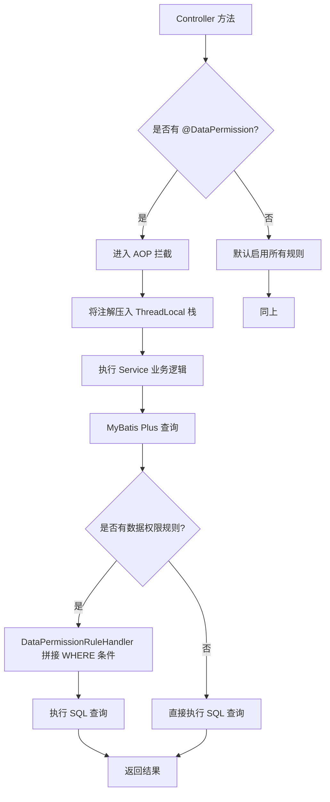
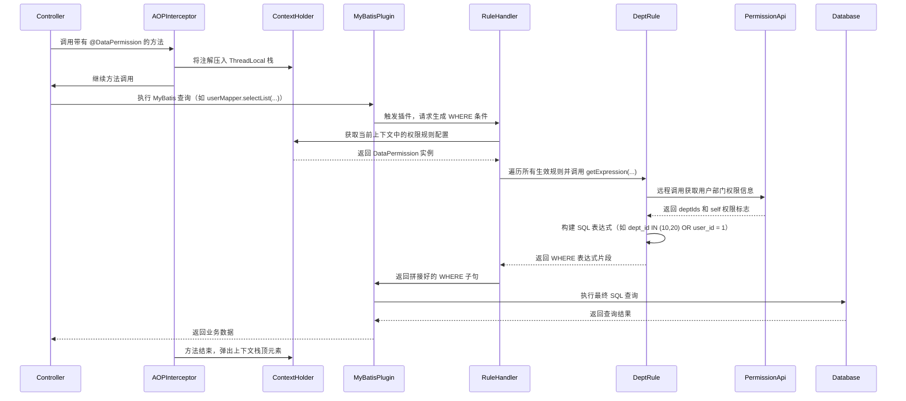
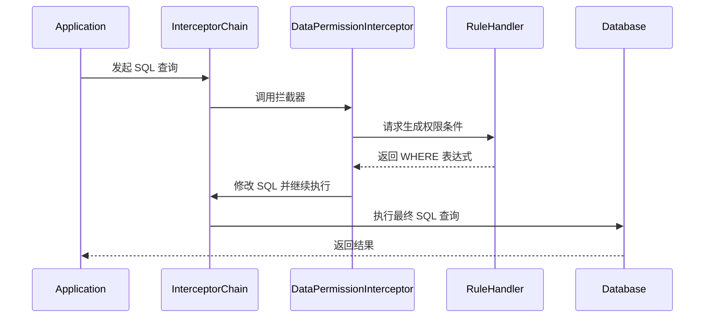

`pei-spring-boot-starter-biz-data-permission` 是一个 **数据权限模块**，其核心作用是为微服务系统提供 **基于 SQL
拦截的数据权限控制能力**。通过该模块，可以在查询数据库时动态添加 `WHERE` 条件，从而实现不同用户只能看到自己有权限访问的数据。

---

## 一、模块概述

### ✅ 模块定位

- **目标**：在 MyBatis Plus 查询执行前，根据当前登录用户的信息自动注入数据权限条件。
- **应用场景**：
    - 管理员 A 只能看到自己部门的数据。
    - 客服 B 只能查看自己负责的客户订单。
    - 租户隔离（多租户）场景下的数据过滤。
- **技术栈依赖**：
    - Spring Boot + MyBatis Plus
    - JSqlParser（SQL 解析）
    - AOP + ThreadLocal 上下文管理

---

## 二、目录结构说明

```
src/main/java/
└── com/pei/dehaze/framework/datapermission/
    ├── config/                                        // 自动配置类
    │   ├── DataPermissionAutoConfiguration.java       // 主要自动配置
    │   ├── DeptDataPermissionAutoConfiguration.java   // 基于部门的权限规则自动注册
    │   └── DataPermissionRpcAutoConfiguration.java    // RPC 调用透传数据权限上下文
    ├── core/
    │   ├── annotation/                                // 注解定义
    │   │   └── DataPermission.java                    // 数据权限注解，用于标注需要限制的方法或类
    │   ├── aop/                                       // AOP 切面逻辑
    │   │   ├── DataPermissionAnnotationAdvisor.java   // Advisor，处理注解切入点
    │   │   ├── DataPermissionAnnotationInterceptor.java // Interceptor，拦截方法并设置上下文
    │   │   └── DataPermissionContextHolder.java       // ThreadLocal 缓存上下文
    │   ├── db/                                        // SQL 层数据权限处理
    │   │   └── DataPermissionRuleHandler.java         // 实现 MultiDataPermissionHandler 接口，拼接 WHERE 条件
    │   ├── rule/                                      // 数据权限规则抽象与实现
    │   │   ├── dept/                                  // 基于部门的数据权限实现
    │   │   │   ├── DeptDataPermissionRule.java        // 部门数据权限规则
    │   │   │   └── DeptDataPermissionRuleCustomizer.java // 自定义扩展接口
    │   │   ├── DataPermissionRule.java                // 数据权限规则接口
    │   │   ├── DataPermissionRuleFactory.java         // 规则工厂接口
    │   │   └── DataPermissionRuleFactoryImpl.java     // 工厂实现类，支持 include/exclude 规则
    │   └── util/                                      // 工具类
    │       └── DataPermissionUtils.java               // 提供 ignore 方法，临时关闭数据权限
```

---

## 三、关键包详解

### 1️⃣ `config` 包

#### 🔹 `DataPermissionAutoConfiguration.java`

```java

@Bean
public DataPermissionRuleHandler dataPermissionRuleHandler(MybatisPlusInterceptor interceptor,
                                                           DataPermissionRuleFactory ruleFactory) {
    DataPermissionRuleHandler handler = new DataPermissionRuleHandler(ruleFactory);
    DataPermissionInterceptor inner = new DataPermissionInterceptor(handler);
    MyBatisUtils.addInterceptor(interceptor, inner, 0); // 添加到 MyBatis 插件链中
    return handler;
}
```

- **作用**：将自定义的 `DataPermissionRuleHandler` 注册为 MyBatis Plus 的插件。
- **原理**：利用 MyBatis Plus 的 `DataPermissionInterceptor` 插件，在 SQL 执行前注入数据权限表达式。

#### 🔹 `DeptDataPermissionAutoConfiguration.java`

```java

@Bean
public DeptDataPermissionRule deptDataPermissionRule(PermissionCommonApi permissionApi, List<DeptDataPermissionRuleCustomizer> customizers) {
}
```

- **作用**：注册基于“部门”的数据权限规则。
- **原理**：从远程调用 `permissionApi.getDeptDataPermission(userId)` 获取用户的部门权限信息，并构建 SQL 表达式。

#### 🔹 `DataPermissionRpcAutoConfiguration.java`

```java

@Bean
public DataPermissionRequestInterceptor dataPermissionRequestInterceptor() {
    return new DataPermissionRequestInterceptor();
}

@Bean
public FilterRegistrationBean<DataPermissionRpcWebFilter> dataPermissionRpcFilter() {
}
```

- **作用**：在 Feign/RPC 调用时，将数据权限状态透传给下游服务。
- **实现方式**：
    - `DataPermissionRequestInterceptor` 在请求头中写入 `data-permission-enable: false`。
    - `DataPermissionRpcWebFilter` 在接收方恢复上下文。

---

### 2️⃣ `annotation` 包

#### 🔹 `DataPermission.java`

```java

@Target({ElementType.TYPE, ElementType.METHOD})
@Retention(RetentionPolicy.RUNTIME)
public @interface DataPermission {
    boolean enable() default true;

    Class<? extends DataPermissionRule>[] includeRules() default {};

    Class<? extends DataPermissionRule>[] excludeRules() default {};
}
```

- **作用**：用于标记哪些类或方法需要启用数据权限。
- **使用示例**：
  ```java
  @DataPermission(enable = false)
  public interface UserService {}
  
  @DataPermission(includeRules = DeptDataPermissionRule.class)
  public class UserController {}
  ```

---

### 3️⃣ `aop` 包

#### 🔹 `DataPermissionAnnotationAdvisor.java`

```java
public class DataPermissionAnnotationAdvisor extends AbstractPointcutAdvisor {
    private final Advice advice;
    private final Pointcut pointcut;

    public DataPermissionAnnotationAdvisor() {
        this.advice = new DataPermissionAnnotationInterceptor();
        this.pointcut = this.buildPointcut();
    }
}
```

- **作用**：AOP Advisor，匹配带有 `@DataPermission` 的类或方法。
- **原理**：通过 `buildPointcut()` 构建切入点，交由 `DataPermissionAnnotationInterceptor` 处理。

#### 🔹 `DataPermissionAnnotationInterceptor.java`

```java

@Override
public Object invoke(MethodInvocation methodInvocation) throws Throwable {
    DataPermission dataPermission = findAnnotation(methodInvocation);
    if (dataPermission != null) {
        DataPermissionContextHolder.add(dataPermission);
    }
    try {
        return methodInvocation.proceed();
    } finally {
        if (dataPermission != null) {
            DataPermissionContextHolder.remove();
        }
    }
}
```

- **作用**：拦截方法调用，将 `@DataPermission` 注解内容压入上下文栈。
- **特性**：支持嵌套调用，出栈后自动恢复上一层权限状态。

#### 🔹 `DataPermissionContextHolder.java`

```java
private static final ThreadLocal<LinkedList<DataPermission>> DATA_PERMISSIONS =
        TransmittableThreadLocal.withInitial(LinkedList::new);

public static void add(DataPermission dataPermission) {
    DATA_PERMISSIONS.get().addLast(dataPermission);
}

public static DataPermission get() {
    return DATA_PERMISSIONS.get().peekLast();
}
```

- **作用**：线程上下文缓存当前方法的数据权限配置。
- **优势**：
    - 支持嵌套调用。
    - 使用 `TransmittableThreadLocal` 支持异步上下文传递。

---

### 4️⃣ `db` 包

#### 🔹 `DataPermissionRuleHandler.java`

```java
public Expression getSqlSegment(Table table, Expression where, String mappedStatementId) {
    List<DataPermissionRule> rules = ruleFactory.getDataPermissionRule(mappedStatementId);
    for (DataPermissionRule rule : rules) {
        if (!rule.getTableNames().contains(tableName)) continue;
        Expression oneExpress = rule.getExpression(tableName, table.getAlias());
        allExpression = allExpression == null ? oneExpress : new AndExpression(allExpression, oneExpress);
    }
    return allExpression;
}
```

- **作用**：MyBatis Plus 插件回调方法，生成最终的 SQL WHERE 条件。
- **流程**：
    1. 根据 Mapper ID 获取对应的权限规则集合。
    2. 对每条规则检查是否适用于当前表名。
    3. 如果适用，则调用 `getExpression(...)` 获取 SQL 片段。
    4. 将多个规则拼接成完整的 `AND` 表达式。

---

### 5️⃣ `rule` 包

#### 🔹 `DataPermissionRule.java`

```java
public interface DataPermissionRule {
    Set<String> getTableNames(); // 生效的表名列表

    Expression getExpression(String tableName, Alias tableAlias); // 生成 WHERE 表达式
}
```

- **作用**：定义数据权限规则的通用接口。
- **实现类**：可继承此接口，自定义不同的权限规则（如按角色、按组织等）。

#### 🔹 `DeptDataPermissionRule.java`

```java
public class DeptDataPermissionRule implements DataPermissionRule {
    private final PermissionCommonApi permissionApi;

    @Override
    public Expression getExpression(String tableName, Alias tableAlias) {
        LoginUser loginUser = SecurityFrameworkUtils.getLoginUser();
        DeptDataPermissionRespDTO deptDataPermission = loginUser.getContext();
        Expression deptExpr = buildDeptExpression(tableName, tableAlias, deptDataPermission.getDeptIds());
        Expression userExpr = buildUserExpression(tableName, tableAlias, deptDataPermission.getSelf(), loginUser.getId());

        return new OrExpression(deptExpr, userExpr); // 或者 AND
    }
}
```

- **作用**：实现基于部门的数据权限规则。
- **字段映射**：支持 `dept_id`、`user_id` 等字段自定义映射。
- **表达式构建**：
    - 如果用户属于多个部门，而部门id为10和20，则生成 `IN (10, 20)`。
    - 如果用户可以查看自己的数据，而该用户id为1，则生成 `user_id = 1`。
    - 最终组合为 `(dept_id IN (10, 20) OR user_id = 1)`。

#### 🔹 `DataPermissionRuleFactory.java`

```java
public interface DataPermissionRuleFactory {
    List<DataPermissionRule> getDataPermissionRules();

    List<DataPermissionRule> getDataPermissionRule(String mappedStatementId);
}
```

- **作用**：规则工厂接口，用于管理所有规则。
- **实现类**：`DataPermissionRuleFactoryImpl`，支持通过 `@DataPermission` 动态筛选生效的规则。

#### 🔹 `DataPermissionRuleFactoryImpl.java`

```java
public List<DataPermissionRule> getDataPermissionRule(String mappedStatementId) {
    if (CollUtil.isEmpty(rules)) return Collections.emptyList();
    DataPermission dataPermission = DataPermissionContextHolder.get();
    if (dataPermission == null) return rules;
    if (!dataPermission.enable()) return Collections.emptyList();
    if (ArrayUtil.isNotEmpty(dataPermission.includeRules())) {
    }
    if (ArrayUtil.isNotEmpty(dataPermission.excludeRules())) {
    }
    return rules;
}
```

- **作用**：根据当前上下文决定启用哪些数据权限规则。
- **策略**：
    - 默认开启所有规则。
    - 若设置了 `includeRules`，仅启用指定规则。
    - 若设置了 `excludeRules`，排除指定规则。

---

### 6️⃣ `util` 包

#### 🔹 `DataPermissionUtils.java`

```java
public static void executeIgnore(Runnable runnable) {
    DataPermissionContextHolder.add(getDisableDataPermission());
    try {
        runnable.run();
    } finally {
        DataPermissionContextHolder.remove();
    }
}
```

- **作用**：临时忽略数据权限校验。
- **使用场景**：系统内部调用、定时任务、数据迁移等无需权限判断的场景。

---

## 四、模块功能总结

| 包名           | 功能        | 关键类                                                                      |
|--------------|-----------|--------------------------------------------------------------------------|
| `config`     | 自动配置      | `DataPermissionAutoConfiguration`, `DeptDataPermissionAutoConfiguration` |
| `annotation` | 注解定义      | `DataPermission.java`                                                    |
| `aop`        | 拦截器与上下文   | `DataPermissionAnnotationInterceptor`, `DataPermissionContextHolder`     |
| `db`         | SQL 权限处理器 | `DataPermissionRuleHandler`                                              |
| `rule`       | 权限规则抽象    | `DataPermissionRule`, `DeptDataPermissionRule`                           |

---

## 五、模块工作流程图解



---



### 🔍 各组件职责说明（对应关键包详解）

| 参与者                                                      | 包路径                    | 职责                                       |
|----------------------------------------------------------|------------------------|------------------------------------------|
| `Controller`                                             | `pei-module-xxx` 中的业务层 | 发起数据库查询操作                                |
| `AOPInterceptor` (`DataPermissionAnnotationInterceptor`) | `core.aop`             | 拦截带有 `@DataPermission` 注解的方法，管理上下文生命周期   |
| `ContextHolder` (`DataPermissionContextHolder`)          | `core.aop`             | 使用 `TransmittableThreadLocal` 管理线程级权限上下文 |
| `MyBatisPlugin` (`DataPermissionInterceptor`)            | `db`                   | MyBatis 插件入口，拦截 SQL 执行                   |
| `RuleHandler` (`DataPermissionRuleHandler`)              | `db`                   | 协调所有数据权限规则，生成 WHERE 子句                   |
| `DeptRule` (`DeptDataPermissionRule`)                    | `rule.dept`            | 基于部门的数据权限规则实现类                           |
| `PermissionApi` (`PermissionCommonApi`)                  | RPC 接口                 | 通过 Feign 或 Dubbo 获取用户的权限信息               |
| `Database`                                               | MySQL / DBMS           | 执行最终带有 WHERE 条件的 SQL 查询                  |

---

### 📌 关键流程点解释

1. **上下文初始化**：

- 在 AOP 拦截器中将 `@DataPermission` 注解内容压入 `DataPermissionContextHolder`。
- 支持嵌套调用、异步任务传递。

2. **SQL 拦截与处理**：

- MyBatis 插件在 SQL 执行前触发。
- 从上下文中获取当前方法需要启用的权限规则集合。

3. **规则表达式构建**：

- 对每个匹配的表名，调用对应的 `DataPermissionRule.getExpression(...)`。
- 示例：`DeptDataPermissionRule` 会根据用户所属部门构建 `IN` 条件。

4. **远程权限获取**：

- 通过 `PermissionCommonApi` 接口远程调用权限服务，获取当前用户的部门列表。

5. **WHERE 条件拼接**：

- 多个规则之间使用 `AND` 或 `OR` 连接。
- 最终注入到 SQL 中执行。

6. **上下文清理**：

- 方法执行完成后，AOP 拦截器自动从上下文中移除当前权限配置。

---

## 六、使用方式

### 1️⃣ 在 Controller 层启用数据权限

```java

@RestController
@RequestMapping("/system/user")
@DataPermission(includeRules = DeptDataPermissionRule.class)
public class UserController {
}
```

### 2️⃣ 在 Mapper 层添加字段映射

```java

@Mapper
public interface UserMapper extends BaseMapper<UserDO> {
    default void init() {
        ((DeptDataPermissionRule) SpringUtil.getBean("deptDataPermissionRule")).addDeptColumn(UserDO.class);
    }
}
```

### 3️⃣ 忽略数据权限（用于系统内部调用）

```
DataPermissionUtils.executeIgnore(() -> {
    // 这里的查询不进行数据权限限制
    userMapper.selectById(1L);
});
```

---

## 七、技术概念详细解析

### 🔹 Spring Boot Auto Configuration Starter 简介

Spring Boot 的自动配置（Auto Configuration）是一种基于类路径和条件判断的自动化装配机制。它通过 `@ConditionalOnClass`、
`@ConditionalOnMissingBean` 等注解，在运行时决定是否注册某些 Bean。开发者只需引入合适的依赖，Spring Boot
即可自动完成相关组件的初始化，极大地提升了开发效率并减少了冗余配置。

在本项目中，`pei-spring-boot-starter-biz-data-permission` 模块作为一个典型的自定义 Starter，遵循了标准的 Spring Boot
自动配置规范。其核心原理如下：

1. **自动配置类注册**：

- 在 `src/main/resources/META-INF/spring.factories` 文件中声明自动配置类。
- 示例：
  `org.springframework.boot.autoconfigure.EnableAutoConfiguration=com.pei.framework.datapermission.config.DataPermissionAutoConfiguration`

2. **条件化 Bean 注册**：

- 使用 `@ConditionalOnClass` 判断是否存在指定类（如 `MyBatisPlusInterceptor`），避免无用的加载。
- 使用 `@ConditionalOnProperty` 控制功能开关（例如是否启用数据权限）。

3. **模块间解耦**：

- Starter 提供统一接口和服务封装，业务模块无需关心具体实现细节。
- 通过 SPI 机制支持规则扩展（如自定义数据权限规则）。

4. **上下文隔离与线程安全**：

- 借助 `ThreadLocal` 和 `TransmittableThreadLocal` 实现请求级别的数据权限上下文隔离。
- 避免线程复用导致的数据污染问题。

### 🔹 MyBatis Plus 插件机制详解

MyBatis Plus 提供了强大的插件机制，允许在 SQL 执行前后进行拦截和修改。这种机制基于 MyBatis 的拦截器链（Interceptor
Chain），通过对 `Executor`、`StatementHandler`、`ParameterHandler` 和 `ResultSetHandler` 四大对象的增强，实现对 SQL 流程的控制。

本模块通过自定义插件 `DataPermissionInterceptor` 实现了动态 WHERE 条件注入，其工作流程如下：

1. **插件注册阶段**：

- 在 `DataPermissionAutoConfiguration`
  中创建 `DataPermissionRuleHandler`
  Bean，并将其包装为 `DataPermissionInterceptor`。
- 将该拦截器添加到 `MyBatisPlusInterceptor` 中，确保在 SQL 执行前被调用。

2. **SQL 解析与拦截**：

- 当执行查询语句时，MyBatis Plus 调用所有注册的拦截器。
- `DataPermissionInterceptor`
  获取当前表名和别名，并调用 `DataPermissionRuleHandler`
  构建数据权限表达式。

3. **WHERE 条件拼接**：

- `DataPermissionRuleHandler`
  遍历所有生效的规则（如部门权限、角色权限等），生成对应的 SQL 片段。
- 多个规则之间使用 `AND` 或 `OR` 连接，最终合并成一个完整的 WHERE 子句。

4. **执行优化与缓存**：

- 规则结果会被缓存以减少重复计算。
- 使用 JSqlParser 对 SQL 进行结构化处理，保证拼接的安全性和准确性。

5. **插件链传递**：

- 插件不会中断原有的拦截器链，而是将控制权交还给下一个拦截器继续处理。
- 最终 SQL 包含数据权限过滤条件后传入数据库执行。

#### 📌 UML 图解 MyBatis Plus 插件流程



### 🔹 线程上下文

在多线程环境中，尤其是像 Java Web 应用这样基于线程池处理请求的系统中，**线程复用**是一个常见现象。如果使用普通的
`ThreadLocal` 来保存上下文（如用户身份、权限信息等），当一个请求被多个线程处理时（例如异步调用、线程池任务切换），上下文信息将无法正确传递，导致数据混乱或丢失。

在本模块中使用 `TransmittableThreadLocal` 线程上下文缓存当前方法的数据权限配置，是为了确保在复杂的异步调用、线程池、定时任务等场景中，
**数据权限上下文能够正确传递且安全可靠**，从而保障系统的安全性与一致性。通过线程上下文的使用，实现了以下功能：

1. **支持嵌套调用与方法链路隔离**：

- 在 AOP 拦截的方法中，可能嵌套调用其他带有不同数据权限注解的方法。
- 线程上下文可以维护一个“栈结构”，确保每个方法调用结束后恢复上一层的权限状态。

2. **避免全局变量污染**：

- 如果使用静态变量保存上下文，会导致并发请求之间相互干扰。
- 使用线程级变量（如 `ThreadLocal`）可以实现线程级别的数据隔离。

3. **支持事务边界与权限控制**：

- 数据权限上下文通常与一次完整的请求生命周期绑定。
- 在事务开始到结束期间，需要保持一致的权限条件，防止越权访问。

#### 🧠 为什么选择 `TransmittableThreadLocal` 而不是 `ThreadLocal` 或 `InheritableThreadLocal`？

| 场景            | ThreadLocal | InheritableThreadLocal | TransmittableThreadLocal |
|---------------|-------------|------------------------|--------------------------|
| 同一线程内         | ✅           | ✅                      | ✅                        |
| 子线程继承父线程上下文   | ❌           | ✅                      | ✅                        |
| 线程池复用场景下传递上下文 | ❌           | ❌                      | ✅                        |

📌 `ThreadLocal` 的局限性

- Java 原生的 ThreadLocal 是一种 线程局部变量机制，每个线程拥有独立的变量副本，互不干扰。其底层通过 Thread 对象内部的
  ThreadLocalMap 实现存储，键为 ThreadLocal 实例，值为线程绑定的数据。
- 只能在当前线程内部访问，不支持子线程或线程池任务之间的上下文传递。
- 当前请求中的某个异步任务可能会在线程池中执行，此时原始线程的 `ThreadLocal` 值将丢失。

📌 `InheritableThreadLocal` 的不足

- 支持子线程继承父线程的上下文，但线程池复用线程时不会每次都创建新线程，因此旧值会残留。
- 容易造成上下文泄露，影响后续请求的安全性和准确性。

📌 `TransmittableThreadLocal` 的优势

- 是阿里巴巴开源库 [TransmittableThreadLocal](https://github.com/alibaba/transmittable-thread-local) 提供的扩展类。
- 解决了线程池复用场景下的上下文传递问题，适用于：
    - 异步任务（`CompletableFuture`）
    - 定时任务（`ScheduledExecutorService`）
    - 请求链路中跨线程调用
- 继承自 InheritableThreadLocal，具备父子线程上下文继承能力。
- 内部通过 `TtlRunnable` 和 `TtlCallable` 包装任务，确保上下文在任务提交前后正确传递和还原。
- 本质上是通过对原始 Runnable 和 Callable 的装饰器（Wrapper）实现，通过在任务提交前捕获当前线程的上下文，并在线程池中的目标线程执行任务时恢复该上下文，从而实现跨线程的上下文透传。
- 支持自动清理机制，避免内存泄漏。

---

#### 🧩 实际应用效果

以本模块为例：

```
// 在 Controller 层拦截并压入权限配置
DataPermissionContextHolder.add(dataPermission);

// 在 Service 层调用 Mapper 查询数据库时，从上下文中获取权限规则
DataPermission dataPermission = DataPermissionContextHolder.get();
```

当服务中存在如下流程时：

```
CompletableFuture.runAsync(() -> {
    // 这里仍然能获取到主线程设置的数据权限上下文
    DataPermissionContextHolder.get();
});
```

如果不使用 `TransmittableThreadLocal`，该异步任务将无法获取正确的权限信息，可能导致查询越权或无权限过滤。

---

## 八、总结

`pei-spring-boot-starter-biz-data-permission` 模块实现了 **基于 SQL 的数据权限控制**，具有如下特点：

- **统一入口**：通过 `@DataPermission` 注解控制权限开关。
- **灵活规则**：通过实现 `DataPermissionRule` 接口可扩展任意规则。
- **高性能**：规则缓存在内存中，避免重复解析。
- **上下文隔离**：通过 `DataPermissionContextHolder` 实现线程安全的上下文管理。
- **RPC 支持**：在 Feign 调用时透传权限状态，确保一致性。
