`pei-spring-boot-starter-biz-tenant` 是一个 **多租户支持模块（Multi-Tenant Support Module）**，其核心作用是为企业级 SaaS
应用提供统一的多租户能力。该模块实现了以下核心功能：

- 数据库层多租户隔离（MyBatis Plus + 多租户插件）
- Redis 缓存多租户隔离（Key 拼接 `tenant_id`）
- HTTP 请求上下文管理（Header 中解析 `tenant_id`）
- 安全校验（防止越权访问其它租户数据）
- 任务调度支持（XXL-Job 支持多个租户并行执行）
- 消息队列支持（Kafka、RocketMQ、RabbitMQ、Redis MQ 自动透传 `tenant_id`）

---

## ✅ 模块概述

### 🎯 模块定位

- **目标**：构建统一的多租户支撑平台，支持：
    - 租户编号自动识别与传递
    - 租户数据隔离（数据库、缓存、消息队列）
    - 租户权限控制（防止用户跨租户访问）
- **应用场景**：
    - SaaS 系统中不同企业使用各自独立数据空间
    - 共享部署下的资源隔离
    - 企业级微服务间租户信息透传

### 🧩 技术栈依赖

- **Spring Boot + Spring Cloud Gateway + Nacos**
- **数据访问层**：
    - MyBatis Plus + MySQL + Redis
- **消息队列**：
    - RocketMQ + XXL-Job（用于异步处理和定时任务）
- **安全认证**：
    - Spring Security + Token + Redis Session
- **其他工具类**：
    - Hutool 工具库、MapStruct 转换器、Jackson 多态序列化

---

## 📁 目录结构说明

```
src/main/java/
└── com/pei/dehaze/framework/tenant/
    ├── config/                  // 配置类
    │   ├── PeiTenantAutoConfiguration.java  // 主配置类
    │   └── TenantProperties.java            // 租户配置属性
    ├── core/                    // 核心逻辑实现
    │   ├── aop/                 // AOP 切面处理
    │   ├── context/             // 租户上下文管理
    │   ├── db/                  // 数据库层多租户拦截器
    │   ├── job/                 // XXL-Job 多租户支持
    │   ├── mq/                  // 消息队列多租户支持
    │   ├── redis/               // Redis 缓存多租户支持
    │   ├── rpc/                 // Feign RPC 多租户支持
    │   ├── security/            // 安全校验（如防止越权）
    │   ├── service/             // 租户服务接口
    │   ├── util/                // 工具类封装
    │   └── web/                 // Web 层过滤器、拦截器
    └── package-info.java        // 模块描述文档
```

---

## 🔍 关键包详解

### 1️⃣ `config` 包 —— 多租户配置加载

#### 示例：`TenantProperties.java`

```java

@ConfigurationProperties(prefix = "pei.tenant")
@Data
public class TenantProperties {

    private final Boolean enable = true;

    private final Set<String> ignoreUrls = new HashSet<>();
    private final Set<String> ignoreVisitUrls = Collections.emptySet();
    private final Set<String> ignoreTables = Collections.emptySet();
    private final Set<String> ignoreCaches = Collections.emptySet();

}
```

- **作用**：从 `application.yaml` 中读取多租户配置。
- **字段说明**：
    - `ignoreUrls`: 忽略租户验证的 URL
    - `ignoreTables`: 忽略租户隔离的数据表
    - `ignoreCaches`: 忽略租户隔离的缓存 Key
- **用途**：
    - 控制哪些接口不强制要求 `tenant_id`
    - 控制哪些表不启用多租户隔离

---

### 2️⃣ `core.context` 包 —— 租户上下文管理

#### 示例：`TenantContextHolder.java`

```java
public class TenantContextHolder {
    private static final ThreadLocal<Long> TENANT_ID = new TransmittableThreadLocal<>();
    private static final ThreadLocal<Boolean> IGNORE = new TransmittableThreadLocal<>();

    public static Long getTenantId() {
        return TENANT_ID.get();
    }

    public static void setTenantId(Long tenantId) {
        TENANT_ID.set(tenantId);
    }

    public static boolean isIgnore() {
        return Boolean.TRUE.equals(IGNORE.get());
    }

    public static void setIgnore(Boolean ignore) {
        IGNORE.set(ignore);
    }

    public static void clear() {
        TENANT_ID.remove();
        IGNORE.remove();
    }
}
```

- **作用**：线程级别的租户 ID 和忽略标志管理。
- **关键特性**：
    - 使用 `TransmittableThreadLocal` 支持线程池传递
    - 提供 `setTenantId(...)` 和 `clear()` 方法保证线程复用问题
- **设计模式**：
    - 单例模式
    - 线程安全（TLS）

---

### 3️⃣ `core.web` 包 —— Web 层租户上下文过滤器

#### 示例：`TenantContextWebFilter.java`

```java
public class TenantContextWebFilter extends OncePerRequestFilter {
    @Override
    protected void doFilterInternal(HttpServletRequest request, HttpServletResponse response, FilterChain chain)
            throws ServletException, IOException {
        Long tenantId = WebFrameworkUtils.getTenantId(request);
        if (tenantId != null) {
            TenantContextHolder.setTenantId(tenantId);
        }
        try {
            chain.doFilter(request, response);
        } finally {
            TenantContextHolder.clear();
        }
    }
}
```

- **作用**：在每个请求开始时设置租户上下文，在请求结束时清理。
- **流程说明**：
    1. 从 Header 解析 `tenant_id`
    2. 设置到 `TenantContextHolder`
    3. 执行后续过滤器链
    4. 清理线程本地变量
- **设计模式**：
    - 过滤器链模式
    - TLS 上下文传递机制

---

### 4️⃣ `core.security` 包 —— 租户安全校验过滤器

#### 示例：`TenantSecurityWebFilter.java`

```java

@Override
private void doFilterInternal(HttpServletRequest request, HttpServletResponse response, FilterChain chain)
        throws ServletException, IOException {
    LoginUser user = SecurityFrameworkUtils.getLoginUser();
    if (user != null) {
        if (tenantId == null) {
            tenantId = user.getTenantId();
        } else if (!Objects.equals(user.getTenantId(), TenantContextHolder.getTenantId())) {
            ServletUtils.writeJSON(response, CommonResult.error(FORBIDDEN.getCode(), "您无权访问该租户的数据"));
            return;
        }
    }
    chain.doFilter(request, response);
}
```

- **作用**：校验当前登录用户是否可以访问指定租户。
- **流程说明**：
    1. 获取当前用户登录信息
    2. 如果未传 `tenant_id`，使用用户默认租户
    3. 如果传了 `tenant_id`，但与用户租户不符，返回 403
- **设计模式**：
    - 前置过滤器（PreFilter）

---

### 5️⃣ `core.db` 包 —— 数据库层多租户拦截器

#### 示例：`TenantDatabaseInterceptor.java`

```java
public class TenantDatabaseInterceptor implements TenantLineHandler {
    @Override
    public Expression getTenantId() {
        return new LongValue(TenantContextHolder.getRequiredTenantId());
    }

    @Override
    public boolean ignoreTable(String tableName) {
        return ignoreTables.containsKey(tableName.toLowerCase());
    }
}
```

- **作用**：MyBatis Plus 插件，实现数据库多租户隔离。
- **关键逻辑**：
    - 在 SQL 查询时自动添加 `tenant_id = ?` 条件
    - 支持忽略某些表（如 `sys_user`, `sys_role`）
- **事务控制**：
    - 通过 `@Transactional` 注解确保一致性

---

### 6️⃣ `core.redis` 包 —— Redis 缓存多租户隔离

#### 示例：`TenantRedisCacheManager.java`

```java
public class TenantRedisCacheManager extends TimeoutRedisCacheManager {
    @Override
    public Cache getCache(String name) {
        if (!TenantContextHolder.isIgnore()
                && TenantContextHolder.getTenantId() != null
                && !CollUtil.contains(ignoreCaches, name)) {
            name = name + ":" + TenantContextHolder.getTenantId();
        }
        return super.getCache(name);
    }
}
```

- **作用**：Redis 缓存 Key 自动拼接租户 ID。
- **优势**：
    - 实现缓存级别的租户隔离
    - 无需手动修改业务代码即可实现 Key 分离
- **适用场景**：
    - 用户信息缓存、Token 缓存等需隔离的数据

---

### 7️⃣ `core.mq` 包 —— 消息队列多租户支持

#### 示例：`TenantRocketMQSendMessageHook.java`

```java
public class TenantRocketMQSendMessageHook implements SendMessageHook {
    @Override
    public void sendMessageBefore(SendMessageContext sendMessageContext) {
        Long tenantId = TenantContextHolder.getTenantId();
        if (tenantId != null) {
            sendMessageContext.getMessage().putUserProperty(HEADER_TENANT_ID, tenantId.toString());
        }
    }
}
```

- **作用**：在发送 RocketMQ 消息前自动注入 `tenant_id`。
- **消费端处理**：
    - 通过 `TenantRocketMQConsumeMessageHook` 将 `tenant_id` 写入上下文
- **扩展性**：
    - 支持 Kafka、RabbitMQ、Redis MQ 的自动透传

---

### 8️⃣ `core.job` 包 —— XXL-Job 多租户支持

#### 示例：`TenantJobAspect.java`

```java

@Around("@annotation(tenantJob)")
public void around(ProceedingJoinPoint joinPoint, TenantJob tenantJob) {
    List<Long> tenantIds = tenantFrameworkService.getTenantIds();
    tenantIds.parallelStream().forEach(tenantId -> {
        TenantUtils.execute(tenantId, () -> {
            joinPoint.proceed();
        });
    });
}
```

- **作用**：定时任务（XXL-Job）支持多个租户并行执行。
- **关键逻辑**：
    - 从远程服务获取所有租户 ID
    - 对每个租户执行一次 Job 逻辑
- **性能优化**：
    - 使用 `parallelStream()` 并发执行任务

---

### 9️⃣ `core.util` 包 —— 多租户工具类

#### 示例：`TenantUtils.java`

```java
public class TenantUtils {
    public static void execute(Long tenantId, Runnable runnable) {
        Long oldTenantId = TenantContextHolder.getTenantId();
        Boolean oldIgnore = TenantContextHolder.isIgnore();
        try {
            TenantContextHolder.setTenantId(tenantId);
            TenantContextHolder.setIgnore(false);
            runnable.run();
        } finally {
            TenantContextHolder.setTenantId(oldTenantId);
            TenantContextHolder.setIgnore(oldIgnore);
        }
    }
}
```

有些情况下，可能需要以某个特定租户的身份去执行一段代码，比如：

- 定时任务中处理多个租户的数据。
- 系统内部操作，如后台管理任务或跨租户查询。
- 数据迁移、批量处理等特殊场景。

在这种情况下，我们不能直接修改全局的租户上下文，否则可能会导致其他线程受影响。因此，我们需要一种机制来：

- 临时设置目标租户上下文；
- 执行任务；
- 恢复原来的上下文，避免副作用。

使用方式：

```
TenantUtils.execute(tenantId, () -> {
  // 在这里执行属于某个租户的操作
});
```

---

### 🔟 `core.aop` 包 —— AOP 支持忽略租户逻辑

#### 示例：`TenantIgnoreAspect.java`

```java

@Around("@annotation(tenantIgnore)")
public Object around(ProceedingJoinPoint joinPoint, TenantIgnore tenantIgnore) throws Throwable {
    Boolean oldIgnore = TenantContextHolder.isIgnore();
    try {
        if (Boolean.TRUE.equals(SpringExpressionUtils.parseExpression(tenantIgnore.enable()))) {
            TenantContextHolder.setIgnore(true);
        }
        return joinPoint.proceed();
    } finally {
        TenantContextHolder.setIgnore(oldIgnore);
    }
}
```

- **作用**：支持方法级别忽略租户隔离。
- **使用方式**：
  ```java
  @TenantIgnore
  public void globalOperation() {
      // 这个方法将忽略租户隔离
  }
  ```

- **应用场景**：
    - 统计分析类操作
    - 系统级全局操作

---

## 🧠 模块工作流程图解

### 多租户模块代码流程图

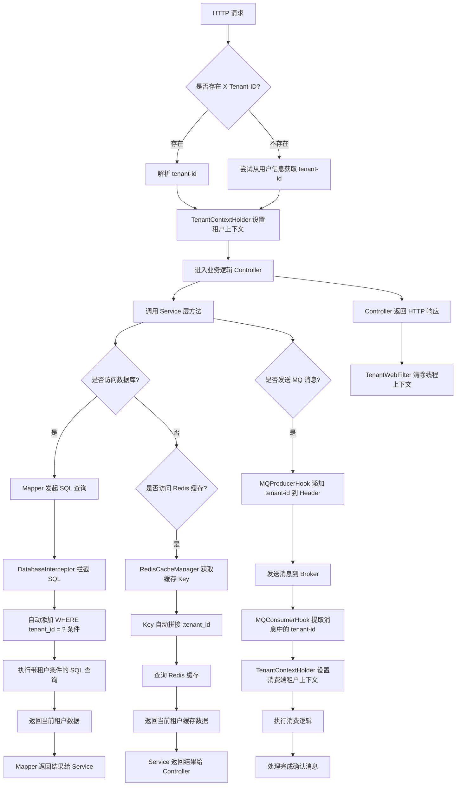

🧩 图解说明与逻辑细化

1. **HTTP 请求入口**

- 客户端发起请求，并可选携带 `X-Tenant-ID`。
- 示例：
  ```http
  GET /api/user HTTP/1.1
  Host: localhost:8080
  X-Tenant-ID: 123456
  ```

2. **TenantWebFilter 解析租户信息**

- 系统注册了一个名为 `TenantWebFilter` 的 Servlet Filter。
- 该 Filter 会优先从请求头中提取 `X-Tenant-ID`。
- 如果请求头中没有提供租户信息，则尝试通过认证信息（如 Token）从用户信息中获取租户 ID。

3. **TenantContextHolder 设置上下文**

- 使用 `TenantContextHolder.setTenantId(tenantId)` 将租户 ID 存储到线程上下文中。
- 保证在整个请求生命周期内，所有涉及数据库操作、缓存操作、消息队列的组件都可以访问当前租户信息。

4. **进入 Controller 层处理**

- 请求进入 Controller 层进行业务处理。
- 此时线程上下文中已包含租户 ID，后续数据库查询将自动带上租户过滤条件。

5. **调用 Service 层方法**

- Controller 调用 Service 层方法处理具体业务逻辑。
- Service 层可能会调用多个 DAO 或 Mapper 方法进行数据操作，也可能访问 Redis 缓存或发送消息。

6. **Mapper 执行数据库查询**

- MyBatis Mapper 执行 SQL 查询。
- 在 SQL 执行前，触发自定义的 `DatabaseInterceptor`（SQL 拦截器）。

7. **DatabaseInterceptor 添加租户条件**

- 拦截器从 `TenantContextHolder` 获取当前线程的租户 ID。
- 动态修改原始 SQL，添加 `WHERE tenant_id = ?` 条件，实现数据隔离。
- 示例：
  ```sql
  SELECT * FROM user WHERE id = 1;
  -- 改写为：
  SELECT * FROM user WHERE id = 1 AND tenant_id = 123456;
  ```

8. **Redis 缓存 Key 自动拼接租户 ID**

- 当调用 `cache.get("user:info:1024")` 时，`TenantRedisCacheManager` 会自动判断是否开启租户隔离。
- 如果开启，则实际缓存 Key 为：`user:info:1024:123456`。
- 保证不同租户的数据不会互相污染。

9. **发送 RocketMQ 消息时注入租户信息**

- Producer 发送消息时，`TenantRocketMQSendMessageHook` 会自动将 `tenant_id` 写入消息 Header。
- 示例：
  ```
  message.putUserProperty("X-Tenant-ID", "123456");
  ```

10. **消费者端恢复租户上下文**

- Consumer 接收到消息后，通过 `TenantRocketMQConsumeMessageHook` 提取消息 Header 中的 `X-Tenant-ID`。
- 设置到 `TenantContextHolder` ，确保消费过程使用正确的租户上下文。

11. **清理线程上下文**

- 请求结束后，`TenantWebFilter` 调用 `TenantContextHolder.clear()` 清除当前线程的租户信息。
- 防止线程复用导致租户信息污染其他请求。

---

#### 1️⃣ Redis 缓存多租户隔离子流程图

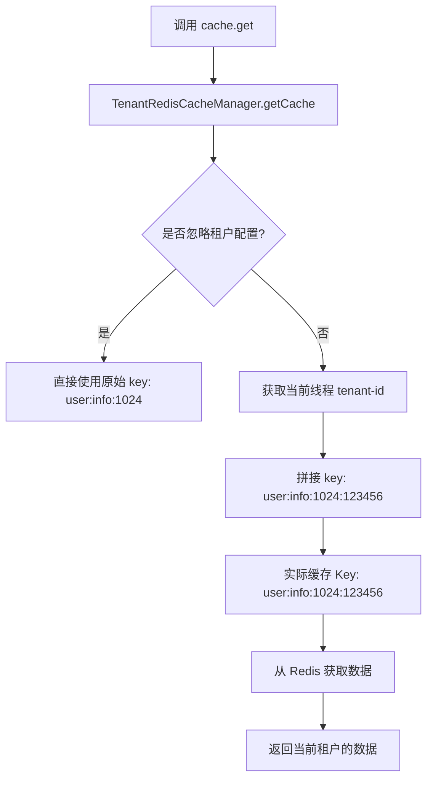

📌 流程说明：

- **A → B**：业务层调用 `cache.get("user:info:1024")`
- **B → C**：进入 `TenantRedisCacheManager` 进行 Key 处理
- **C 判断是否忽略租户隔离**
    - 如果是白名单缓存（如系统级统计），则跳过租户隔离
- **E 获取当前线程上下文中的 tenant-id**
- **F → G**：将原始 Key 拼接为 `key:tenant_id` 格式
- **H → I**：从 Redis 获取对应租户的数据

---

#### 2️⃣ RocketMQ 消息队列消费子流程图（生产 + 消费）

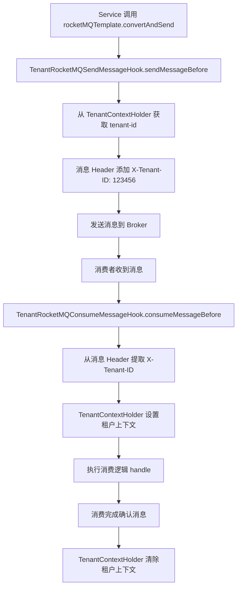

📌 流程说明：

- **A → D**：在消息发送前通过 `TenantRocketMQSendMessageHook` 自动注入 `X-Tenant-ID`
- **F → I**：在消息消费前通过 `TenantRocketMQConsumeMessageHook` 提取消息头中的 `X-Tenant-ID` 并设置上下文
- **J → L**：执行消费逻辑后清理线程上下文

---

#### 3️⃣ XXL-Job 支持多个租户并行执行子流程图

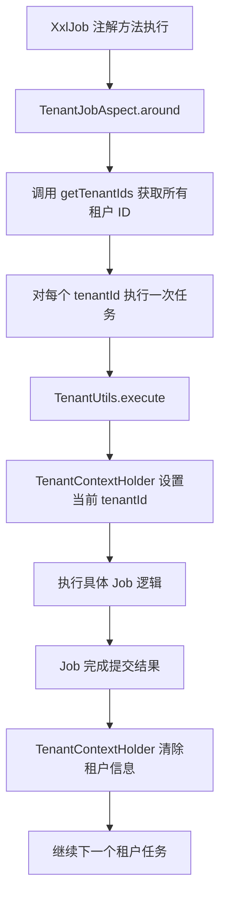

📌 流程说明：

- **A → B**：通过 `TenantJobAspect` 实现环绕增强
- **C 获取所有租户 ID**：通常通过远程服务或数据库查询获得所有租户列表
- **D → E**：对每个租户 ID 调用 `TenantUtils.execute()`，临时设置租户上下文
- **F → G**：执行实际的任务逻辑，此时所有数据库、缓存访问都会带上当前租户条件
- **I → J**：任务完成后清除上下文，防止污染下一个租户任务

---

### 多租户模块代码时序图

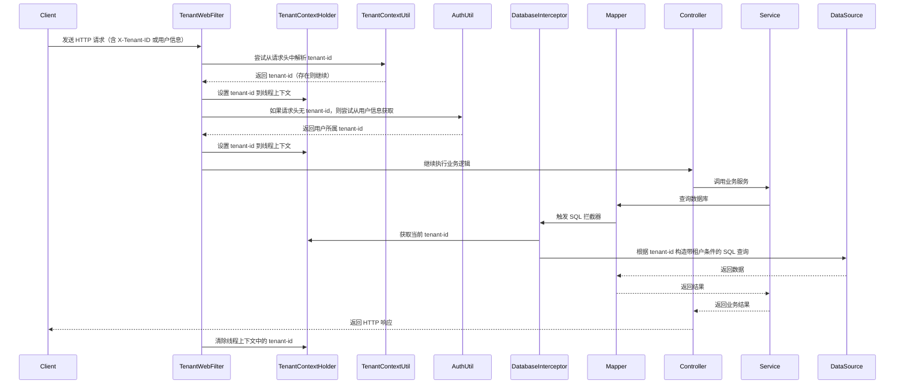

---

📚 流程说明与逻辑解析

1. **客户端发送请求**

- 客户端向服务端发起 HTTP 请求。
- 可选地在请求头中携带 `X-Tenant-ID` 字段，用于指定租户 ID。
  ```http
  GET /api/user HTTP/1.1
  Host: localhost:8080
  X-Tenant-ID: 123456
  ```

2. **TenantWebFilter 解析租户信息**

- 系统注册了一个名为 `TenantWebFilter` 的 Servlet Filter。
- 该 Filter 会优先从请求头中提取 `X-Tenant-ID`。
- 如果请求头中没有提供租户信息，则尝试通过认证信息（如 Token）从用户信息中获取租户 ID。

3. **TenantContextHolder 设置上下文**

- 使用 `TenantContextHolder.setTenantId(tenantId)` 将租户 ID 存储到线程上下文中。
- 保证在整个请求生命周期内，所有涉及数据库操作的组件都可以访问当前租户信息。

4. **进入 Controller 层处理**

- 请求进入 Controller 层进行业务处理。
- 此时线程上下文中已包含租户 ID，后续数据库查询将自动带上租户过滤条件。

5. **调用业务服务**

- Controller 调用 Service 层方法处理具体业务逻辑。
- Service 层可能会调用多个 DAO 或 Mapper 方法进行数据操作。

6. **Mapper 执行数据库查询**

- MyBatis Mapper 执行 SQL 查询。
- 在 SQL 执行前，触发自定义的 `DatabaseInterceptor`（SQL 拦截器）。

7. **DatabaseInterceptor 添加租户条件**

-

拦截器从 `TenantContextHolder`
获取当前线程的租户 ID。

- 动态修改原始 SQL，添加 `WHERE tenant_id = ?` 条件，实现数据隔离。
- 示例：
  ```sql
  SELECT * FROM user WHERE id = 1;
  -- 改写为：
  SELECT * FROM user WHERE id = 1 AND tenant_id = 123456;
  ```


8. **返回数据并处理响应**

- 数据库返回符合条件的数据。
- Mapper 将结果返回给 Service，Service 返回给 Controller。
- Controller 返回 HTTP 响应给客户端。

9. **清理线程上下文**

- 请求结束后，`TenantWebFilter`
  调用 `TenantContextHolder.clear()`
  清除当前线程的租户信息。
- 防止线程复用导致租户信息污染其他请求。

---

## 🧩 模块功能总结

| 包名                 | 功能            | 关键类                             |
|--------------------|---------------|---------------------------------|
| `config`           | 配置加载          | `TenantProperties`              |
| `core.context`     | 租户上下文管理       | `TenantContextHolder`           |
| `core.web`         | 租户过滤器         | `TenantContextWebFilter`        |
| `core.security`    | 租户安全校验        | `TenantSecurityWebFilter`       |
| `core.db`          | 数据库租户拦截器      | `TenantDatabaseInterceptor`     |
| `core.redis`       | Redis 缓存租户隔离  | `TenantRedisCacheManager`       |
| `core.mq.rocketmq` | RocketMQ 租户支持 | `TenantRocketMQSendMessageHook` |
| `core.job`         | XXL-Job 多租户支持 | `TenantJobAspect`               |
| `core.aop`         | AOP 忽略租户支持    | `TenantIgnoreAspect`            |

---

## ✨ 技术概念详解

### 🔄 Spring Boot ConfigurationProperties 实现原理

`@ConfigurationProperties` 是 Spring Boot 提供的一种机制，用于将外部配置（如 `application.yaml` 或
`application.properties`）映射为 Java Bean。其背后的核心实现依赖于 **Spring Environment 抽象模型** 和 **BeanPostProcessor
扩展机制**。

#### 1️⃣ Spring Environment 抽象模型

##### 📌 概念简介：

`Environment` 是 Spring 框架中用于管理 **配置属性（Properties）** 和 **环境信息（Profile）**
的核心抽象接口。它为应用程序提供了一种统一的方式来访问不同来源的配置数据，如系统环境变量、JVM 参数、配置文件等。

##### 🔍 核心组成结构：

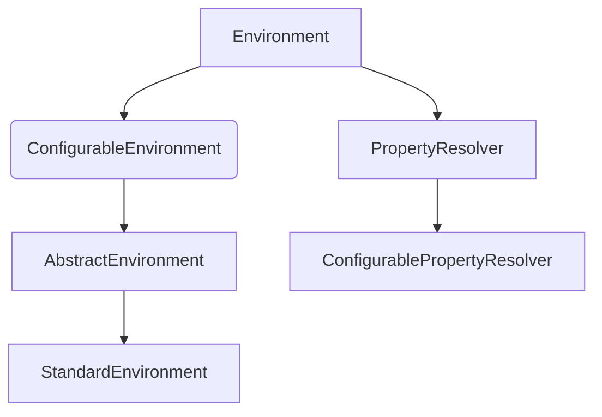

- `Environment`：定义了基础的环境访问方法。
- `PropertyResolver`：支持属性解析功能（如占位符替换）。
- `ConfigurableEnvironment`：扩展了可配置的方法（如设置 Active Profiles）。
- `StandardEnvironment`：标准实现类，适用于大多数非 Web 应用场景。
- `WebEnvironment`：专为 Web 应用设计的子接口。

##### ⚙️ 工作原理：

1. **多层级 PropertySource 管理**：
    - Spring 使用 `PropertySources` 来组织多个属性源（如系统环境变量、JVM 参数、`application.yaml` 等）。
    - 属性源按照优先级顺序排列，例如命令行参数 > JVM 参数 > 配置文件 > 系统环境变量。

2. **配置加载流程**：
    - 应用启动时，Spring Boot 自动加载 `application.properties`
      或 `application.yml`
      文件。
    - 通过 `Environment` 接口将这些属性注入到对应的 `@ConfigurationProperties` 对象中。

3. **Profile 支持**：
    - 可以通过 `spring.profiles.active=dev` 激活特定环境配置。
    - 不同 Profile 下可以拥有不同的数据库连接、日志级别等配置。

4. **属性解析与绑定**：
    - `Environment` 支持 `${}` 占位符解析。
    - 结合 `@Value("${xxx}")` 注解或 `@ConfigurationProperties` 实现自动绑定。

##### 🔄 典型应用场景：

| 场景    | 描述                               |
|-------|----------------------------------|
| 多环境配置 | 开发、测试、生产使用不同的数据库连接               |
| 动态配置  | 通过 Spring Cloud Config 实现远程配置热更新 |
| 属性注入  | 将外部配置注入到业务组件中进行初始化               |

---

#### 2️⃣ BeanPostProcessor 扩展机制

##### 📌 概念简介：

`BeanPostProcessor` 是 Spring 容器提供的一个扩展点接口，允许开发者在 **Bean 初始化前后** 插入自定义逻辑。它是 Spring
实现各种高级特性的基石之一，例如 AOP、自动代理、注解处理等。

##### 📐 接口定义：

```java
public interface BeanPostProcessor {
    Object postProcessBeforeInitialization(Object bean, String beanName) throws BeansException;

    Object postProcessAfterInitialization(Object bean, String beanName) throws BeansException;
}
```

- `postProcessBeforeInitialization`：在 Bean 初始化之前执行（即调用 `InitializingBean.afterPropertiesSet()` 或自定义
  `init-method` 之前）。
- `postProcessAfterInitialization`：在 Bean 初始化之后执行。

##### ⚙️ 工作原理：

1. **注册阶段**：
    - 用户可以通过 `@Component` 或 `@Bean` 方式将自定义的 `BeanPostProcessor` 注册到容器中。
    - Spring 在启动过程中会收集所有 `BeanPostProcessor` 并按顺序执行。

2. **执行顺序**：
    - 若有多个 `BeanPostProcessor`，可通过实现 `Ordered` 接口控制执行顺序。
    - 默认情况下按 Bean 名称排序。

3. **作用对象**：
    - 适用于所有由 Spring 管理的 Bean。
    - 特别适合对第三方库中的 Bean 进行增强处理（如动态代理、属性修改等）。

4. **典型用途**：
    - AOP 增强：为 Bean 创建代理对象。
    - 注解处理：扫描并处理自定义注解。
    - 属性填充：为某些 Bean 设置额外属性。
    - 缓存构建：缓存某些 Bean 的创建过程。

##### 🔄 示例流程图：

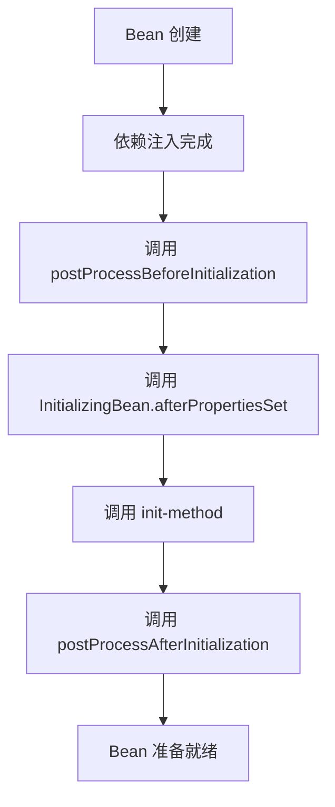

##### 📌 应用示例：

- `AutowiredAnnotationBeanPostProcessor`：负责处理 `@Autowired` 注解。
- `CommonAnnotationBeanPostProcessor`：处理 `@Resource`, `@PostConstruct` 等 JSR-250 注解。
- `AspectJAwareAdvisorAutoProxyCreator`：AOP 功能的核心处理器，负责生成代理对象。

---

#### 🔄 整体流程说明：

1. **配置读取**：
    - Spring Boot 启动时加载 `application.yaml`。
    - 通过 `Environment` 接口从 `PropertySources` 中提取配置项。

2. **Bean 创建**：
    - 当遇到带有 `@ConfigurationProperties(prefix = "pei.tenant")` 的类时，Spring Boot 会扫描所有以 `pei.tenant`
      开头的配置项，创建该类的实例，将该类注册为单例 Bean。
    - 使用泛型集合、嵌套对象等结构时，Spring 会递归解析配置并构建完整的对象图。
    - 例如：`Set<String> ignoreUrls` 可以直接绑定 `pei.tenant.ignore-urls=abc,def`。
    - 此时会触发 `BeanPostProcessor` 链的执行。

3. **属性绑定**：
    - `ConfigurationPropertiesBindingPostProcessor` 是 Spring 提供的一个内置 `BeanPostProcessor`。
    - 它会在 `postProcessBeforeInitialization` 阶段将配置属性绑定到目标对象上。

4. **校验与返回**：
    - 如果配置中包含 `@Validated` 注解，则会进行 JSR-303 校验。
    - 默认值可以在字段上直接初始化，也可以通过构造方法设置。
    - 最终返回已绑定和校验过的 Bean。

##### 🔄 数据流图示：

```mermaid
graph TD
    A[application.yaml] --> B(Environment 加载配置)
    B --> C[BeanFactory 创建 ConfigurationProperties Bean]
    C --> D[调用 BeanPostProcessor 链]
    D --> E[ConfigurationPropertiesBindingPostProcessor 绑定属性]
    E --> F[@Validated 校验]
F --> G[Bean 初始化完成]
```

#### 🔄 应用场景与优势：

| 特性    | 说明                                                |
|-------|---------------------------------------------------|
| 简洁性   | 一行代码即可完成复杂配置映射                                    |
| 可维护性  | 配置集中管理，便于阅读和修改                                    |
| 类型安全性 | 自动转换和校验，避免运行时错误                                   |
| 动态更新  | 结合 `@RefreshScope` 支持热更新（需配合 Spring Cloud Config） |

#### 🔗 关系图示：

```
mermaid
graph TD
A[application.yaml] --> B(Spring Environment)
B --> C(ConfigurationPropertiesBindHandler)
C --> D[TenantProperties]
D --> E[其他组件使用配置]
```

通过 `@ConfigurationProperties`，我们实现了对多租户模块灵活而高效的配置管理，使得整个系统具备更强的可扩展性和可维护性。

### 🧠 什么是 `ContextHolder`？

在多租户系统或需要跨层级共享上下文信息的场景中，`ContextHolder` 是一种非常常见且关键的设计模式。它的本质是一个 *
*线程上下文持有者工具类**，用于在 **当前线程执行期间存储、传递和清理上下文信息**。

#### ✅ 定义与核心作用：

- **ContextHolder** 是一个 **静态工具类**，通常采用 **单例模式 + ThreadLocal 模式**。
- 它的作用是为当前线程提供一个“上下文容器”，可以临时保存诸如：
    - 当前租户 ID
    - 登录用户信息
    - 请求追踪 ID（traceId）
    - 国际化语言设置等

`TenantContextHolder` 是一个典型的 **线程上下文持有者（Thread Context Holder）**，它采用了 **单例模式 + ThreadLocal 模式**
来实现跨层级调用的数据隔离。

1. **单例模式（Singleton Pattern）**：
    - 整个 JVM 生命周期内仅存在一个实例。
    - 保证了全局访问的一致性，所有组件都通过同一个入口获取或设置租户上下文。

2. **线程本地变量（ThreadLocal Pattern）**：
    - 使用 `TransmittableThreadLocal` 替代原生 `ThreadLocal`，解决了线程池传递问题。
    - 每个线程拥有独立副本，互不干扰，从而实现了线程级别的数据隔离。
    - 不同请求之间不会互相干扰。
    - 业务层、DAO 层、缓存层均可通过 `TenantContextHolder.getTenantId()` 获取当前线程的租户上下文。

#### 🎯 为什么需要使用 `ContextHolder`？

##### 1. **避免参数透传**

如果不使用 ContextHolder，上下文信息必须通过方法参数层层传递，导致：

- 方法签名臃肿
- 调用链复杂
- 业务逻辑与上下文信息耦合

ContextHolder 的存在使得这些信息可以**全局访问**，而无需显式传递。

##### 2. **线程安全控制**

在并发环境下，多个请求可能同时执行。ContextHolder 使用 `ThreadLocal` 或其增强版（如 Alibaba 的 `TransmittableThreadLocal`
），确保每个线程拥有独立副本，互不干扰。

##### 3. **支持异步调用和线程池**

原生 `ThreadLocal` 在线程池中复用线程时会丢失上下文。使用 `TransmittableThreadLocal` 可以在线程切换时自动继承上下文，适用于：

- 异步任务（@Async）
- 定时任务（XXL-Job）
- 消息队列消费（RocketMQ）

##### 4. **统一上下文生命周期管理**

ContextHolder 提供了统一的设置（set）、获取（get）和清理（clear）接口，保证上下文不会因未清理而导致数据污染或内存泄漏。

---

#### 🔄 工作原理图示

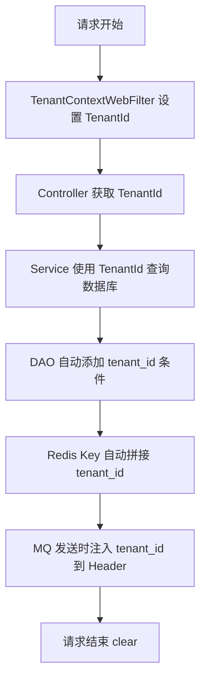

---

#### 📌 典型应用场景

| 场景        | 使用方式                   |
|-----------|------------------------|
| **多租户识别** | 存储当前租户 ID，用于数据库查询、缓存隔离 |
| **权限校验**  | 存储登录用户信息，用于鉴权判断        |
| **链路追踪**  | 存储 traceId，用于日志追踪      |
| **国际化处理** | 存储 locale，用于多语言展示      |
| **事务控制**  | 存储是否只读、是否开启分布式事务       |

---

#### ⚠️ 注意事项

- 必须在请求结束时调用 `clear()` 方法清理上下文，防止线程复用导致的数据泄露。
- 在线程池环境中务必使用 `TransmittableThreadLocal` 替代原生 `ThreadLocal`。
- 不要滥用 ContextHolder 存储过多状态信息，应保持轻量级设计。

---

### 🧠 Spring Boot 中的过滤器与拦截器深度解析

在 Spring Boot 应用中，**过滤器（Filter）** 和 **拦截器（Interceptor）**
是两个非常重要的组件，它们分别位于不同的层级，用于实现诸如请求日志、权限校验、多租户识别、跨域处理等通用功能。虽然它们都具备“拦截请求”的能力，但在实现原理和使用场景上有显著差异。

---

#### 1️⃣ 过滤器（Filter）

##### ✅ 定义与作用：

- **Filter 是 Servlet 规范的一部分**，属于 Web 容器层面的组件。
- 它运行在 Controller 之前，适用于：
    - 请求头解析（如 X-Tenant-ID）
    - 日志记录
    - 跨域处理
    - 全局异常捕获

##### 🔁 工作流程：

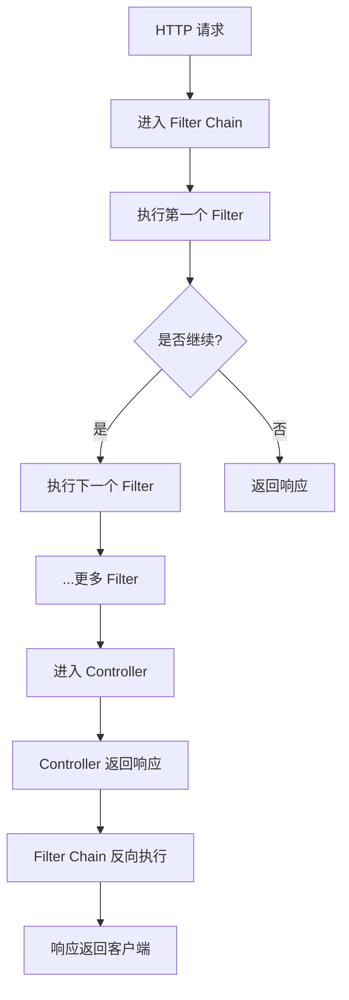

##### 🔄 执行机制：

- Filter Chain 是一个链表结构，Spring Boot 会按照配置顺序依次调用每个 Filter。
- 每个 Filter 可以选择是否继续向下传递请求（通过 `chain.doFilter()` 或 `chain.doFilterInternal()`）。
- 支持前置处理和后置处理（即请求前后都可以执行逻辑）。

##### ⚙️ 特性总结：

| 特性                     | 说明                       |
|------------------------|--------------------------|
| 属于 Servlet 标准          | 可在任意基于 Servlet 的容器中使用    |
| 执行时机早于 Interceptor     | 在 DispatcherServlet 处理之前 |
| 不依赖 Spring MVC         | 即使没有配置 Spring MVC 也能运行   |
| 可操作原始 Request/Response | 如修改输入流、设置响应头等            |

---

#### 2️⃣ 拦截器（Interceptor）

##### ✅ 定义与作用：

- **Interceptor 是 Spring MVC 提供的功能**，属于应用层的组件。
- 它主要用于：
    - 登录状态验证
    - 接口权限控制
    - 方法级别的日志记录
    - 自定义业务逻辑增强

##### 🔁 工作流程：

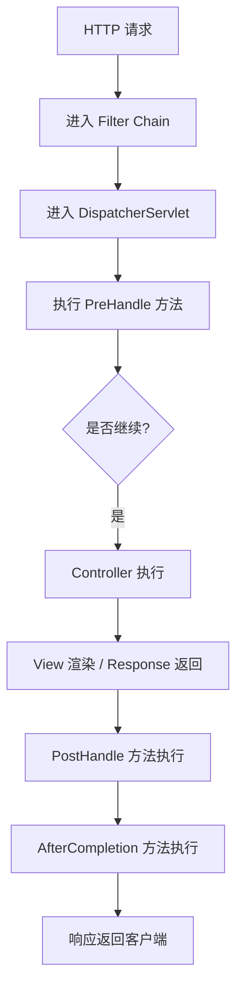

##### 🔄 执行阶段：

1. **preHandle()**
    - 在 Controller 方法执行前调用。
    - 返回值为 boolean，决定是否继续执行后续逻辑。

2. **postHandle()**
    - 在 Controller 方法执行后、视图渲染前调用。
    - 可访问 Controller 返回的数据模型（Model）。

3. **afterCompletion()**
    - 整个请求完成后调用（无论是否发生异常）。
    - 常用于资源清理或耗时统计。

##### ⚙️ 特性总结：

| 特性                 | 说明                     |
|--------------------|------------------------|
| 属于 Spring MVC      | 仅在 Spring MVC 场景下生效    |
| 可访问 Controller 上下文 | 如 Handler、Model 等      |
| 更适合业务逻辑增强          | 如权限判断、接口埋点             |
| 无法处理静态资源           | 默认不拦截 `/static/**` 等路径 |

---

#### 3️⃣ Filter 与 Interceptor 对比总结

| 特性                       | Filter  | Interceptor          |
|--------------------------|---------|----------------------|
| 所属规范                     | Servlet | Spring MVC           |
| 执行时机                     | 更早      | DispatcherServlet 内部 |
| 是否依赖 Spring              | 否       | 是                    |
| 是否支持 pre/post 处理         | 是       | 是                    |
| 可否访问 Controller 数据       | 否       | 是（Handler、Model）     |
| 是否可拦截静态资源                | 是       | 否                    |
| 是否可修改 Request/Response 流 | 是       | 否                    |
| 是否支持全局异常处理               | 是       | 否                    |

---

在本模块中，`TenantContextWebFilter` 是一个典型的 **Filter 实现类**，它负责：

- 从 HTTP Header 中提取 `X-Tenant-ID`
- 设置到 `TenantContextHolder`
- 请求结束后清理上下文

而如果需要进行更细粒度的租户权限控制（如接口级别的越权检测），则可以结合 Interceptor，在 `preHandle()` 中进行进一步判断。

---

#### 5️⃣ Spring Boot HTTP 请求处理全流程

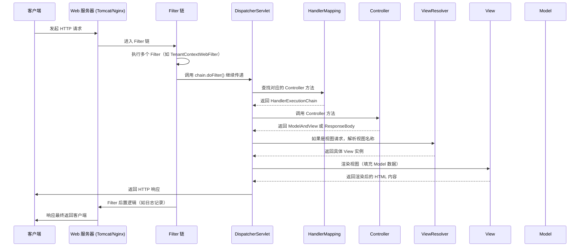

🧱 各层级组件作用详解：

| 层级  | 组件                   | 作用                                                  |
|-----|----------------------|-----------------------------------------------------|
| 第一层 | Web Server（如 Tomcat） | 接收客户端 HTTP 请求，建立连接并解析请求头、请求体                        |
| 第二层 | Filter Chain         | 执行一系列过滤器（如 XSS 防护、跨域处理、租户识别等），决定是否继续传递请求            |
| 第三层 | DispatcherServlet    | Spring MVC 的核心控制器，协调整个请求处理流程                        |
| 第四层 | HandlerMapping       | 根据 URL 映射到具体的 Controller 及其方法                       |
| 第五层 | Controller           | 执行业务逻辑，返回数据或视图名                                     |
| 第六层 | ViewResolver + View  | 如果是视图请求，解析视图模板并渲染数据（如 Thymeleaf、JSP）                |
| 第七层 | Response 构建          | 将 Controller 返回的数据序列化为 JSON、XML 或 HTML 并封装为 HTTP 响应 |
| 第八层 | Filter Chain（后置）     | 执行 Filter 的后置逻辑，如记录请求耗时、清理上下文                       |
| 第九层 | Web Server           | 将最终响应写回客户端                                          |

🔁 特别说明：异步与拦截器执行顺序

**异步请求流程补充（如 @Async / Callable）**

- 若 Controller 返回 `Callable` 或使用了 `@Async`：
    - 请求线程会释放，由后台任务线程重新执行后续逻辑。
    - 此时需要配合 `TtlRunnable` 使用以保证上下文传递。

**Interceptor 的执行阶段**

- `preHandle()`：在 Controller 方法调用前执行。
- `postHandle()`：在 Controller 方法执行后、视图渲染前执行。
- `afterCompletion()`：在整个请求完成后执行，无论是否异常。

---

## 📌 总结

`pei-spring-boot-starter-biz-tenant` 模块实现了以下核心功能：

| 功能         | 技术实现                                           | 用途                     |
|------------|------------------------------------------------|------------------------|
| 租户上下文      | TenantContextHolder + TransmittableThreadLocal | 保证线程内租户一致              |
| 数据库隔离      | MyBatis Plus + TenantDatabaseInterceptor       | 查询时自动加上 `tenant_id` 条件 |
| Redis 隔离   | TenantRedisCacheManager                        | 缓存 Key 拼接 `tenant_id`  |
| 消息队列支持     | TenantRocketMQSendMessageHook                  | 发送消息时带上 `tenant_id`    |
| 安全校验       | TenantSecurityWebFilter                        | 防止用户越权访问其它租户数据         |
| XXL-Job 支持 | TenantJobAspect                                | 定时任务按租户并行执行            |
| AOP 忽略支持   | TenantIgnoreAspect                             | 支持方法级别忽略租户限制           |

它是一个轻量但功能完整的多租户支持模块，适用于电商、社交、CRM、ERP、AI 等需要多租户隔离的场景。
