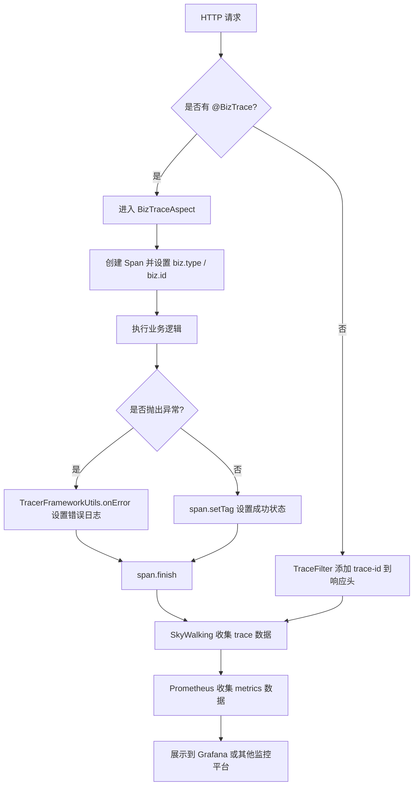

`pei-spring-boot-starter-monitor` 是一个 **服务监控模块**，其核心作用是为微服务架构提供 **链路追踪、日志增强、指标收集** 等功能。它基于 SkyWalking 实现了全链路的 Trace 跟踪，并结合 Micrometer 收集服务运行时的性能指标。

---

## 一、模块概述

### ✅ 模块定位
- **目标**：为整个系统提供统一的监控能力，包括：
    - 链路追踪（Trace）
    - 日志上下文（traceId）
    - 指标收集（Metrics）
- **应用场景**：
    - 全链路追踪，排查接口调用耗时瓶颈。
    - 异常日志中自动附加 traceId，便于日志追踪。
    - Prometheus + Grafana 实时监控服务状态。
- **技术栈依赖**：
    - SkyWalking（APM）
    - Micrometer（指标收集）
    - Spring Boot Actuator（暴露 `/actuator/metrics` 接口）
    - OpenTracing（标准 API）

---

## 二、目录结构说明

```
src/main/java/
└── com/pei/dehaze/framework/tracer/
    ├── config/                   // 自动配置类
    │   ├── PeiTracerAutoConfiguration.java      // 主要 Tracer 自动配置
    │   ├── TracerProperties.java               // 配置属性
    │   └── YudaoMetricsAutoConfiguration.java  // Metrics 自动配置
    ├── core/
    │   ├── annotation/            // 注解定义
    │   │   └── BizTrace.java      // 用于标记业务编号与类型
    │   ├── aop/                   // AOP 切面逻辑
    │   │   └── BizTraceAspect.java// 处理 @BizTrace 注解，记录 span
    │   ├── filter/                // Web Filter
    │   │   └── TraceFilter.java   // 设置 traceId 到响应 header
    │   └── util/                  // 工具类
    │       └── TracerFrameworkUtils.java // 提供 Span 错误处理等工具方法
```


---

## 三、关键包详解

### 1️⃣ `config` 包

#### 🔹 `PeiTracerAutoConfiguration.java`
```java
@Bean
public FilterRegistrationBean<TraceFilter> traceFilter() {
    FilterRegistrationBean<TraceFilter> registrationBean = new FilterRegistrationBean<>();
    registrationBean.setFilter(new TraceFilter());
    registrationBean.setOrder(WebFilterOrderEnum.TRACE_FILTER);
    return registrationBean;
}
```

- **作用**：注册 Web Filter，确保 traceId 被正确写入响应头。
- **原理**：通过 `WebFilterOrderEnum` 控制执行顺序，避免与其他 Filter 冲突。

#### 🔹 `TracerProperties.java`
```java
@ConfigurationProperties("pei.tracer")
@Data
public class TracerProperties {}
```

- **作用**：读取 `application.yaml` 中的 tracer 配置项。
- **示例配置**：
  ```yaml
  pei:
    tracer:
      enable: true
  ```


#### 🔹 `YudaoMetricsAutoConfiguration.java`
```java
@Bean
public MeterRegistryCustomizer<MeterRegistry> metricsCommonTags(
        @Value("${spring.application.name}") String applicationName) {
    return registry -> registry.config().commonTags("application", applicationName);
}
```

- **作用**：设置所有指标的公共 tag，如 `application=system-server`。
- **用途**：在 Prometheus 查询时区分不同服务来源。

---

### 2️⃣ `annotation` 包

#### 🔹 `BizTrace.java`
```java
@Target({ElementType.METHOD})
@Retention(RetentionPolicy.RUNTIME)
@Inherited
public @interface BizTrace {

    String ID_TAG = "biz.id";
    String TYPE_TAG = "biz.type";

    String operationName() default "";
    String id();
    String type();
}
```

- **作用**：用于标注业务操作的类型和编号，便于链路追踪。
- **使用方式**：
  ```java
  @BizTrace(id = "#id", type = "user-service")
  public UserDTO getUserById(Long id) {
      // ...
  }
  ```

- **SkyWalking 配置**：需在 `application.yaml` 中配置 `SW_SEARCHABLE_TAG_KEYS=biz.type,biz.id` 才能搜索。

---

### 3️⃣ `aop` 包

#### 🔹 `BizTraceAspect.java`
```java
@Around(value = "@annotation(trace)")
public Object around(ProceedingJoinPoint joinPoint, BizTrace trace) throws Throwable {
    String operationName = getOperationName(joinPoint, trace);
    Span span = tracer.buildSpan(operationName).withTag(Tags.COMPONENT.getKey(), "biz").start();

    try {
        return joinPoint.proceed();
    } catch (Throwable throwable) {
        TracerFrameworkUtils.onError(throwable, span);
        throw throwable;
    } finally {
        setBizTag(span, joinPoint, trace);
        span.finish();
    }
}
```

- **作用**：AOP 切面处理 `@BizTrace` 注解，记录业务类型的 span。
- **流程**：
    1. 创建新的 Span。
    2. 设置 biz.type 和 biz.id 标签。
    3. 记录异常日志。
    4. 完成 Span。

---

### 4️⃣ `filter` 包

#### 🔹 `TraceFilter.java`
```java
@Override
private void doFilterInternal(HttpServletRequest request, HttpServletResponse response, FilterChain chain)
        throws IOException, ServletException {
    response.addHeader("trace-id", TracerUtils.getTraceId());
    chain.doFilter(request, response);
}
```

- **作用**：在 HTTP 响应头中添加当前请求的 `trace-id`。
- **用途**：前端或下游服务可获取该 ID，用于日志追踪或错误复现。

---

### 5️⃣ `util` 包

#### 🔹 `TracerFrameworkUtils.java`
```java
public static void onError(Throwable throwable, Span span) {
    Tags.ERROR.set(span, Boolean.TRUE);
    if (throwable != null) {
        span.log(errorLogs(throwable));
    }
}

private static Map<String, Object> errorLogs(Throwable throwable) {
    Map<String, Object> errorLogs = new HashMap<>();
    errorLogs.put("event", Tags.ERROR.getKey());
    errorLogs.put("error.object", throwable);
    errorLogs.put("error.kind", throwable.getClass().getName());
    errorLogs.put("message", throwable.getMessage());
    StringWriter sw = new StringWriter();
    throwable.printStackTrace(new PrintWriter(sw));
    errorLogs.put("stack", sw.toString());
    return errorLogs;
}
```

- **作用**：封装对 Span 的异常处理逻辑。
- **优势**：统一格式化异常信息，方便 SkyWalking 展示堆栈。

---

## 四、模块工作流程图解




---

## 五、模块功能总结

| 包名 | 功能 | 关键类 |
|------|------|--------|
| `config` | 自动配置 | `PeiTracerAutoConfiguration`, `YudaoMetricsAutoConfiguration` |
| `annotation` | 注解定义 | `BizTrace.java` |
| `aop` | 切面逻辑 | `BizTraceAspect.java` |
| `filter` | Web 过滤器 | `TraceFilter.java` |
| `util` | 工具类 | `TracerFrameworkUtils.java` |

---

## 六、模块实现原理详解

### 1️⃣ SkyWalking 链路追踪集成

该模块默认使用 SkyWalking 作为链路追踪组件，通过以下方式实现：

- **自动注入 trace-id**：由 `TraceFilter` 在响应头中返回当前请求的 `trace-id`。
- **业务标签支持**：通过 `@BizTrace(type = "user", id = "#userId")` 注解，将业务信息附加到 Span 上。
- **异常日志采集**：发生异常时，自动记录异常信息和堆栈到 Span 中。

### 2️⃣ Micrometer 指标收集

- **自动配置**：通过 `YudaoMetricsAutoConfiguration` 设置全局应用名。
- **Prometheus 暴露接口**：Spring Boot Actuator 提供 `/actuator/metrics` 接口，Micrometer 将指标数据格式化后输出。
- **Grafana 可视化**：配合 Prometheus 抓取 `/actuator/metrics` 接口，实现服务状态可视化。

---

## 七、典型使用方式

### 1️⃣ 启用 trace-id 返回
```yaml
pei:
  tracer:
    enable: true
```


### 2️⃣ 在 Service 方法上添加业务标签
```java
@BizTrace(type = "user", id = "#id")
public UserDTO getUserById(Long id) {
    // ...
}
```


### 3️⃣ 查看链路追踪日志
```log
ERROR [Biz/user-service.getUserById] event=error, error.kind=com.example.UserNotFoundException, message="用户不存在", stack="..."
```


### 4️⃣ Prometheus 指标查询
```promql
http_server_requests_seconds_count{uri="/api/user/getUserById"}
```


---

## 八、建议改进方向

| 改进点 | 描述 |
|--------|------|
| ✅ SkyWalking 配置优化 | 可以通过 `application.yaml` 动态配置 SkyWalking Agent 参数，而不是硬编码。 |
| ✅ 更丰富的注解支持 | 支持在 Controller 方法上使用 `@BizTrace`，更细粒度控制链路。 |
| ✅ 自定义指标注册 | 提供 `MetricUtils` 类，支持手动上报自定义指标（如缓存命中率、数据库连接数）。 |
| ✅ 日志打印 trace-id | 在日志模板中增加 `%X{tid}` 占位符，自动打印 trace-id，提升调试效率。 |
| ✅ 集成 Zipkin | 当前仅支持 SkyWalking，未来可扩展支持 Zipkin，适配不同团队需求。 |

---

## 九、总结

`pei-spring-boot-starter-monitor` 模块实现了 **基于 SkyWalking 的链路追踪** 和 **Micrometer 的指标采集**，具有如下特点：

- **统一 trace-id**：通过 `TraceFilter` 设置 trace-id 到响应头。
- **业务标签支持**：通过 `@BizTrace` 注解记录业务类型和编号。
- **异常日志采集**：自动记录异常堆栈到 Span。
- **指标标准化**：通过 `YudaoMetricsAutoConfiguration` 设置通用 tags。
- **可观测性高**：支持 SkyWalking、Prometheus、Grafana 等多种监控平台。

如果你有具体某个类（如 `BizTraceAspect`、`TraceFilter`）想要深入了解，欢迎继续提问！
