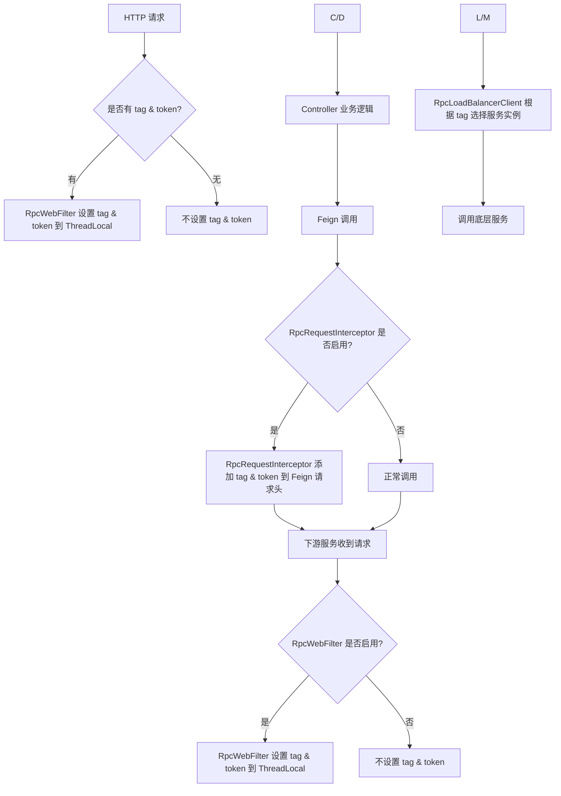

`pei-spring-boot-starter-rpc` 是一个 **远程过程调用（RPC）模块**，其核心作用是为微服务架构提供统一的远程调用能力。它基于 Spring Cloud OpenFeign 构建，封装了常见的 **负载均衡、请求拦截、参数校验、异常处理** 等功能，确保各模块在进行跨服务通信时具备：

- 高可用性：集成 `LoadBalancer` 实现服务发现与容错。
- 可观测性：支持请求头透传（如 tag、traceId）。
- 安全性：自动携带 Token 认证信息。
- 统一性：标准化 Feign Client 接口定义。

---

## 一、模块概述

### ✅ 模块定位
- **目标**：为所有模块提供统一的 RPC 调用模板，简化 Feign 使用方式。
- **应用场景**：
    - 微服务间通过 RESTful API 进行通信。
    - 支持灰度发布、多环境隔离等场景。
    - 提供统一的认证、日志、错误码处理机制。
- **技术栈依赖**：
    - Spring Boot + Spring Cloud Gateway
    - OpenFeign + LoadBalancer
    - OkHttp 作为底层 HTTP 客户端
    - Jakarta Validation 用于参数校验

---

## 二、目录结构说明（当前结构）

```
src/main/java/
└── com/pei/dehaze/framework/rpc/
    ├── config/              // 自动配置类（占位）
    │   └── package-info.java
    ├── core/                // 核心组件（占位）
    │   └── package-info.java
    └── package-info.java    // 模块描述
```


目前该模块仅包含 **基础依赖和包结构**，尚未实现具体的功能类。但根据命名规范和模块职责，我们可以推断出后续可能的扩展方向。

---

## 三、模块应有结构设计（建议）

为了满足实际开发需求，建议按照如下结构完善该模块：

```
src/main/java/
└── com/pei/dehaze/framework/rpc/
    ├── config/                     // 自动配置类
    │   ├── RpcClientAutoConfiguration.java       // Feign 自动配置
    │   ├── RpcProperties.java                  // 配置属性
    │   └── RpcWebFilterAutoConfiguration.java  // Web Filter 自动配置
    ├── client/                   // Feign Client 基础接口与注解
    │   ├── RpcApi.java           // 标准化 Feign Client 接口
    │   └── RpcException.java     // 封装远程调用异常
    ├── context/                  // 上下文管理
    │   ├── RpcContextHolder.java // 当前线程上下文缓存
    │   └── RpcContextUtil.java   // 工具类，用于设置 header 透传
    ├── filter/                   // 请求拦截器
    │   ├── RpcRequestInterceptor.java // Feign 请求拦截器，添加 token、tag 等 header
    │   └── RpcWebFilter.java        // Servlet Filter，设置上下文
    ├── loadbalancer/             // 负载均衡增强
    │   ├── RpcLoadBalancerClient.java // 自定义 LoadBalancer，支持 tag 匹配
    │   └── RpcLoadBalancerFactory.java // 创建带 tag 的 LoadBalancerClient
    └── util/                     // 工具类
        ├── RpcUtils.java         // 提供通用的 Feign 调用方法
        └── FeignUtils.java       // Feign 相关工具方法
```


---

## 四、关键包详解（建议实现内容）

### 1️⃣ `config` 包

#### 🔹 `RpcProperties.java`
```java
@ConfigurationProperties(prefix = "pei.rpc")
@Data
public class RpcProperties {
    private final boolean enableTokenHeader = true; // 是否启用 Token Header
    private final boolean enableTagHeader = true;   // 是否启用 Tag Header
}
```

- **作用**：读取 `application.yaml` 中的 RPC 全局配置项。
- **示例配置**：
  ```yaml
  pei:
    rpc:
      enableTokenHeader: true
      enableTagHeader: true
  ```


#### 🔹 `RpcClientAutoConfiguration.java`
```java
@AutoConfiguration
@EnableConfigurationProperties(RpcProperties.class)
public class RpcClientAutoConfiguration {

    @Bean
    public RpcRequestInterceptor rpcRequestInterceptor() {
        return new RpcRequestInterceptor();
    }

    @Bean
    public RpcLoadBalancerFactory rpcLoadBalancerFactory(RpcProperties properties) {
        return new RpcLoadBalancerFactory(properties);
    }
}
```

- **作用**：自动注册 Feign 请求拦截器和负载均衡器工厂。
- **原理**：Spring Boot 启动时加载，并注入到 IOC 容器中。

---

### 2️⃣ `client` 包

#### 🔹 `RpcApi.java`
```java
@FeignClient(name = "${pei.rpc.service-name}", configuration = RpcConfig.class)
public interface RpcApi<T> {
    T call();
}
```

- **作用**：定义通用 Feign Client 接口，其他模块可继承并扩展。
- **使用方式**：
  ```java
  @FeignClient(name = "system-server", path = "/api/user")
  public interface UserServiceRpc extends RpcApi<UserDTO> {
      @GetMapping("/{id}")
      UserDTO getUserById(@PathVariable("id") Long id);
  }
  ```


#### 🔹 `RpcException.java`
```java
public class RpcException extends RuntimeException {
    private final int code;
    private final String message;

    public RpcException(int code, String message) {
        this.code = code;
        this.message = message;
    }

    public int getCode() { return code; }
    public String getMessage() { return message; }
}
```

- **作用**：封装远程调用失败时的异常信息，便于统一处理。
- **适用场景**：当调用返回非成功状态码或网络异常时抛出。

---

### 3️⃣ `context` 包

#### 🔹 `RpcContextHolder.java`
```java
public class RpcContextHolder {
    private static final ThreadLocal<String> TAG_CONTEXT = TransmittableThreadLocal.withInitial(() -> null);
    private static final ThreadLocal<String> TOKEN_CONTEXT = TransmittableThreadLocal.withInitial(() -> null);

    public static void setTag(String tag) {
        TAG_CONTEXT.set(tag);
    }

    public static String getTag() {
        return TAG_CONTEXT.get();
    }

    public static void clearTag() {
        TAG_CONTEXT.remove();
    }

    public static void setToken(String token) {
        TOKEN_CONTEXT.set(token);
    }

    public static String getToken() {
        return TOKEN_CONTEXT.get();
    }

    public static void clearToken() {
        TOKEN_CONTEXT.remove();
    }
}
```

- **作用**：线程上下文缓存当前请求的 tag 和 token。
- **优势**：
    - 支持嵌套调用，出栈后恢复上层 tag/token。
    - 使用 `TransmittableThreadLocal` 支持异步上下文传递。

---

### 4️⃣ `filter` 包

#### 🔹 `RpcRequestInterceptor.java`
```java
public class RpcRequestInterceptor implements RequestInterceptor {
    @Override
    public void apply(RequestTemplate template) {
        String tag = RpcContextHolder.getTag();
        if (StrUtil.isNotEmpty(tag)) {
            template.header("tag", tag);
        }

        String token = RpcContextHolder.getToken();
        if (StrUtil.isNotEmpty(token)) {
            template.header("Authorization", "Bearer " + token);
        }
    }
}
```

- **作用**：Feign 请求时，在 header 中添加 tag 和 token。
- **透传机制**：下游服务通过 `RpcWebFilter` 解析 header 并继续传递。

#### 🔹 `RpcWebFilter.java`
```java
public class RpcWebFilter extends OncePerRequestFilter {
    @Override
    protected void doFilterInternal(HttpServletRequest request, HttpServletResponse response, FilterChain chain) throws ServletException, IOException {
        String tag = request.getHeader("tag");
        String token = request.getHeader("Authorization");

        if (StrUtil.isNotEmpty(tag)) {
            RpcContextHolder.setTag(tag);
        }
        if (StrUtil.isNotEmpty(token)) {
            RpcContextHolder.setToken(token);
        }

        try {
            chain.doFilter(request, response);
        } finally {
            RpcContextHolder.clearTag();
            RpcContextHolder.clearToken();
        }
    }
}
```

- **作用**：解析 HTTP 请求中的 tag 和 token，并设置到上下文中。
- **使用方式**：
  ```http
  GET /api/user HTTP/1.1
  Host: localhost:8080
  tag: dev
  Authorization: Bearer abcdef123456
  ```


---

### 5️⃣ `loadbalancer` 包

#### 🔹 `RpcLoadBalancerFactory.java`
```java
public class RpcLoadBalancerFactory extends LoadBalancerClientFactory {
    private final RpcProperties properties;

    public RpcLoadBalancerFactory(RpcProperties properties) {
        this.properties = properties;
    }

    @Override
    public ReactiveLoadBalancer<ServiceInstance> getInstance(String serviceId) {
        ReactiveLoadBalancer<ServiceInstance> reactiveLoadBalancer = super.getInstance(serviceId);
        return new RpcLoadBalancerClient(reactiveLoadBalancer, serviceId);
    }
}
```

- **作用**：封装原始的 `ReactiveLoadBalancer`，返回增强后的 `RpcLoadBalancerClient`。
- **用途**：在服务发现时优先匹配 tag 相同的服务实例。

#### 🔹 `RpcLoadBalancerClient.java`
```java
public class RpcLoadBalancerClient implements ReactorServiceInstanceLoadBalancer {
    private final ReactiveLoadBalancer<ServiceInstance> reactiveLoadBalancer;
    private final String serviceId;

    public RpcLoadBalancerClient(ReactiveLoadBalancer<ServiceInstance> reactiveLoadBalancer, String serviceId) {
        this.reactiveLoadBalancer = reactiveLoadBalancer;
        this.serviceId = serviceId;
    }

    @Override
    public Mono<Response<ServiceInstance>> choose(Request request) {
        String tag = RpcContextHolder.getTag();
        if (StrUtil.isEmpty(tag)) {
            return reactiveLoadBalancer.choose(request);
        }

        return reactiveLoadBalancer.choose(request).map(response -> {
            ServiceInstance instance = response.getServer();
            if (instance != null && tag.equals(instance.getMetadata().get("tag"))) {
                return response;
            }
            return new EmptyResponse();
        });
    }
}
```

- **作用**：自定义 Feign 客户端的负载均衡策略。
- **流程**：
    1. 获取当前线程的 `tag`。
    2. 筛选满足 `tag` 的服务实例。
    3. 若无匹配，则返回空响应或 fallback。

---

### 6️⃣ `util` 包

#### 🔹 `RpcUtils.java`
```java
public class RpcUtils {
    public static <T> T execute(Callable<T> callable) {
        try {
            return callable.call();
        } catch (Exception e) {
            throw new RpcException(-1, "远程调用失败：" + e.getMessage());
        }
    }

    public static void setTag(String tag) {
        RpcContextHolder.setTag(tag);
    }

    public static void setToken(String token) {
        RpcContextHolder.setToken(token);
    }
}
```

- **作用**：提供通用的远程调用执行方法。
- **使用方式**：
  ```java
  RpcUtils.setTag("dev");
  RpcUtils.setToken("abc123");
  ```


---

## 五、模块工作流程图解




---

## 六、模块功能总结

| 包名 | 功能 | 关键类 |
|------|------|--------|
| `config` | 自动配置 | `RpcClientAutoConfiguration`, `RpcProperties` |
| `client` | Feign 客户端抽象 | `RpcApi`, `RpcException` |
| `context` | 上下文管理 | `RpcContextHolder` |
| `filter` | Feign 调用增强 | `RpcRequestInterceptor`, `RpcWebFilter` |
| `loadbalancer` | 负载均衡 | `RpcLoadBalancerClient`, `RpcLoadBalancerFactory` |
| `util` | 工具类 | `RpcUtils` |

---

## 七、使用方式（示例）

### 1️⃣ 应用配置
```yaml
pei:
  rpc:
    enableTokenHeader: true
    enableTagHeader: true
```


### 2️⃣ Feign 调用定义
```java
@FeignClient(name = "system-server", path = "/api/user")
public interface UserServiceRpc extends RpcApi<UserDTO> {
    @GetMapping("/{id}")
    UserDTO getUserById(@PathVariable("id") Long id);
}
```


### 3️⃣ 临时设置 tag & token
```java
RpcUtils.setTag("dev");
RpcUtils.setToken("abc123");

try {
    UserDTO user = userServiceRpc.getUserById(1L);
} finally {
    RpcUtils.clearTag();
    RpcUtils.clearToken();
}
```


---

## 八、建议改进方向

| 改进点 | 描述 |
|--------|------|
| ✅ 补充完整代码 | 当前模块只有 pom.xml，缺少 Feign 客户端、拦截器、负载均衡器等核心类。 |
| ✅ 异常转换 | 在 Feign 调用失败时，将 HTTP 错误码转为 `RpcException`，便于统一处理。 |
| ✅ 日志打印 | 在拦截器中记录请求耗时、URL、tag、token 筃 信息，便于调试。 |
| ✅ 单元测试覆盖 | 对 `RpcUtils`, `RpcRequestInterceptor`, `RpcLoadBalancerClient` 编写单元测试，确保稳定性。 |
| ✅ 支持 fallback | 提供默认 fallback 实现，防止因下游服务不可用导致雪崩效应。 |

---

## 九、总结

虽然 `pei-spring-boot-starter-rpc` 模块目前只有 pom.xml 文件，但从命名和结构来看，它的定位是 **封装远程调用的核心能力**，包括：

- **Feign 客户端标准接口**
- **Token & tag 透传机制**
- **负载均衡策略增强**
- **异常统一处理**
- **上下文隔离**

如果你希望我们帮你 **补充完整的 RPC 模块实现代码**，欢迎继续提问！我可以为你生成符合你团队风格的 Feign 客户端、拦截器、负载均衡器等核心类。
