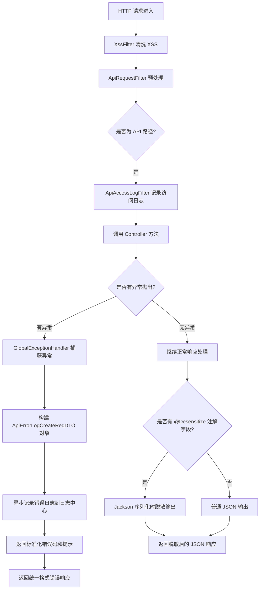
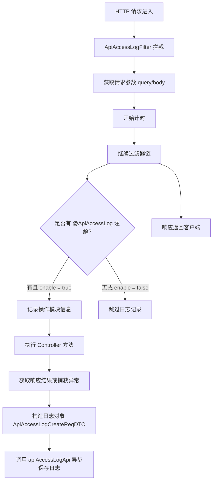
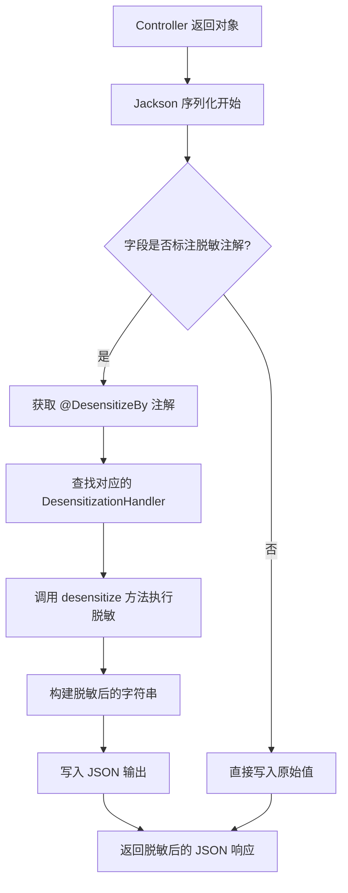

`pei-spring-boot-starter-web` 是一个 **Web 框架增强模块（Web Framework Extension Module）**，其核心作用是为企业级应用提供统一的
Web 层支撑能力。该模块基于 `Spring Boot + Spring MVC + Swagger + Jackson` 实现高性能、安全、易维护的 Web 服务，并支持以下功能：

- 全局异常处理与日志记录
- API 访问日志记录
- 数据脱敏（如手机号、身份证）
- XSS 安全防护
- Swagger 接口文档自动生成
- 请求体缓存（用于重复读取）
- Banner 启动横幅展示

---

## ✅ 模块概述

### 🎯 模块定位

- **目标**：构建统一的 Web 层基础框架，支持：
  - 统一异常处理机制
  - 自动记录 API 访问日志
  - 敏感数据脱敏输出
  - 增强 Jackson 序列化/反序列化
  - 支持多租户模式下的接口隔离
- **应用场景**：
  - 管理后台 API 开发
  - 用户 APP 接口开发
  - 微服务间通信接口定义

### 🧩 技术栈依赖

- **Spring Boot 3.4 + Spring Cloud Gateway**
- **Web 层工具**：
  - Knife4j OpenAPI 文档生成器
  - SpringDoc OpenAPI 集成
- **安全相关**：
  - JSoup XSS 过滤器
  - Jackson JSON 脱敏序列化器
- **日志与监控**：
  - SLF4J 日志记录
  - Trace ID 支持（用于链路追踪）

---

## 📁 目录结构说明

```
src/main/java/
│ com/pei/dehaze/framework/web/
├── config/                                    // Web 层通用配置类
│   ├── PeiWebAutoConfiguration.java           // Web 自动装配配置
│   ├── WebProperties.java                     // 从 application.yaml 中加载 web 模块相关配置
│   └── core/                                  // 核心逻辑实现
│       ├── filter/                            // 请求过滤器
│       │   ├── ApiRequestFilter.java          // API 请求基础过滤器
│       │   ├── CacheRequestBodyFilter.java    // 缓存请求体过滤器（用于多次读取）
│       │   ├── CacheRequestBodyWrapper.java   // 请求体缓存包装器
│       │   └── DemoModeFilter.java            // 演示模式限制过滤器（可选功能）
│       ├── handler/                           // 全局异常处理器
│       │   └── GlobalExceptionHandler.java    // 统一异常处理与日志记录
│       └── util/                              // Web 工具类封装
│           └── WebFrameworkUtils.java         // 提供 Web 请求常用工具方法（如获取用户信息、IP、租户 ID）
├── apilog/                                    // API 日志记录模块
│   ├── config/                                // API 日志自动配置类
│   │   ├── PeiApiLogAutoConfiguration.java    // 自动注册日志组件
│   │   └── PeiApiLogRpcAutoConfiguration.java // RPC 场景下日志远程调用配置
│   └── core/
│       ├── annotation/                        // 注解定义
│       │   └── ApiAccessLog.java              // 用于标注需要记录访问日志的方法
│       ├── enums/                             // 枚举定义
│       │   └── OperateTypeEnum.java           // 定义操作类型（如查询、创建、更新等）
│       └── filter/                            // 实际日志记录过滤器
│           └── ApiAccessLogFilter.java        // 在 Filter 阶段记录 API 访问日志
├── desensitize/                               // 数据脱敏模块
│   ├── config/                                // 脱敏模块自动配置
│   │   └── PeiDesensitizeAutoConfiguration.java
│   └── core/
│       ├── annotation/                        // 各类脱敏注解定义
│       │   ├── DesensitizeBy.java
│       │   ├── DesensitizeStrategy.java
│       │   ├── MobileDesensitize.java
│       │   ├── IdCardDesensitize.java
│       │   └── EmailDesensitize.java
│       ├── base/                              // 脱敏基类及序列化器
│       │   ├── handler/                       // 脱敏处理器接口
│       │   │   └── DesensitizationHandler.java
│       │   ├── serializer/                    // Jackson 序列化器支持
│       │   │   └── StringDesensitizeSerializer.java
│       │   └── annotation/                    // 基础注解 @DesensitizeBy 等
│       └── slider/                            // 滑动脱敏具体实现
│           ├── annotation/                    // 如 BankCardDesensitize, PasswordDesensitize
│           └── handler/                       // 对应处理器实现
├── jackson/                                   // Jackson JSON 扩展模块
│   └── config/
│       └── PeiJacksonAutoConfiguration.java // 注册自定义序列化器（如敏感数据脱敏输出）
├── swagger/                                   // 接口文档自动化生成模块
│   └── config/
│       ├── PeiSwaggerAutoConfiguration.java // Knife4j + SpringDoc 自动配置
│       └── SwaggerProperties.java             // Swagger UI 显示配置参数
└── xss/                                       // XSS 安全防护模块
    ├── config/                                // 自动配置类
    │   ├── PeiXssAutoConfiguration.java
    │   └── XssProperties.java
    └── core/
        ├── clean/                             // HTML 清洗规则定义
        ├── filter/                            // XSS 过滤器主类
        │   └── XssFilter.java
        └── json/                              // JSON 请求参数清洗适配器
            └── XssJsonFilter.java
```

---

## 🔍 关键包详解

### 1️⃣ `web.config` 包 —— Web 层配置加载

#### 示例：`WebProperties.java`

```java

@ConfigurationProperties(prefix = "pei.web")
@Data
public class WebProperties {

    private static final String DEFAULT_BANNER = "classpath:banner.txt";
    private static final Integer DEFAULT_BANNER_WIDTH = 76;
    private static final Boolean DEFAULT_DEMO_ENABLED = false;

    /**
     * 是否启用 demo 模式（会抛出异常）
     */
    private final Boolean demoEnabled = DEFAULT_DEMO_ENABLED;

    /**
     * Banner 文件路径
     */
    private final String banner = DEFAULT_BANNER;

    /**
     * Banner 输出宽度
     */
    private final Integer bannerWidth = DEFAULT_BANNER_WIDTH;

}
```

- **作用**：从 `application.yaml` 中读取 Web 层配置。
- **字段说明**：
  - `demoEnabled`: 是否开启演示模式（抛出异常模拟错误）
  - `banner`: Banner 文件路径
  - `bannerWidth`: Banner 输出宽度
- **用途**：
  - 控制是否启用测试环境限制
  - 设置启动 Banner 显示样式

---

### 2️⃣ `web.core.filter` 包 —— 请求过滤器链

#### 示例：`ApiRequestFilter.java`

```java
public abstract class ApiRequestFilter extends OncePerRequestFilter {

    protected final WebProperties webProperties;

    @Override
    protected boolean shouldNotFilter(HttpServletRequest request) {
        String apiUri = request.getRequestURI().substring(request.getContextPath().length());
        return !StrUtil.startWithAny(apiUri, webProperties.getAdminApi().getPrefix(), webProperties.getAppApi().getPrefix());
    }
}
```

- **作用**：作为所有 API 请求过滤器的抽象基类。
- **关键逻辑**：
  - 控制是否对当前请求应用过滤逻辑
  - 仅针对 `/admin-api/**` 和 `/app-api/**` 开头的路径生效
- **设计模式**：
  - 模板方法模式（继承 Spring 的 `OncePerRequestFilter`）
  - 配置驱动控制过滤范围（通过 `WebProperties`）

---

### 3️⃣ `web.core.handler` 包 —— 全局异常处理器

#### 示例：`GlobalExceptionHandler.java`

```java

@RestControllerAdvice
@AllArgsConstructor
@Slf4j
public class GlobalExceptionHandler {
    public static final Set<String> IGNORE_ERROR_MESSAGES = Set.of("无效的刷新令牌");

    private final String applicationName;
    private final ApiErrorLogCommonApi apiErrorLogApi;

    @ExceptionHandler(Exception.class)
    public CommonResult<?> allExceptionHandler(HttpServletRequest request, Throwable e) {
        // 构建错误日志
        ApiErrorLogCreateReqDTO errorLog = new ApiErrorLogCreateReqDTO();
        buildExceptionLog(errorLog, request, e);

        // 记录错误日志
        try {
            apiErrorLogApi.createApiErrorLog(errorLog);
        } catch (Exception ex) {
            log.error("[createExceptionLog][url({}) log({}) 发生异常]", request.getRequestURI(), JsonUtils.toJsonString(errorLog), ex);
        }

        // 返回通用错误结果
        return CommonResult.error(GlobalErrorCodeConstants.INTERNAL_SERVER_ERROR.getCode(), e.getMessage());
    }

    private void buildExceptionLog(ApiErrorLogCreateReqDTO errorLog, HttpServletRequest request, Throwable e) {
        // 设置用户信息
        errorLog.setUserId(WebFrameworkUtils.getLoginUserId(request));
        errorLog.setUserType(WebFrameworkUtils.getLoginUserType(request));

        // 设置异常信息
        errorLog.setExceptionName(e.getClass().getName());
        errorLog.setExceptionMessage(ExceptionUtil.getMessage(e));
        errorLog.setExceptionRootCauseMessage(ExceptionUtil.getRootCauseMessage(e));
        errorLog.setExceptionStackTrace(ExceptionUtil.stacktraceToString(e));

        // 设置其它字段
        errorLog.setTraceId(TracerUtils.getTraceId());
        errorLog.setApplicationName(applicationName);
        errorLog.setRequestUrl(request.getRequestURI());
        errorLog.setRequestMethod(request.getMethod());
        errorLog.setUserAgent(ServletUtils.getUserAgent(request));
        errorLog.setUserIp(JakartaServletUtil.getClientIP(request));
        errorLog.setExceptionTime(LocalDateTime.now());
    }
}
```

- **作用**：捕获所有未处理的异常并返回统一格式。
- **流程说明**：
    1. 拦截所有 Controller 抛出的异常
    2. 构建详细的错误日志对象 `ApiErrorLogCreateReqDTO`
    3. 将日志写入远程服务（如日志中心）
    4. 返回标准化错误码和提示给前端
- **优势**：
  - 避免敏感信息暴露
  - 提供可追溯的日志信息

---

### 4️⃣ `apilog` 包 —— API 日志记录

#### 示例：`ApiAccessLogFilter.java`

```java

@Override
private void doFilterInternal(HttpServletRequest request, HttpServletResponse response, FilterChain filterChain)
        throws ServletException, IOException {
    LocalDateTime beginTime = LocalDateTime.now();
    Map<String, String> queryString = ServletUtils.getParamMap(request);
    String requestBody = ServletUtils.isJsonRequest(request) ? ServletUtils.getBody(request) : null;

    try {
        filterChain.doFilter(request, response);
        createApiAccessLog(request, beginTime, queryString, requestBody, null);
    } catch (Exception ex) {
        createApiAccessLog(request, beginTime, queryString, requestBody, ex);
        throw ex;
    }
}
```

- **作用**：在请求处理前后记录完整的 API 调用日志。
- **关键逻辑**：
  - 记录请求参数（脱敏敏感字段如 `password`, `token`）
  - 记录响应结果或异常信息
  - 支持异步写入日志（调用 `apiAccessLogApi.createApiAccessLogAsync(...)`）
- **扩展功能**：
  - 支持通过注解 `@ApiAccessLog` 控制是否记录日志
  - 自动识别操作模块（`@Tag`）、操作名（`@Operation`）等业务信息
- **设计模式**：
  - 过滤器链模式（Filter Chain）
  - 注解驱动行为（`@ApiAccessLog`）

---

#### 示例：`ApiAccessLogInterceptor.java`

```java

@Aspect
@Slf4j
public class ApiAccessLogInterceptor {
    @Around("@annotation(apiAccessLog)")
    public Object around(ProceedingJoinPoint joinPoint, ApiAccessLog apiAccessLog) throws Throwable {
        // 开始计时
        long startTime = System.currentTimeMillis();

        // 执行方法
        Object result = null;
        try {
            result = joinPoint.proceed();
        } finally {
            // 构建访问日志
            ApiAccessLogCreateReqDTO log = new ApiAccessLogCreateReqDTO();
            log.setOperateModule(apiAccessLog.module());
            log.setOperateName(apiAccessLog.name());
            log.setOperateType(apiAccessLog.type().getType());

            // 设置请求参数
            log.setRequestParams(JsonUtils.toJsonString(joinPoint.getArgs()));

            // 设置响应结果
            if (result instanceof CommonResult<?>) {
                log.setResultCode(((CommonResult<?>) result).getCode());
                log.setResultMsg(((CommonResult<?>) result).getMsg());
            }

            // 记录日志
            apiErrorLogApi.createApiErrorLog(log);
        }

        return result;
    }
}
```

- **作用**：通过 AOP 自动记录 API 访问日志。
- **关键逻辑**：
  - 使用 `@Around` 注解拦截带 `@ApiAccessLog` 的方法
  - 记录请求时间、操作人、IP、User-Agent、请求参数、响应结果
- **设计模式**：
  - AOP 切面编程
  - 模板方法模式（封装日志结构）

---

### 5️⃣ `desensitize` 包 —— 数据脱敏模块

- **作用**：在 JSON 序列化时自动对敏感字段（如手机号、身份证号等）进行脱敏处理。
- **核心机制**：
  - 基于 Jackson 自定义序列化器
  - 支持滑动脱敏、正则脱敏等多种策略
  - 可通过 Spring EL 表达式控制是否启用脱敏
- **适用场景**：API 接口返回数据时防止敏感信息泄露，满足安全合规要求。

---

#### 1. `base` 包 —— 核心抽象层

##### 关键类

- `@DesensitizeBy`: 元注解，用于指定脱敏处理器
- `DesensitizationHandler`: 脱敏处理接口，定义通用行为
- `StringDesensitizeSerializer`: Jackson 自定义序列化器，负责字段值的脱敏转换

##### 示例：脱敏序列化器关键逻辑

```java

@Override
public void serialize(String value, JsonGenerator gen, SerializerProvider serializerProvider) throws IOException {
    if (StrUtil.isBlank(value)) {
        gen.writeNull();
        return;
    }
    Field field = getField(gen);
    for (Annotation annotation : field.getAnnotations()) {
        if (AnnotationUtil.hasAnnotation(annotation.annotationType(), DesensitizeBy.class)) {
            value = this.desensitizationHandler.desensitize(value, annotation);
            gen.writeString(value);
            return;
        }
    }
    gen.writeString(value);
}
```

- **功能**：在序列化过程中自动识别并执行脱敏逻辑。
- **特点**：非侵入性，仅对标注了脱敏注解的字段生效。

---

#### 2. `slider` 包 —— 滑动脱敏策略

##### 示例注解：`@MobileDesensitize`

```java

@DesensitizeBy(handler = MobileDesensitization.class)
public @interface MobileDesensitize {
    int prefixKeep() default 3;

    int suffixKeep() default 4;

    String replacer() default "*";
}
```

##### 示例处理器：`MobileDesensitization`

```java
public class MobileDesensitization extends AbstractSliderDesensitizationHandler<MobileDesensitize> {
    @Override
    Integer getPrefixKeep(MobileDesensitize annotation) {
        return annotation.prefixKeep();
    }

    @Override
    Integer getSuffixKeep(MobileDesensitize annotation) {
        return annotation.suffixKeep();
    }

    @Override
    String getReplacer(MobileDesensitize annotation) {
        return annotation.replacer();
    }
}
```

- **作用**：对字符串前后保留一定长度，中间用 `*` 替换。
- **典型应用**：
  - 手机号 → `188****1111`
  - 银行卡号 → `998800******7031`
  - 身份证号 → `530321**********11`

---

#### 3. `regex` 包 —— 正则脱敏策略

##### 示例注解：`@EmailDesensitize`

```java

@DesensitizeBy(handler = EmailDesensitizationHandler.class)
public @interface EmailDesensitize {
    String regex() default "(^.)[^@]*(@.*$)";

    String replacer() default "$1****$2";
}
```

##### 示例处理器：`EmailDesensitizationHandler`

```java
public class EmailDesensitizationHandler extends AbstractRegexDesensitizationHandler<EmailDesensitize> {
    @Override
    String getRegex(EmailDesensitize annotation) {
        return annotation.regex();
    }

    @Override
    String getReplacer(EmailDesensitize annotation) {
        return annotation.replacer();
    }
}
```

- **作用**：基于正则表达式匹配并替换敏感字段内容。
- **典型应用**：
  - 邮箱 → `e****@gmail.com`
  - 自定义规则支持任意格式文本脱敏

---

#### 4. `strategy` 枚举（未显式列出）

- 定义标准脱敏策略名称（如 MOBILE、ID_CARD 等）
- 供业务层统一调用，避免硬编码字段名

---

### 6️⃣ `xss` 包 —— XSS 安全防护

#### 示例：`PeiXssAutoConfiguration.java`

```java

@Bean
public FilterRegistrationBean<XssFilter> xssFilter(XssProperties properties) {
    FilterRegistrationBean<XssFilter> registration = new FilterRegistrationBean<>();
    registration.setFilter(new XssFilter(properties));
    registration.addUrlPatterns("/*");
    registration.setName("xssFilter");
    registration.setOrder(FilterOrder.XSS_FILTER);
    return registration;
}
```

- **作用**：防止跨站脚本攻击（XSS）。
- **关键逻辑**：
  - 使用 `jsoup` 对 HTML 内容进行清洗
  - 支持白名单标签和属性过滤
- **适用场景**：
  - 富文本编辑器输入内容清洗
  - 表单提交内容清理

---

### 7️⃣ `swagger` 包 —— 接口文档自动化

#### 示例：`PeiSwaggerAutoConfiguration.java`

```java

@Bean
@Primary
public OpenAPIService openApiBuilder() {
    return new OpenAPIService();
}

@Bean
public GroupedOpenApi allGroupedOpenApi() {
    return buildGroupedOpenApi("all", "");
}
```

- **作用**：集成 Knife4j 和 SpringDoc，自动生成 OpenAPI 文档。
- **关键逻辑**：
  - 支持分组管理（如 `/system`, `/member`）
  - 自定义安全方案（Bearer Token）
- **示例注解**：

  ```java
  @Tag(name = "管理后台 - 用户")
  @RestController
  public class UserController {}
  ```

---

### 8️⃣ `jackson` 包 —— JSON 序列化扩展

#### 示例：`PeiJacksonAutoConfiguration.java`

```java

@Configuration
public class PeiJacksonAutoConfiguration {
    @Bean
    public Jackson2ObjectMapperBuilderCustomizer jackson2ObjectMapperBuilderCustomizer() {
        return builder -> {
            builder.serializerByType(String.class, new SensitiveDataJsonSerializer());
        };
    }
}
```

- **作用**：自定义 Jackson 序列化规则。
- **关键逻辑**：
  - 支持敏感数据脱敏输出（如手机号、邮箱）
  - 支持 LocalDateTime 自动格式化
- **设计模式**：
  - 模板方法模式（封装脱敏逻辑）

---

### 9️⃣ `banner` 包 —— 启动横幅显示

#### 示例：`BannerApplicationRunner.java`

```java

@Component
@RequiredArgsConstructor
public class BannerApplicationRunner implements ApplicationRunner {
    private final WebProperties webProperties;

    @Value("${pei.banner}")
    private Resource bannerResource;

    @Override
    public void run(ApplicationArguments args) {
        try {
            String banner = FileCopyUtils.copyToByteArray(bannerResource.getInputStream());
            System.out.println(banner);
        } catch (IOException ex) {
            log.warn("[run][读取 Banner 文件失败]", ex);
        }
    }
}
```

- **作用**：在应用启动时打印项目 Logo。
- **关键逻辑**：
  - 支持自定义 Banner 文件路径
  - 支持控制台颜色输出（ANSI）
- **设计模式**：
  - 单例模式
  - 工厂模式（创建 Banner 流）

---

## 🧠 模块工作流程图解

### 1️⃣ 请求处理流程



---

🧭 完整流程详解

1. **HTTP 请求进入**

- 客户端发起 HTTP 请求（如 `/admin-api/user/list`）。
- 此阶段还未进入业务逻辑，是整个请求处理的入口点。

2. **XSS 清洗过滤器（XssFilter）**

- **所在模块**：`xss`
- **作用**：
  - 对所有传入的请求参数、Header、Body 中的 HTML 内容进行清洗。
  - 使用 `jsoup` 实现白名单标签过滤，防止 XSS 攻击。
- **典型场景**：
  - 用户提交富文本内容
  - 表单输入中可能包含 `<script>` 标签
- **处理结果**：
  - 清洗后的内容继续传递给后续组件
  - 非 HTML 内容不处理

3. **ApiRequestFilter 预处理**

- **所在模块**：`web.core.filter`
- **作用**：
  - 控制是否对当前路径启用 Web 层统一过滤器逻辑。
  - 默认只对 `/admin-api/**` 和 `/app-api/**` 生效。
- **关键逻辑**：
  - 判断 URL 是否符合 API 接口规范
  - 可用于设置请求上下文、用户识别等前置操作
- **设计模式**：
  - 模板方法模式（继承 Spring 的 `OncePerRequestFilter`）
  - 配置驱动控制过滤范围（通过 `WebProperties`）

4. **判断是否为 API 路径**

- **逻辑说明**：
  - 如果请求路径匹配 `/admin-api/**` 或 `/app-api/**`，则进入 API 处理流程。
  - 否则跳过 Web 框架增强模块的逻辑，走通用 MVC 处理。

5. **ApiAccessLogFilter 记录访问日志**

- **所在模块**：`apilog.core.filter`
- **作用**：
  - 在请求前后记录完整的 API 调用信息。
  - 包括开始时间、请求参数、响应结果、异常信息等。
- **支持特性**：
  - 敏感字段自动脱敏（如 password、token）
  - 异步写入日志（避免阻塞主线程）
  - 通过注解 `@ApiAccessLog` 控制是否启用日志记录

6. **调用 Controller 方法**

- **所在模块**：Spring MVC 框架本身处理
- **说明**：
  - 进入具体业务逻辑处理，例如调用 `UserService.getUserById(...)`。
  - 此处不属于 `pei-spring-boot-starter-web` 模块职责，但它是整个流程的核心执行点。

7. **是否有异常抛出？**

- **说明**：
  - 所有未被捕获的异常（包括业务异常、系统异常、验证失败等）都会被全局异常处理器捕获。
  - 包括 `@Valid` 参数校验失败也会触发异常。

8. **GlobalExceptionHandler 捕获异常**

- **所在模块**：`web.core.handler`
- **作用**：
  - 拦截所有未处理的异常，返回统一格式 `CommonResult<T>`。
  - 构建详细的错误日志对象 `ApiErrorLogCreateReqDTO`。
  - 异步调用远程服务 `apiErrorLogApi.createApiErrorLog(...)` 保存日志。
- **关键类**：
  - `GlobalExceptionHandler.java`
- **优势**：
  - 统一错误码和提示
  - 日志可追溯
  - 避免敏感信息暴露

9. **构建错误日志对象**

- **说明**：
  - 提取用户 ID、用户类型、请求地址、异常名称、堆栈信息等。
  - 包括 Trace ID，便于链路追踪。
- **类参考**：
  - `ApiErrorLogCreateReqDTO`

10. **异步记录错误日志**

- **说明**：
  - 调用 `apiErrorLogApi.createApiErrorLog(...)` 将错误日志发送到日志中心或数据库。
  - 异步非阻塞方式，不影响主流程性能。
- **设计建议**：
  - 可使用 RabbitMQ / RocketMQ / Redis MQ 异步队列实现高性能日志记录
  - 防止日志写入失败影响主流程（try-catch 包裹日志写入逻辑）

11. **返回标准化错误码和提示**

- **说明**：
  - 返回统一结构 `CommonResult<T>`，code = 错误码，msg = 异常描述。
  - 示例：

      ```json
      {
        "code": 500,
        "msg": "Internal Server Error",
        "data": null
      }
      ```

- **好处**：
  - 前端统一处理错误
  - 不暴露原始堆栈信息，保障安全

12. **继续正常响应处理**

- **说明**：
  - 若无异常，继续执行 Controller 逻辑，准备返回数据。

13. **是否有 @Desensitize 注解字段？**

- **说明**：
  - 若返回对象中标注了 `@Desensitize`，则在 Jackson 序列化过程中自动脱敏。
  - 如手机号 `18800001111` → `188****1111`

14. **Jackson 序列化时脱敏输出**

- **所在模块**：`desensitize` + `jackson`
- **说明**：
  - 自定义 `JsonSerializer` 实现脱敏逻辑
  - 支持滑动脱敏、正则替换等多种策略

15. **普通 JSON 输出**

- **说明**：
  - 若字段未标注脱敏注解，则直接序列化原始值。

16. **返回响应**

- **说明**：
  - 最终响应返回客户端，格式为标准 `CommonResult<T>`。
  - 成功或失败均保持统一格式。

### 2️⃣ API 日志记录流程



📌 流程详解

1. **HTTP 请求进入**

- 客户端发起 HTTP 请求，如 `/admin-api/user/create`。

2. **ApiAccessLogFilter 拦截**

- 所有符合 `/admin-api/**` 或 `/app-api/**` 的请求都会被该过滤器拦截。
- 通过 `@ApiAccessLog` 注解控制是否启用日志记录。

3. **获取请求参数**

- 提取 URL 参数（query）和 JSON 请求体（body），用于后续日志记录。
- 支持脱敏配置：自动移除敏感字段（如 `password`, `token` 等）。

4. **开始计时**

- 记录请求开始时间，用于计算接口调用耗时。

5. **继续过滤器链**

- 调用 `filterChain.doFilter(...)` 继续执行后续的过滤器或进入 Controller 层。

6. **判断是否记录日志**

- 如果方法上标注了 `@ApiAccessLog(enable = true)`，则进行日志记录。
- 否则跳过，不影响业务流程。

7. **记录操作模块信息**

- 从注解中读取 `operateModule` 和 `operateName`。
- 若未指定，则尝试从 Swagger 注解 `@Tag` 和 `@Operation` 中提取相关信息。

8. **执行 Controller 方法**

- 正常处理业务逻辑，可能抛出异常。

9. **获取响应结果或捕获异常**

- 获取 `CommonResult` 响应数据，或捕获全局异常。
- 包括响应码、消息、错误详情等。

10. **构造日志对象**

- 构建完整的 `ApiAccessLogCreateReqDTO` 对象，包含：
  - 用户 ID、用户类型
  - 请求 URL、方法、IP、User-Agent
  - 请求参数（可选）
  - 响应结果（可选）
  - 操作模块信息
  - 开始/结束时间、持续时间

11. **异步保存日志**

- 使用 `apiAccessLogApi.createApiAccessLogAsync(...)` 异步写入数据库，避免阻塞主流程。

12. **跳过日志记录（可选）**

- 如果 `@ApiAccessLog(enable = false)`，直接跳过日志记录逻辑。

13. **响应返回客户端**

- 不论是否记录日志，最终都会将响应结果返回给客户端。

---

### 3️⃣ 数据脱敏流程



---

🧭 详细流程说明

1. **Controller 返回对象**

- 用户请求进入 Controller，返回一个 Java 对象（如 `User`）。
- 此时该对象可能包含敏感字段（如手机号、身份证号等）。

2. **Jackson 序列化开始**

- Spring Boot 使用 Jackson 将 Java 对象转换为 JSON 格式响应。
- 在序列化过程中，自动触发自定义的 `StringDesensitizeSerializer`。

3. **判断是否存在脱敏注解**

- 在序列化每个字段时，会检查其是否标注了类似 `@MobileDesensitize` 的注解。
- 实际通过 `@DesensitizeBy` 元注解识别并绑定处理器。

4. **获取 @DesensitizeBy 注解**

- 如果字段带有脱敏注解，则提取注解信息（如保留前后缀长度、替换符等）。

5. **查找对应的 DesensitizationHandler**

- 通过注解中声明的 `handler()` 属性找到对应的脱敏处理器（如 `MobileDesensitization`）。
- 处理器继承统一接口 `DesensitizationHandler`，保证行为一致性。

6. **执行 desensitize 方法进行脱敏**

- 调用处理器的 `desensitize(String origin, Annotation annotation)` 方法。
- 内部处理逻辑包括：
  - 判断是否禁用脱敏（支持 `disable()` 表达式）
  - 根据规则生成脱敏字符串
- 滑动脱敏
  - 适用于固定格式的字符串字段，如手机号、身份证号、银行卡号等
  - 计算中间替换长度，保留前后部分，中间用脱敏字符替换。
- 正则替换
  - 适用于非固定结构但有特定模式的字段，如邮箱、地址、自定义格式字段等。

7. **构建脱敏后的字符串**

- 根据策略生成最终脱敏结果（如 `188****1111`）。

8. **写入 JSON 输出**

- 将脱敏后的字符串写入 JSON 字段中，替代原始敏感数据。

9. **直接写入原始值（无注解情况）**

- 若字段未标注脱敏注解，则直接输出原始值，不做任何处理。

10. **返回脱敏后的 JSON 响应**

- 最终返回给客户端的数据已对敏感字段完成脱敏，保障安全合规。

---

## 🧩 模块功能总结

| 包名                 | 功能       | 关键类                           |
|--------------------|----------|-------------------------------|
| `web.config`       | Web 层配置  | `WebProperties`               |
| `web.core.filter`  | 请求过滤器    | `ApiRequestFilter`            |
| `web.core.handler` | 异常处理器    | `GlobalExceptionHandler`      |
| `apilog`           | API 日志记录 | `ApiAccessLogInterceptor`     |
| `desensitize`      | 数据脱敏     | `SensitiveDataJsonSerializer` |
| `xss`              | XSS 防护   | `XssFilter`                   |
| `swagger`          | 接口文档     | `PeiSwaggerAutoConfiguration` |

---

## 📌 总结

`pei-spring-boot-starter-web` 模块实现了以下核心功能：

| 功能        | 技术实现                    | 用途              |
|-----------|-------------------------|-----------------|
| 全局异常处理    | GlobalExceptionHandler  | 统一错误码和日志记录      |
| API 日志记录  | ApiAccessLogInterceptor | 记录接口调用详情        |
| 数据脱敏      | Jackson JsonSerializer  | 敏感信息保护          |
| XSS 安全防护  | XssFilter               | 防止脚本注入          |
| 接口文档      | Knife4j + SpringDoc     | 自动生成 OpenAPI 文档 |
| Banner 显示 | BannerApplicationRunner | 启动 Logo 显示      |

它是一个轻量但功能完整的 Web 框架模块，适用于电商、社交、CRM、ERP、AI 等需要统一 Web 层规范的场景。
