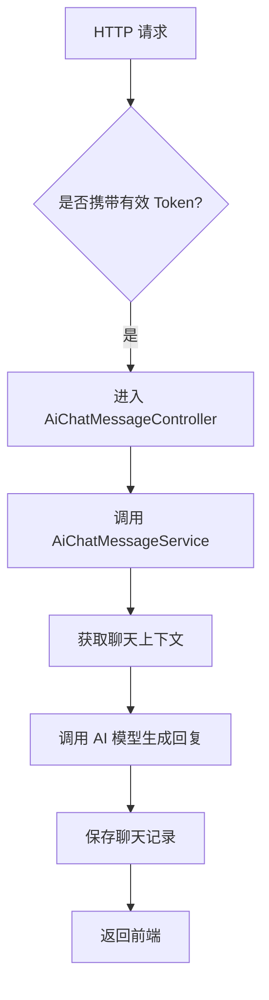
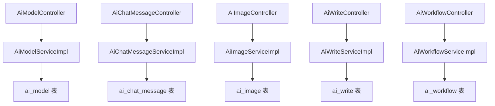
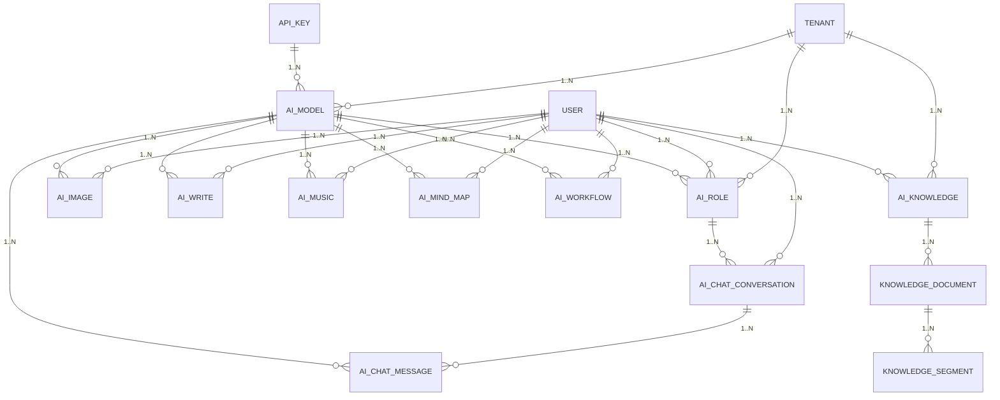

`pei-module-ai` 是一个 **基于 Spring Boot 的 AI 模块（AI Module）**，其核心作用是为企业提供统一的 AI 服务集成能力。该模块支持多种大模型平台接入，包括但不限于：

- 国内：通义千问、文心一言、讯飞星火、智谱 GLM、DeepSeek
- 国外：OpenAI、Ollama、Midjourney、StableDiffusion、Suno

它实现了以下核心功能：

- 聊天助手（Chat）
- 图像生成（Image Generation）
- 音乐创作（Music Creation）
- 思维导图（Mind Map）
- 写作辅助（Writing Assistant）
- 工作流引擎（Workflow Engine）
- 知识库管理（Knowledge Base）

---

## ✅ 模块概述

### 🎯 模块定位

- **目标**：构建统一的 AI 服务平台，支持：
  - 多模型平台配置管理（API Key、模型类型）
  - 聊天对话记录与历史回溯
  - 知识库导入与检索增强
  - 图像/音乐生成任务管理
  - 思维导图自动生成
  - 可扩展的工作流引擎
- **应用场景**：
  - 客服系统中使用 AI 辅助回答
  - 商城商品描述自动生成
  - 用户画像分析与内容推荐
  - 企业知识库智能问答系统

### 🧩 技术栈依赖

- **Spring Boot + Spring Cloud Gateway + Nacos**
- **数据访问层**：
  - MyBatis Plus + MySQL + Redis
- **消息队列**：
  - RocketMQ + XXL-Job（用于异步处理和定时任务）
- **安全认证**：
  - Spring Security + Token + Redis Session
- **AI 工具类**：
  - Spring AI + Hutool 工具库、MapStruct 转换器、Jackson 多态序列化

---

## 📁 目录结构说明

```
src/main/java/
└── com/pei/dehaze/module/ai/
    ├── api/                    // API 接口定义，供其它模块调用
    │   └── enums               // 枚举定义
    ├── controller/             // 控制器层，处理 HTTP 请求
    │   ├── admin/              // 管理后台控制器
    │   │   ├── chat            // 聊天相关
    │   │   ├── image           // 图像生成相关
    │   │   ├── knowledge       // 知识库相关
    │   │   ├── model           // 模型管理相关
    │   │   ├── music           // 音乐生成相关
    │   │   ├── tool            // 工具管理相关
    │   │   ├── workflow        // 工作流相关
    │   │   └── write           // 写作辅助相关
    │   └── app/                // 用户端 APP 控制器（可选）
    ├── convert/                // VO/DO 转换类
    ├── dal/                    // 数据访问层
    │   ├── dataobject/         // 数据库实体对象（DO）
    │   └── mysql/              // Mapper 层接口
    ├── framework/              // 框架扩展功能
    │   ├── ai                  // AI 核心封装逻辑
    │   ├── rpc                 // 远程调用封装
    │   └── security            // 权限控制封装
    ├── job/                    // 定时任务调度
    ├── service/                // 业务逻辑实现
    │   ├── chat                // 聊天服务
    │   ├── image               // 图像生成服务
    │   ├── knowledge           // 知识库服务
    │   ├── model               // 模型管理服务
    │   ├── music               // 音乐生成服务
    │   ├── tool                // 工具管理服务
    │   ├── workflow            // 工作流服务
    │   └── write               // 写作辅助服务
    └── AiServerApplication.java // 启动类
```

---

## 🔍 关键包详解

### 1️⃣ `api.enums` 包 —— 枚举定义

#### 示例：`AiChatRoleEnum.java`

```java
@AllArgsConstructor
@Getter
public enum AiChatRoleEnum {

    AI_WRITE_ROLE("写作助手", """
            你是一位出色的写作助手，能够帮助用户生成创意和灵感，并在用户提供场景和提示词时生成对应的回复。
            """),

    AI_MIND_MAP_ROLE("导图助手", """
             你是一位非常优秀的思维导图助手，你会把用户的所有提问都总结成思维导图，然后以 Markdown 格式输出。
            """)
}
```

- **作用**：统一管理内置 AI 角色。
- **用途**：
  - 在聊天、写作、导图等场景中预设角色行为
  - 提供静态方法简化判断逻辑

---

### 2️⃣ `controller.admin.model` 包 —— 模型管理后台接口

#### 示例：`AiModelController.java`

```java
@Tag(name = "管理后台 - AI 模型")
@RestController
@RequestMapping("/ai/model")
@Validated
public class AiModelController {

    @Resource
    private AiModelService modelService;

    @PostMapping("/create")
    @Operation(summary = "创建模型")
    @PreAuthorize("@ss.hasPermission('ai:model:create')")
    public CommonResult<Long> createModel(@Valid @RequestBody AiModelSaveReqVO createReqVO) {
        return success(modelService.createModel(createReqVO));
    }
}
```

- **作用**：对外暴露 `/ai/model/**` 接口，实现管理员相关的模型操作。
- **权限控制**：
  - 使用 `@PreAuthorize` 校验用户是否有操作权限
- **返回值规范**：
  - 统一使用 `CommonResult`

---

### 3️⃣ `service.model` 包 —— 模型服务逻辑

#### 示例：`AiModelServiceImpl.java`

```java
@Service
@Validated
@Slf4j
public class AiModelServiceImpl implements AiModelService {

    @Resource
    private AiModelMapper modelMapper;

    @Override
    public Long createModel(AiModelSaveReqVO createReqVO) {
        AiModelDO model = BeanUtils.toBean(createReqVO, AiModelDO.class);
        modelMapper.insert(model);
        return model.getId();
    }

    @Override
    public void updateModel(AiModelSaveReqVO updateReqVO) {
        AiModelDO model = modelMapper.selectById(updateReqVO.getId());
        if (model == null) {
            throw exception(MODEL_NOT_EXISTS);
        }
        BeanUtils.copyProperties(model, updateReqVO);
        modelMapper.updateById(model);
    }
}
```

- **作用**：实现 AI 模型的创建、更新、删除、查询等操作。
- **关键逻辑**：
  - 支持多平台模型配置（如 OpenAI、通义千问）
  - 支持模型分组管理
- **事务控制**：
  - 使用 `@Transactional` 保证插入和后续操作一致性

---

### 4️⃣ `dal.dataobject.model` 包 —— 模型数据库映射对象

#### 示例：`AiModelDO.java`

```java
@TableName("ai_model")
@KeySequence("ai_model_seq")
@Data
@EqualsAndHashCode(callSuper = true)
@ToString(callSuper = true)
@Builder
@NoArgsConstructor
@AllArgsConstructor
public class AiModelDO extends BaseDO {

    /**
     * 模型编号
     */
    @TableId
    private Long id;

    /**
     * 模型名称
     */
    private String name;

    /**
     * 模型标识符（如 gpt-3.5-turbo）
     */
    private String model;

    /**
     * 平台类型（枚举 AiPlatformEnum）
     */
    private Integer platformType;

    /**
     * API Key
     */
    private String apiKey;

    /**
     * 是否启用
     */
    private Boolean enable;

    /**
     * 状态（启用/禁用）
     */
    private Integer status;
}
```

- **作用**：映射 `ai_model` 表。
- **字段说明**：
  - `model`: 模型标识符（如 `gpt-3.5-turbo`）
  - `platformType`: 所属平台（如 OpenAI、Qwen）
  - `apiKey`: 对应平台的 API 密钥
- **继承 BaseDO**：包含基础字段如 `creator`, `createTime`, `updater`, `updateTime`, `deleted`, `tenantId`

---

### 5️⃣ `framework.ai.core` 包 —— AI 模型工厂封装

#### 示例：`AiModelFactoryImpl.java`

```java
@Component
public class AiModelFactoryImpl implements AiModelFactory {

    @Resource
    private PeiAiProperties aiProperties;

    @Resource
    private DashScopeChatModel dashScopeChatModel;
    @Resource
    private DashScopeImageModel dashScopeImageModel;
    @Resource
    private DashScopeEmbeddingModel dashScopeEmbeddingModel;

    @Resource
    private QwenChatModel qwenChatModel;
    @Resource
    private QwenImageModel qwenImageModel;
    @Resource
    private QwenEmbeddingModel qwenEmbeddingModel;

    @Resource
    private BaiChuanChatModel baiChuanChatModel;
    @Resource
    private HunYuanChatModel hunYuanChatModel;
    @Resource
    private XingHuoChatModel xingHuoChatModel;

    @Override
    public ChatModel getChatModel(String model) {
        switch (model) {
            case "qwen": return qwenChatModel;
            case "baichuan": return baiChuanChatModel;
            case "hunyuan": return hunYuanChatModel;
            case "xinghuo": return xingHuoChatModel;
            default: throw new UnsupportedOperationException("不支持的模型：" + model);
        }
    }

    @Override
    public ImageModel getImageModel(String model) {
        switch (model) {
            case "qwen": return qwenImageModel;
            case "dashscope": return dashScopeImageModel;
            default: throw new UnsupportedOperationException("不支持的图像模型：" + model);
        }
    }
}
```

- **作用**：封装不同平台 AI 模型的初始化逻辑。
- **优势**：
  - 解耦具体模型实现
  - 支持运行时动态选择模型
- **使用场景**：
  - 在 Service 中通过 `aiModelFactory.getChatModel(...)` 获取聊天模型
  - 在 Controller 中根据用户输入选择对应模型

---

### 6️⃣ `service.chat` 包 —— 聊天服务逻辑

#### 示例：`AiChatMessageServiceImpl.java`

```java
@Service
@Validated
@Slf4j
public class AiChatMessageServiceImpl implements AiChatMessageService {

    @Resource
    private AiChatMessageMapper chatMessageMapper;

    @Resource
    private AiChatConversationService conversationService;

    @Resource
    private AiChatRoleService roleService;

    @Override
    public Flux<CommonResult<String>> sendMessage(AiChatMessageSendReqVO reqVO, Long userId) {
        AiChatRoleDO role = roleService.getRequiredRole(reqVO.getRoleId());
        AiChatConversationDO conversation = conversationService.getOrCreate(userId, reqVO.getRoleId());

        List<Message> history = chatMessageMapper.selectByConversation(conversation.getId());

        ChatResponse response = aiModelFactory.getChatModel(role.getModel())
                .call(new Prompt(reqVO.getContent(), history));

        return Flux.just(success(response.getResult().getOutput().getContent()));
    }
}
```

- **作用**：实现 AI 聊天、历史记录、上下文维护等功能。
- **流程说明**：
  - 用户发送消息 → 插入数据库
  - 调用 AI 模型 → 获取响应
  - 返回结果并保存到历史记录
- **事务控制**：
  - 使用 `@Transactional` 保证消息记录与状态同步更新

---

### 7️⃣ `service.image` 包 —— 图像生成服务逻辑

#### 示例：`AiImageServiceImpl.java`

```java
@Service
@Validated
@Slf4j
public class AiImageServiceImpl implements AiImageService {

    @Resource
    private AiImageMapper imageMapper;

    @Resource
    private AiModelService modalService;

    @Resource
    private FileApi fileApi;

    @Override
    public String generateImage(AiImageDrawReqVO drawReqVO, Long userId) {
        AiModelDO model = modalService.validateModel(drawReqVO.getModelId());

        ImageOptions options = buildImageOptions(drawReqVO);

        ImagePrompt prompt = new ImagePrompt(drawReqVO.getPrompt(), options);
        ImageResponse response = aiModelFactory.getImageModel(model.getModel()).call(prompt);

        String imageUrl = fileApi.uploadFile(response.getImages().get(0).getData());
        saveImageRecord(userId, imageUrl, drawReqVO);

        return imageUrl;
    }
}
```

- **作用**：实现图像生成、图片上传、历史记录等功能。
- **关键逻辑**：
  - 支持 Midjourney、Stable Diffusion、DashScope 等模型
  - 自动上传生成的图片至文件服务器
- **事务控制**：
  - 使用 `@Transactional` 保证图片记录与 URL 一致性

---

### 8️⃣ `service.write` 包 —— 写作辅助服务逻辑

#### 示例：`AiWriteServiceImpl.java`

```java
@Service
@Validated
@Slf4j
public class AiWriteServiceImpl implements AiWriteService {

    @Resource
    private AiChatRoleService chatRoleService;

    @Resource
    private AiModelService modalService;

    @Resource
    private AiWriteMapper writeMapper;

    @Override
    public Flux<CommonResult<String>> generateWriteContent(AiWriteGenerateReqVO generateReqVO, Long userId) {
        AiChatRoleDO role = CollUtil.getFirst(
                chatRoleService.getChatRoleListByName(AiChatRoleEnum.AI_WRITE_ROLE.getName()));

        AiModelDO model = getModel(role);

        ChatOptions options = buildChatOptions(generateReqVO);

        Prompt prompt = new Prompt(generateReqVO.getContent(), options);

        ChatResponse response = aiModelFactory.getChatModel(model.getModel()).call(prompt);

        return Flux.just(success(response.getResult().getOutput().getContent()));
    }
}
```

- **作用**：实现文章、文案、邮件、脚本等内容生成。
- **字段说明**：
  - 支持模板化生成（如新闻稿、营销文案）
  - 支持中文/英文多语言切换
- **事务控制**：
  - 使用 `@Transactional` 保证内容生成与日志记录一致性

---

### 9️⃣ `service.mindmap` 包 —— 思维导图服务逻辑

#### 示例：`AiMindMapServiceImpl.java`

```java
@Service
@Validated
@Slf4j
public class AiMindMapServiceImpl implements AiMindMapService {

    @Resource
    private AiChatRoleService chatRoleService;

    @Resource
    private AiModelService modalService;

    @Resource
    private AiMindMapMapper mindMapMapper;

    @Override
    public Flux<CommonResult<String>> generateMindMap(AiMindMapGenerateReqVO generateReqVO, Long userId) {
        AiChatRoleDO role = CollUtil.getFirst(
                chatRoleService.getChatRoleListByName(AiChatRoleEnum.AI_MIND_MAP_ROLE.getName()));
        AiModelDO model = getModel(role);

        ChatOptions options = buildChatOptions(generateReqVO);

        Prompt prompt = new Prompt(generateReqVO.getContent(), options);

        ChatResponse response = aiModelFactory.getChatModel(model.getModel()).call(prompt);

        return Flux.just(success(response.getResult().getOutput().getContent()));
    }
}
```

- **作用**：实现自动将文本转换为思维导图（Markdown 格式）。
- **设计模式**：
  - 使用 `StreamingChatModel` 实现实时生成
  - 使用 `Flux` 支持 SSE 流式响应
- **日志追踪**：
  - 使用 `trace_id` 进行链路追踪

---

### 🔟 `service.workflow` 包 —— 工作流服务逻辑

#### 示例：`AiWorkflowServiceImpl.java`

```java
@Service
@Validated
@Slf4j
public class AiWorkflowServiceImpl implements AiWorkflowService {

    @Resource
    private AiWorkflowMapper workflowMapper;

    @Resource
    private Tinyflow tinyflow;

    @Override
    public Object testWorkflow(AiWorkflowTestReqVO testReqVO) {
        AiWorkflowDO workflow = workflowMapper.selectById(testReqVO.getId());
        if (workflow == null) {
            throw exception(WORKFLOW_NOT_EXISTS);
        }

        Map<String, Object> context = testReqVO.getContext();
        return tinyflow.execute(workflow.getCode(), context);
    }
}
```

- **作用**：实现可视化工作流编排，支持多个 AI 模型串联执行。
- **流程说明**：
  - 用户编辑工作流代码（DSL）
  - 编译并执行工作流
  - 支持调试与监控
- **事务控制**：
  - 使用 `@Transactional` 保证工作流状态变更一致性

---

## 🧠 模块工作流程图解

### 1️⃣ 聊天交互流程



### 2️⃣ 图像生成流程

```mermaid
graph TD
    A[用户点击生成按钮] --> B[进入 AiImageController.generate(...)]
    B --> C[调用 AiImageService.generate(...)]
    C --> D[构造 ImagePrompt]
    D --> E[调用 AI 模型生成图片]
    E --> F[上传图片至文件服务器]
    F --> G[保存记录并返回 URL]
    G --> H[响应客户端]
```

### 3️⃣ 写作辅助流程

```mermaid
graph TD
    A[用户提交写作请求] --> B[进入 AiWriteController.generate(...)]
    B --> C[调用 AiWriteService.generate(...)]
    C --> D[构造 Prompt]
    D --> E[调用 AI 模型生成内容]
    E --> F[返回 Markdown 格式内容]
    F --> G[响应客户端]
```

---

## 🧱 模块间关系图



---

## 🧩 模块功能总结

| 包名 | 功能 | 关键类 |
|------|------|--------|
| `api.enums` | 枚举定义 | `AiChatRoleEnum` |
| `controller.admin.model` | 模型管理后台 | `AiModelController` |
| `service.model` | 模型服务逻辑 | `AiModelServiceImpl` |
| `dal.dataobject.model` | 模型数据 | `AiModelDO` |
| `framework.ai.core` | AI 模型封装 | `AiModelFactoryImpl` |
| `service.chat` | 聊天服务逻辑 | `AiChatMessageServiceImpl` |
| `service.image` | 图像生成服务逻辑 | `AiImageServiceImpl` |
| `service.write` | 写作辅助服务逻辑 | `AiWriteServiceImpl` |
| `service.mindmap` | 思维导图服务逻辑 | `AiMindMapServiceImpl` |
| `service.workflow` | 工作流服务逻辑 | `AiWorkflowServiceImpl` |

---

## 🧾 模块实现原理详解

### 1️⃣ 聊天服务实现流程

- **步骤**：
    1. 用户发送聊天请求
    2. 进入 `AiChatMessageController`
    3. 调用 `AiChatMessageService.sendMessage(...)`
    4. 调用 `ChatModel.call(...)` 生成回复
    5. 插入 `ai_chat_message` 表
    6. 返回响应给前端

### 2️⃣ 图像生成服务实现流程

- **步骤**：
    1. 用户提交绘图请求
    2. 进入 `AiImageController.generate(...)`
    3. 调用 `AiImageService.generate(...)`
    4. 构造 `ImagePrompt`
    5. 调用 `ImageModel.call(...)` 生成图片
    6. 上传图片至文件服务器
    7. 插入 `ai_image` 表
    8. 返回图片 URL

### 3️⃣ 工作流服务实现流程

- **步骤**：
    1. 用户提交工作流代码
    2. 进入 `AiWorkflowController.create(...)`
    3. 调用 `AiWorkflowService.create(...)`
    4. 插入 `ai_workflow` 表
    5. 调用 `Tinyflow.execute(...)` 执行流程
    6. 返回执行结果

---

## ✅ 建议改进方向

| 改进点 | 描述 |
|--------|------|
| ✅ 多租户增强 | 当前仅支持单租户，未来需支持多租户数据隔离 |
| ✅ 异常日志增强 | 在 SQL 查询失败时记录详细日志，便于排查问题 |
| ✅ 性能优化 | 使用 `PreparedStatement` 替代 `queryForRowSet`，防止 SQL 注入 |
| ✅ 单元测试 | 当前代码未提供单元测试，建议补充测试用例 |
| ✅ 流程监控 | 增加成功率统计、异常率、平均响应时间等指标 |

---

## 📌 总结

`pei-module-ai` 模块实现了以下核心功能：

| 功能 | 技术实现 | 用途 |
|------|-----------|------|
| 聊天服务 | AiChatMessageDO + AiChatMessageService | 实现自然语言对话 |
| 图像生成 | AiImageDO + AiImageService | 生成图像、头像、海报 |
| 音乐创作 | AiMusicDO + AiMusicService | 生成歌词、旋律、音轨 |
| 思维导图 | AiMindMapDO + AiMindMapService | 自动生成 Markdown 导图 |
| 写作辅助 | AiWriteDO + AiWriteService | 生成文章、文案、脚本 |
| 工作流引擎 | AiWorkflowDO + AiWorkflowService | 编排多个 AI 模型组合执行 |
| 知识库管理 | AiKnowledgeDO + AiKnowledgeService | 支持文档上传、向量检索 |
| 工具管理 | AiToolDO + AiToolService | 支持工具调用、函数调用 |

它是一个轻量但功能完整的 AI 服务模块，适用于电商、社交、CRM、ERP、大屏报表等多个需要 AI 能力的场景。

## 📊 数据库表设计

### ER 图



#### **AI模型 - API密钥 (1:N)**

- 每个AI模型必须绑定一个API密钥，用于调用不同平台的AI服务
- 一个API密钥可以被多个模型共享使用，支持多平台、多模型的灵活配置
- 这种设计使得系统可以轻松接入OpenAI、Qwen、Midjourney等主流AI平台，同时保证了密钥的安全管理

#### **AI模型 - AI角色 (1:N)**

- 一个AI模型可以被多个角色使用，例如写作助手、导图助手、客服助理等
- 角色定义了使用哪个模型进行交互，支持不同场景下的模型切换
- 这种设计提升了系统的灵活性和可扩展性，用户可以在不同角色之间快速切换而无需频繁修改底层模型配置

#### **AI模型 - AI生成任务 (1:N)**

- 所有AI生成任务（如聊天回复、图像生成、文章创作）都依赖于具体的AI模型
- 毋庸置疑，每个生成任务记录中都有`modelId`和`model`字段作为外键引用
- 通过这种结构，系统能够清晰地追踪每次AI输出所使用的具体模型，便于后期效果分析与优化

#### **AI知识库 - 知识文档 - 知识分段 (1:N)**

- `AiKnowledgeDO` 是知识库主表，描述知识库名称、状态、模型等基本信息
- `AiKnowledgeDocumentDO` 是知识库中的文档，每个文档属于一个知识库
- `AiKnowledgeSegmentDO` 是文档的切片，用于向量检索时的最小单位
- 文档→分段→向量索引，这一层级结构支持高效的知识检索，同时保留了原始内容的追溯能力

#### **AI聊天会话 - AI聊天记录 (1:N)**

- `AiChatConversationDO` 表示一次完整的对话，包含角色设定、温度参数等上下文信息
- `AiChatMessageDO` 表示每条消息，属于某次特定的对话
- 支持上下文维护和历史回溯，确保连续对话的连贯性和一致性

#### **AI角色 - AI聊天会话 (1:N)**

- 一个角色可以产生多个会话
- 每个会话关联特定的角色，支持不同角色之间的切换
- 提供个性化对话体验，比如用户可以选择“写作助手”或“编程助手”来完成不同的任务

#### **用户 - 所有 DO (N:1)**

- 所有数据对象中都有`userId`字段，表示操作者是谁
- 如：AI聊天记录、AI绘图任务、AI写作任务等
- 支持多用户环境下的权限管理和行为追踪

#### **租户 - AI模型/AI角色/AI知识库 (1:N)**

- 支持SaaS模式的部署，实现多租户数据隔离
- 每个模型、知识库、角色都属于一个租户
- 在业务逻辑层做自动的租户过滤，确保不同租户的数据互不干扰

---

### 各表设计思路

#### **AI模型表 (`ai_model`)**

AI模型表是系统中用于集中管理和配置各类人工智能模型的重要数据结构。该表的设计旨在为用户提供一个统一、灵活且可扩展的模型管理方案，适用于多平台、多类型AI模型的集成与使用。

AI模型表主要用于存储所有支持的AI模型的配置信息。这些信息涵盖了模型的基本属性，例如其标识符、所属平台、模型类型以及相关的运行参数等。通过这一表格结构，系统能够清晰地记录和维护每个模型的具体配置，从而确保在实际调用时能够准确无误地加载相应的模型资源。

在设计上，AI模型表具备良好的通用性和扩展性：

- 支持多种平台的模型接入，如OpenAI、通义千问（Qwen）、Stable Diffusion、Midjourney等
- 引入了分组机制，可以将模型按照功能或用途划分为不同的组别
- 存储模型级参数，如温度（temperature）、最大Token数（maxTokens）等，提升用户体验的一致性

此外，AI模型表还支持软删除（`deleted`字段），便于模型的版本控制和灰度发布策略实施。

#### **API密钥表 (`ai_api_key`)**

API密钥表负责安全地存储调用不同平台AI接口所需的密钥信息。该表设计考虑了以下关键点：

- 安全性：密钥加密存储，防止敏感信息泄露
- 多平台支持：可以绑定不同AI平台的API密钥，如OpenAI、Qwen、Midjourney等
- 易维护性：支持密钥轮换、更新和禁用操作，方便管理员进行密钥生命周期管理

#### **AI角色表 (`ai_chat_role`)**

AI角色表用于定义预设的AI助手角色，如写作助手、导图助手等。它具备以下设计特点：

- 统一管理内置AI角色，提供静态方法简化判断逻辑
- 支持角色分类（category）和排序（sort），便于用户界面展示
- 可以引用知识库（knowledgeIds）和工具（toolIds），增强角色的功能扩展性
- 允许公开（publicStatus）或私有角色，满足管理员和普通用户的双重需求

#### **AI知识库相关表 (`ai_knowledge`, `ai_knowledge_document`, `ai_knowledge_segment`)**

这三张表构成了完整的知识库体系：

- `ai_knowledge` 是知识库主表，定义向量模型、召回参数等
- `ai_knowledge_document` 是上传的文件内容，每个文档属于一个知识库
- `ai_knowledge_segment` 是文档的切片，用于向量检索

这种设计实现了从文档→分段→向量索引的完整流程，既支持高效检索，又保留了原始内容的可追溯性。同时，每个分段存储在向量数据库中，便于后续语义搜索。

#### **AI聊天相关表 (`ai_chat_conversation`, `ai_chat_message`)**

这两张表构建了完整的对话系统：

- `ai_chat_conversation` 记录一次完整的对话上下文，包括角色设定、模型参数等
- `ai_chat_message` 记录每条消息，包含是否携带上下文（useContext）、召回的知识库分段（segmentIds）

这种设计支持上下文维护和历史回溯，使得对话更自然流畅。同时也为知识库增强提供了数据支撑。

#### **AI生成任务表 (`ai_image`, `ai_write`, `ai_music`, `ai_mind_map`, `ai_workflow`)**

这些表分别对应图像生成、写作辅助、音乐创作、思维导图和工作流执行任务，它们具有以下共同特征：

- 都引用`modelId`字段，表明所使用的AI模型
- 都包含`userId`字段，表示操作者身份
- 都记录创建/更新时间、软删除标志位等基础字段

**差异点在于：**

- `ai_image` 包含图像尺寸、平台、绘制参数等字段
- `ai_write` 包含写作类型、格式、语气、语言等控制输出质量的字段
- `ai_music` 包含音乐风格标签、时长、歌词等内容
- `ai_mind_map` 存储生成的Markdown格式导图内容
- `ai_workflow` 存储DSL代码，支持可视化编排多个AI模型执行

#### **用户与租户表**

虽然未直接体现在模块内部，但整个系统继承自框架的`BaseDO`类，意味着：

- 所有DO中都有`userId`字段，表示操作者是谁
- 所有DO中都有`tenantId`字段，支持多租户模式
- 在业务逻辑层做自动的租户过滤，确保数据隔离

---

### 设计优势总结

#### 1. **统一模型管理**

- 所有AI模型统一管理，便于维护和扩展
- 支持多平台、多类型模型接入
- 模型参数统一配置，提升用户体验

#### 2. **灵活的角色与会话机制**

- 角色定义了使用哪个模型进行聊天
- 会话记录上下文，支持连续对话
- 消息记录召回的知识库分段，便于溯源

#### 3. **强大的知识库与检索机制**

- 文档→分段→向量索引，支持高效检索
- 每个回复都记录召回的分段ID列表，便于评估检索效果
- 分段内容存储在向量库中，支持语义相似度匹配

#### 4. **多样化的AI生成任务支持**

- 图像生成、写作辅助、音乐创作等任务独立建模
- 每个任务都可以指定模型、用户、平台等
- 支持异步任务跟踪（status, finishTime, errorMessage）

#### 5. **平台适配与扩展性**

- platform字段区分不同平台
- taskId保存第三方平台的任务编号
- options/buttons支持平台特定参数
- 这些设计使得系统可以无缝对接各种AI平台

#### 6. **完善的审计与追踪机制**

- 所有DO继承`BaseDO`，包含creator/create_time/updater/update_time/deleted等字段
- 支持数据恢复和操作历史追踪
- 提供完整的日志记录能力

#### 7. **性能优化**

- 使用索引提升查询效率（idx_user_id, idx_model_id等）
- 分页加载聊天记录，避免一次性加载过多数据
- 分段存储大文本内容，提高检索效率

#### 8. **可追溯性与效果评估**

- 每个回复记录召回的分段ID列表（segmentIds）
- 方便溯源和效果评估
- 支持知识库优化迭代

#### 9. **多租户支持**

- tenantId字段贯穿所有DO
- 支持SaaS模式的部署
- 实现不同租户数据的物理隔离
