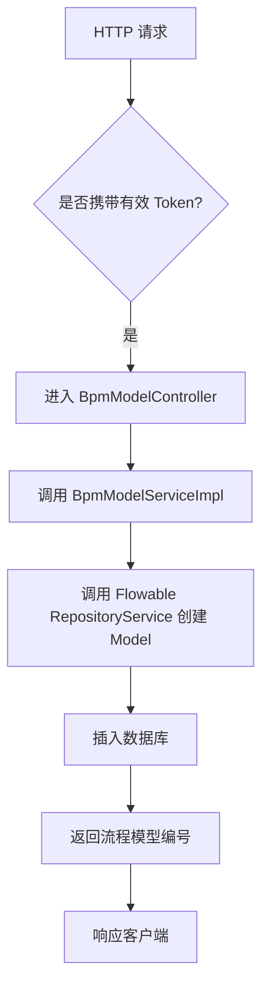
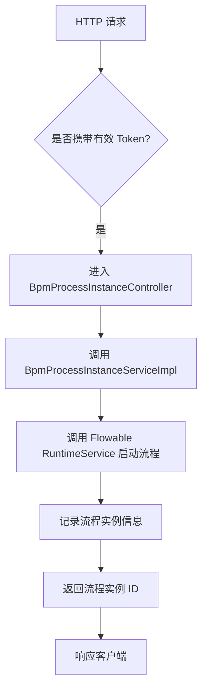
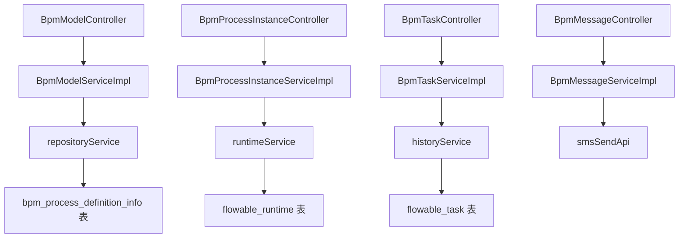

`pei-module-bpm` 是一个 **基于 Flowable 的业务流程管理模块（Business Process Management）**，其核心作用是为企业提供工作流引擎服务，包括流程定义、表单配置、任务审批、流程实例管理等功能。该模块基于 Spring Boot 3.4 + Java 17 实现，遵循分层架构设计，并与 `Flowable 6.x`、`Spring Security`、`MyBatis Plus`、`Redis` 等技术栈深度集成。

---

## ✅ 模块概述

### 🎯 模块定位
- **目标**：构建统一的 BPM 流程管理系统，支持：
    - 流程建模（图形化流程设计）
    - 表单配置（动态表单绑定）
    - 审核中心（我的申请、我的待办、我的已办）
    - 流程监控（流程状态、节点历史）
    - 多种候选人策略（角色、用户组、部门负责人等）
- **应用场景**：
    - OA 系统审批流程（请假、报销、采购）
    - CRM 销售订单审核
    - ERP 入库出库审批
    - 财务付款、收款流程控制
- **技术栈依赖**：
    - Spring Boot + Spring Cloud Gateway + Nacos
    - Flowable 6.x 工作流引擎
    - MyBatis Plus + MySQL + Redis
    - MapStruct + Lombok + Hutool 工具类
    - 自定义监听器 + HTTP 回调机制

---

## 📁 目录结构说明

```
src/main/java/
└── com/pei/dehaze/module/bpm/
    ├── api/                    // API 接口定义，供其它模块调用
    │   └── task/               // 任务相关的接口定义
    ├── controller/             // 控制器层，处理 HTTP 请求
    │   └── admin/              // 管理后台控制器
    ├── convert/                // VO/DO 转换类
    ├── dal/                    // 数据访问层
    │   ├── dataobject/         // 数据库实体对象（DO）
    │   └── mysql/              // Mapper 层接口
    ├── framework/              // 框架扩展功能
    │   ├── flowable/           // Flowable 扩展组件
    │   │   ├── core/           // 核心封装逻辑
    │   │   └── util/           // Flowable 工具类
    │   └── security/           // 安全认证相关逻辑
    ├── service/                // 业务逻辑实现
    │   ├── definition/         // 流程定义服务
    │   ├── message/            // 消息通知服务（短信、邮件）
    │   └── task/               // 任务调度服务
    ├── enums/                  // 枚举定义
    └── BpmServerApplication.java // 启动类
```


---

## 🔍 关键包详解

### 1️⃣ `api.task` 包 —— 任务接口定义

#### 🔹 示例：`BpmProcessInstanceStatusEvent.java`
```java
public interface BpmProcessInstanceStatusEvent {
    void onProcessInstanceApproved(String processInstanceId);
    void onProcessInstanceRejected(String processInstanceId);
}
```


- **作用**：对外暴露流程实例状态变更事件接口。
- **用途**：
    - 用于其它模块监听流程审批通过或拒绝事件
    - 可以触发后续业务动作（如发送短信、更新库存）

---

### 2️⃣ `controller.admin.definition` 包 —— 流程模型管理

#### 🔹 示例：`BpmModelController.java`
```java
@Tag(name = "管理后台 - 流程模型")
@RestController
@RequestMapping("/bpm/model")
@Validated
public class BpmModelController {

    @Resource
    private BpmModelService modelService;

    @PostMapping("/create")
    @Operation(summary = "创建流程模型")
    public CommonResult<Long> createModel(@Valid @RequestBody BpmModelSaveReqVO saveReqVO) {
        return success(modelService.createModel(saveReqVO));
    }
}
```


- **作用**：对外暴露 `/bpm/model/**` 接口，实现管理员相关的流程模型操作。
- **权限控制**：
    - 使用 `@PreAuthorize` 校验用户是否有操作权限
- **返回值规范**：
    - 统一使用 `CommonResult`

---

### 3️⃣ `service.definition` 包 —— 流程定义服务逻辑

#### 🔹 示例：`BpmModelServiceImpl.java`
```java
@Service
@Validated
@Slf4j
public class BpmModelServiceImpl implements BpmModelService {

    @Resource
    private RepositoryService repositoryService;
    @Resource
    private BpmFormService bpmFormService;

    @Override
    public Long createModel(BpmModelSaveReqVO saveReqVO) {
        Model model = repositoryService.newModel();
        model.setName(saveReqVO.getName());
        model.setKey(saveReqVO.getKey());
        repositoryService.saveModel(model);
        return model.getId();
    }
}
```


- **作用**：实现流程模型的创建、更新、删除、查询等操作。
- **关键逻辑**：
    - 使用 Flowable 提供的 `RepositoryService` 创建和保存流程模型
    - 支持 JSON 格式的模型数据存储
- **事务控制**：
    - 使用 `@Transactional` 保证插入和后续操作的原子性

---

### 4️⃣ `dal.dataobject.definition` 包 —— 数据库映射对象

#### 🔹 示例：`BpmProcessDefinitionInfoDO.java`
```java
@TableName("bpm_process_definition_info")
@KeySequence("bpm_process_definition_info_seq")
@Data
@EqualsAndHashCode(callSuper = true)
@ToString(callSuper = true)
@Builder
@NoArgsConstructor
@AllArgsConstructor
public class BpmProcessDefinitionInfoDO extends BaseDO {

    /**
     * 编号
     */
    @TableId
    private Long id;

    /**
     * 流程定义编号
     */
    private String processDefinitionId;

    /**
     * 流程模型编号
     */
    private String modelId;

    /**
     * 流程类型
     */
    private Integer modelType;

    /**
     * 分类编码
     */
    private String category;

    /**
     * 图标
     */
    private String icon;

    /**
     * 描述
     */
    private String description;

    /**
     * 表单类型
     */
    private Integer formType;

    /**
     * 表单编号
     */
    private Long formId;

    /**
     * 自定义提交路径
     */
    private String formCustomCreatePath;

    /**
     * 自定义查看路径
     */
    private String formCustomViewPath;
}
```


- **作用**：映射 `bpm_process_definition_info` 表。
- **字段说明**：
    - `processDefinitionId`: 流程定义 ID（Flowable 原生字段）
    - `modelType`: 流程模型类型（枚举 `BpmModelTypeEnum`）
    - `formType`: 表单类型（枚举 `BpmModelFormTypeEnum`）
    - `formId`: 动态表单 ID（关联 `BpmFormDO`）
- **继承 BaseDO**：包含基础字段如 `creator`, `createTime`, `updater`, `updateTime`, `deleted`, `tenantId`

---

### 5️⃣ `framework.flowable.core.util.SimpleModelUtils` 包 —— 简化流程模型构建

#### 🔹 示例：`SimpleModelUtils.java`
```java
public class SimpleModelUtils {

    private static final Map<BpmSimpleModelNodeTypeEnum, NodeConvert> NODE_CONVERTS = new HashMap<>();

    static {
        List<NodeConvert> converts = Arrays.asList(
            new StartNodeConvert(),
            new EndNodeConvert(),
            new ApproveNodeConvert(),
            new CopyNodeConvert(),
            new TransactorNodeConvert(),
            new DelayTimerNodeConvert(),
            new TriggerNodeConvert()
        );
        converts.forEach(convert -> NODE_CONVERTS.put(convert.getType(), convert));
    }

    public static BpmnModel buildBpmnModel(String name, String key, BpmSimpleModelNodeVO nodeVO) {
        BpmnModel model = new BpmnModel();
        Process process = new Process();
        process.setId(key);
        process.setName(name);

        // 添加开始节点
        StartEvent startEvent = new StartEvent();
        startEvent.setId(START_USER_NODE_ID);
        startEvent.setName("发起人");
        process.addFlowElement(startEvent);

        // 添加结束节点
        EndEvent endEvent = new EndEvent();
        endEvent.setId("EndEvent_1");
        endEvent.setName("结束");
        process.addFlowElement(endEvent);

        // 添加用户任务节点
        UserTask userTask = new UserTask();
        userTask.setId(nodeVO.getNodeId());
        userTask.setName(nodeVO.getNodeName());
        process.addFlowElement(userTask);

        // 添加连线
        SequenceFlow sequenceFlow = new SequenceFlow();
        sequenceFlow.setId("flow_1");
        sequenceFlow.setSourceRef(START_USER_NODE_ID);
        sequenceFlow.setTargetRef(nodeVO.getNodeId());
        process.addFlowElement(sequenceFlow);

        SequenceFlow sequenceFlow2 = new SequenceFlow();
        sequenceFlow2.setId("flow_2");
        sequenceFlow2.setSourceRef(nodeVO.getNodeId());
        sequenceFlow2.setTargetRef("EndEvent_1");
        process.addFlowElement(sequenceFlow2);

        model.addProcess(process);
        new BpmnAutoLayout(model).execute();
        return model;
    }
}
```


- **作用**：将简化版的流程定义（如钉钉风格）转换为标准 BPMN 模型。
- **优势**：
    - 降低用户学习 BPMN 模型复杂度
    - 支持多种节点类型（审批、抄送、触发器、条件分支等）
- **使用场景**：
    - 流程设计器前端传递简化结构 → 后端自动转换为 BPMN XML

---

### 6️⃣ `enums.definition` 包 —— 流程定义枚举

#### 🔹 示例：`BpmTriggerTypeEnum.java`
```java
@Getter
@AllArgsConstructor
public enum BpmTriggerTypeEnum implements ArrayValuable<Integer> {

    HTTP_REQUEST(1, "发起 HTTP 请求"),
    HTTP_CALLBACK(2, "接收 HTTP 回调"),

    FORM_UPDATE(10, "更新流程表单数据"),
    FORM_DELETE(11, "删除流程表单数据");

    private final Integer type;
    private final String desc;

    public static BpmTriggerTypeEnum typeOf(Integer type) {
        return ArrayUtil.firstMatch(o -> o.getType().equals(type), values());
    }
}
```


- **作用**：统一管理流程模型中使用的各种触发器类型。
- **优势**：
    - 减少魔法数字
    - 提供静态方法简化判断逻辑

---

### 7️⃣ `service.task` 包 —— 任务服务逻辑

#### 🔹 示例：`BpmProcessInstanceServiceImpl.java`
```java
@Service
@Validated
@Slf4j
public class BpmProcessInstanceServiceImpl implements BpmProcessInstanceService {

    @Resource
    private RuntimeService runtimeService;
    @Resource
    private HistoryService historyService;

    @Override
    public ProcessInstance startProcessInstance(String processDefinitionKey, Map<String, Object> variables) {
        return runtimeService.startProcessInstanceByKey(processDefinitionKey, variables);
    }

    @Override
    public List<Task> getTasksByAssignee(Long userId) {
        return taskService.createTaskQuery().taskAssignee(userId.toString()).list();
    }
}
```


- **作用**：实现流程实例的启动、暂停、终止、查询等操作。
- **流程生命周期管理**：
    - 启动流程：`runtimeService.startProcessInstanceByKey(...)`
    - 查询任务：`taskService.createTaskQuery().taskAssignee(...).list()`
- **流程变量**：
    - 支持传入自定义变量（如 `userId`, `deptId`）

---

### 8️⃣ `framework.flowable.core.listener.BpmUserTaskListener` 包 —— 用户任务监听器

#### 🔹 示例：`BpmUserTaskListener.java`
```java
@Component
@Slf4j
@Scope("prototype")
public class BpmUserTaskListener implements TaskListener {

    public static final String DELEGATE_EXPRESSION = "${bpmUserTaskListener}";

    @Resource
    private BpmProcessInstanceService processInstanceService;

    @Setter
    private FixedValue listenerConfig;

    @Override
    public void notify(DelegateTask delegateTask) {
        BpmSimpleModelNodeVO.ListenerHandler handler = parseListenerConfig(listenerConfig);

        // 添加默认参数
        handler.getBody().add(new HttpRequestParam("taskId", FIXED_VALUE, delegateTask.getId()));
        handler.getBody().add(new HttpRequestParam("assignee", FIXED_VALUE, delegateTask.getAssignee()));

        // 发起 HTTP 请求
        BpmHttpRequestUtils.executeBpmHttpRequest(delegateTask.getProcessInstanceId(),
                handler.getPath(), handler.getHeader(), handler.getBody(), false, null);
    }
}
```


- **作用**：当流程任务分配给用户时，触发监听器并执行指定逻辑。
- **监听方式**：
    - 配置在 BPMN 文件中：`${bpmUserTaskListener}`
- **扩展性**：
    - 支持 HTTP 请求回调，便于集成外部系统

---

### 9️⃣ `service.message` 包 —— 流程消息服务

#### 🔹 示例：`BpmMessageServiceImpl.java`
```java
@Service
@Validated
@Slf4j
public class BpmMessageServiceImpl implements BpmMessageService {

    @Resource
    private SmsSendApi smsSendApi;

    @Override
    public void sendMessageWhenProcessInstanceApprove(BpmMessageSendWhenProcessInstanceApproveReqDTO reqDTO) {
        Map<String, Object> templateParams = new HashMap<>();
        templateParams.put("processInstanceName", reqDTO.getProcessInstanceName());
        templateParams.put("detailUrl", getProcessInstanceDetailUrl(reqDTO.getProcessInstanceId()));
        smsSendApi.sendSingleSmsToAdmin(BpmMessageConvert.INSTANCE.convert(reqDTO.getStartUserId(),
                BpmMessageEnum.PROCESS_INSTANCE_APPROVE.getSmsTemplateCode(), templateParams)).checkError();
    }
}
```


- **作用**：在流程实例状态变化时，发送通知给相关人员。
- **消息类型**：
    - 审批通过通知
    - 审批拒绝通知
    - 任务超时提醒
- **发送渠道**：
    - 短信通知
    - 微信推送（可扩展）

---

### 🔟 `service.definition` 包 —— 用户组服务逻辑

#### 🔹 示例：`BpmUserGroupServiceImpl.java`
```java
@Service
@Validated
public class BpmUserGroupServiceImpl implements BpmUserGroupService {

    @Resource
    private BpmUserGroupMapper userGroupMapper;

    @Override
    public Long createUserGroup(BpmUserGroupSaveReqVO createReqVO) {
        BpmUserGroupDO group = BeanUtils.toBean(createReqVO, BpmUserGroupDO.class);
        userGroupMapper.insert(group);
        return group.getId();
    }

    @Override
    public void updateUserGroup(BpmUserGroupSaveReqVO updateReqVO) {
        validateUserGroupExists(updateReqVO.getId());
        BpmUserGroupDO updateObj = BeanUtils.toBean(updateReqVO, BpmUserGroupDO.class);
        userGroupMapper.updateById(updateObj);
    }
}
```


- **作用**：实现用户组的创建、更新、删除、查询等操作。
- **字段说明**：
    - `userIds`: 成员用户 ID 列表
    - `status`: 用户组状态（启用/禁用）
- **事务控制**：
    - 使用 `@Transactional` 保证操作一致性

---

## 🧠 模块工作流程图解

### 1️⃣ 创建流程模型流程



### 2️⃣ 流程实例启动流程



---

## 🧱 模块间关系图




---

## 🧩 模块功能总结

| 包名 | 功能 | 关键类 |
|------|------|--------|
| `api.task` | 任务接口定义 | `BpmProcessInstanceStatusEvent` |
| `controller.admin.definition` | 流程模型管理 | `BpmModelController` |
| `service.definition` | 流程定义服务 | `BpmModelServiceImpl` |
| `dal.dataobject.definition` | 流程模型数据 | `BpmProcessDefinitionInfoDO` |
| `framework.flowable.core.util` | 流程模型构建 | `SimpleModelUtils` |
| `enums.definition` | 流程定义枚举 | `BpmTriggerTypeEnum` |
| `service.task` | 流程任务服务 | `BpmProcessInstanceServiceImpl` |
| `framework.flowable.core.listener` | 用户任务监听器 | `BpmUserTaskListener` |
| `service.message` | 流程消息服务 | `BpmMessageServiceImpl` |
| `service.definition` | 用户组服务逻辑 | `BpmUserGroupServiceImpl` |

---

## 🧾 模块实现原理详解

### 1️⃣ 流程建模机制
- **使用 Flowable Modeler**：
    - 创建 `org.flowable.engine.repository.Model`
    - 存储 BPMN XML 数据到数据库
- **支持简化模型构建**：
    - 仿钉钉流程设计器输入格式（JSON）
    - 转换为标准 BPMN XML 并部署

### 2️⃣ 流程部署流程
- **部署过程**：
  ```mermaid
  graph TD
      A[HTTP 请求] --> B[进入 BpmModelController]
      B --> C[调用 BpmModelServiceImpl]
      C --> D[调用 Flowable RepositoryService]
      D --> E[保存 Model 到数据库]
      E --> F[生成 BPMN XML]
      F --> G[部署流程定义]
  ```


### 3️⃣ 任务候选人策略
- **支持多种策略**：
    - 角色、用户组、部门成员、表达式等
- **示例策略：`DEPT_LEADER`**
    - 获取当前用户的部门负责人作为审批人
- **实现方式**：
    - 通过 `BpmTaskCandidateInvoker` 解析策略
    - 由 `BpmTaskCandidateStrategy` 实现具体逻辑

---

## ✅ 建议改进方向

| 改进点 | 描述 |
|--------|------|
| ✅ 多租户增强 | 当前仅支持单租户，未来需支持多租户数据隔离 |
| ✅ 异常日志增强 | 在 SQL 查询失败时记录详细日志，便于排查问题 |
| ✅ 性能优化 | 使用 `PreparedStatement` 替代 `queryForRowSet`，防止 SQL 注入 |
| ✅ 单元测试 | 当前代码未提供单元测试，建议补充测试用例 |
| ✅ 流程版本管理 | 当前只保留最新流程定义，建议增加历史版本支持 |

---

## 📌 总结

`pei-module-bpm` 模块实现了以下核心功能：

| 功能 | 技术实现 | 用途 |
|------|-----------|------|
| 流程建模 | BpmModelDO + BpmModelService | 流程可视化建模 |
| 流程部署 | Flowable RepositoryService | 将 BPMN 部署为可运行的流程 |
| 任务分配 | BpmTaskCandidateStrategy | 支持多种候选人策略 |
| 流程实例 | BpmProcessInstanceDO + ProcessInstanceService | box 流程实例生命周期 |
| 任务监听 | BpmUserTaskListener | 任务分配时触发通知 |
| 消息通知 | BpmMessageService | 审批通过、驳回、超时提醒 |
| 用户组管理 | BpmUserGroupDO + BpmUserGroupService | 用户组维护 |
| 流程分类 | BpmCategoryDO + BpmCategoryService | 对流程进行分类管理 |

它是一个轻量但功能完整的 BPM 流程管理模块，适用于企业审批、OA、CRM、ERP 等需要流程控制的场景。如果你有具体某个类（如 `BpmModelServiceImpl`、`BpmProcessInstanceServiceImpl`）想要深入了解，欢迎继续提问！
