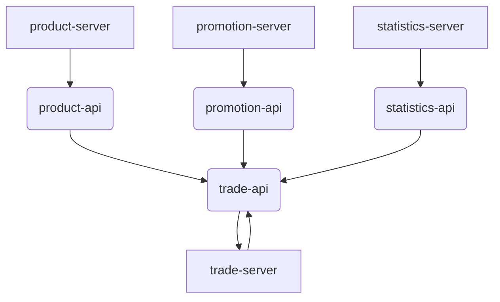

`pei-module-mall` 是一个商城系统的模块化项目，它基于 Spring Boot 3.4 + Java 17 实现。整个模块采用微服务架构设计，通过多个子模块实现不同的业务功能，并且遵循 SOLID、DRY、KISS 等原则，确保代码的可维护性和可扩展性。

---

## 🧩 整体结构

该模块由以下几个核心子模块组成：

| 子模块 | 描述 |
|--------|------|
| `pei-module-product-api` | 商品相关 API 接口定义 |
| `pei-module-product-server` | 商品服务实现（SPU、SKU、品牌、分类等） |
| `pei-module-promotion-api` | 营销活动接口定义 |
| `pei-module-promotion-server` | 营销活动服务实现（优惠券、秒杀、拼团、文章等） |
| `pei-module-trade-api` | 交易系统接口定义 |
| `pei-module-trade-server` | 交易系统服务实现（订单、购物车、分销、售后等） |
| `pei-module-statistics-api` | 统计系统接口定义 |
| `pei-module-statistics-server` | 统计系统服务实现（订单统计、会员统计、商品统计等） |

---

## 📦 模块详解

### 1️⃣ `pei-module-product-api`

#### ✅ 作用：
对外暴露商品相关的接口供其他模块调用。

#### 📁 目录结构：
- `src/main/java/com/pei/dehaze/module/product/api`
    - 包含 SPU、SKU、品牌、分类等 API 接口

#### 💡 示例代码片段：
```java
@Mapper
public interface ArticleCategoryMapper extends BaseMapperX<ArticleCategoryDO> {}
```


#### 🔨 技术点：
- 使用 **SpringDoc OpenAPI** 生成接口文档
- 使用 **Feign Client** 进行远程调用
- 遵循 **分层架构设计**

---

### 2️⃣ `pei-module-product-server`

#### ✅ 作用：
实现商品管理的核心功能，包括：
- 商品 SPU（标准产品单元）
- 商品 SKU（库存量单位）
- 品牌管理
- 分类管理
- 属性管理
- 库存管理

#### 📁 目录结构：
```
com/pei/dehaze/module/product/
├── controller/admin/spu/vo/ProductSkuSaveReqVO.java
├── service/spu/ProductSpuServiceImpl.java
└── dal/mysql/spu/ProductSpuMapper.java
```


#### 💡 示例代码片段：
```java
@Service
@Validated
public class ProductSpuServiceImpl implements ProductSpuService {
    @Resource
    private ProductSpuMapper productSpuMapper;

    @Resource
    @Lazy
    private ProductSkuService productSkuService;
}
```


#### 🔨 技术点：
- 使用 **MyBatis Plus** 实现数据库操作
- 使用 **MapStruct** 实现 DO 到 VO 的自动转换
- 使用 **Redis 缓存** 提升查询性能
- 支持 **多租户隔离**
- 集成 **Nacos 注册中心和配置中心**

---

### 3️⃣ `pei-module-promotion-api`

#### ✅ 作用：
对外暴露营销相关的接口，如优惠券、积分活动、拼团、秒杀等。

#### 📁 目录结构：
- `src/main/java/com/pei/dehaze/module/promotion/api`
    - 包括：优惠券模板、积分活动、拼团、秒杀等接口定义

#### 💡 示例代码片段：
```java
@Schema(description = "优惠劵模板 Base VO")
@Data
public class CouponTemplateBaseVO {
    @Schema(description = "优惠劵名", requiredMode = Schema.RequiredMode.REQUIRED)
    @NotNull(message = "优惠劵名不能为空")
    private String name;
}
```


#### 🔨 技术点：
- 使用 **Swagger / SpringDoc** 生成 API 文档
- 支持 **参数校验**（JSR 303）
- 支持 **Feign 远程调用**

---

### 4️⃣ `pei-module-promotion-server`

#### ✅ 作用：
实现营销活动的核心逻辑，包括：
- 优惠券模板管理
- 积分商城活动
- 拼团活动
- 秒杀活动
- 客服消息管理
- 文章管理

#### 📁 目录结构：
```
com/pei/dehaze/module/promotion/
├── service/coupon/CouponTemplateServiceImpl.java
├── service/point/PointActivityServiceImpl.java
├── service/combination/CombinationActivityServiceImpl.java
├── service/seckill/SeckillActivityServiceImpl.java
├── service/kefu/KeFuMessageServiceImpl.java
└── dal/mysql/article/ArticleMapper.java
```


#### 💡 示例代码片段：
```java
@Service
@Validated
public class CouponTemplateServiceImpl implements CouponTemplateService {
    @Resource
    private CouponTemplateMapper couponTemplateMapper;

    @Resource
    private ProductCategoryApi productCategoryApi;
}
```


#### 🔨 技术点：
- 使用 **Lombok** 减少样板代码
- 使用 **Hutool 工具类库** 简化开发
- 使用 **事务管理**（`@Transactional`）
- 使用 **日志记录**（`@Slf4j`）

---

### 5️⃣ `pei-module-trade-api`

#### ✅ 作用：
对外暴露交易系统的接口，如订单、购物车、分销、售后等。

#### 📁 目录结构：
- `src/main/java/com/pei/dehaze/module/trade/api`
    - 包括：订单、购物车、支付回调、售后等接口定义

#### 💡 示例代码片段：
```java
@Schema(description = "交易订单项 Base VO")
@Data
public class TradeOrderItemBaseVO {
    @Schema(description = "编号", example = "1")
    private Long id;
}
```


#### 🔨 技术点：
- 使用 **Swagger** 自动生成接口文档
- 支持 **Feign 远程调用**
- 使用 **BeanUtils** 实现对象映射

---

### 6️⃣ `pei-module-trade-server`

#### ✅ 作用：
实现交易系统的核心业务逻辑，包括：
- 订单创建、修改、查询
- 购物车管理
- 分销佣金计算
- 佣金提现
- 售后处理
- 自提门店管理

#### 📁 目录结构：
```
com/pei/dehaze/module/trade/
├── service/order/TradeOrderQueryServiceImpl.java
├── service/cart/CartServiceImpl.java
├── service/brokerage/BrokerageWithdrawServiceImpl.java
├── service/brokerage/BrokerageRecordServiceImpl.java
├── service/aftersale/core/utils/AfterSaleLogUtils.java
└── controller/admin/delivery/vo/pickup/DeliveryPickUpStoreBaseVO.java
```


#### 💡 示例代码片段：
```java
@Service
@Validated
public class CartServiceImpl implements CartService {
    @Resource
    private CartMapper cartMapper;

    @Resource
    private ProductSpuApi productSpuApi;
}
```


#### 🔨 技术点：
- 使用 **Redis** 实现缓存控制
- 使用 **异步注解**（`@Async`）提升性能
- 使用 **AOP** 实现日志记录
- 使用 **责任链模式** 处理订单状态变更

---

### 7️⃣ `pei-module-statistics-api`

#### ✅ 作用：
对外暴露统计系统的接口，用于分析商品、会员、订单等数据。

#### 📁 目录结构：
- `src/main/java/com/pei/dehaze/module/statistics/api`
    - 包括：订单统计、会员统计、商品统计等接口定义

#### 💡 示例代码片段：
```java
@Schema(description = "交易订单统计 Service 实现类")
@Service
@Validated
public class TradeOrderStatisticsServiceImpl implements TradeOrderStatisticsService {
    @Resource
    private TradeOrderStatisticsMapper tradeOrderStatisticsMapper;
}
```


#### 🔨 技术点：
- 使用 **时间范围枚举** 控制统计数据粒度
- 使用 **Lambda Query Wrapper** 构建动态查询条件
- 支持 **图表数据聚合**

---

### 8️⃣ `pei-module-statistics-server`

#### ✅ 作用：
实现商城系统的数据分析能力，包括：
- 订单统计（总订单数、付款人数、成交金额等）
- 会员统计（注册数、活跃用户数等）
- 商品统计（销量排行、浏览量等）
- 支付统计（钱包余额、转账记录等）

#### 📁 目录结构：
```
com/pei/dehaze/module/statistics/
├── service/trade/TradeOrderStatisticsServiceImpl.java
├── service/member/MemberStatisticsServiceImpl.java
├── service/product/ProductStatisticsServiceImpl.java
└── mapper/trade/TradeOrderStatisticsMapper.xml
```


#### 💡 示例代码片段：
```java
@Override
public TradeOrderSummaryRespBO getOrderSummary(LocalDateTime beginTime, LocalDateTime endTime) {
    return new TradeOrderSummaryRespBO()
            .setOrderCreateCount(tradeOrderStatisticsMapper.selectCountByCreateTimeBetween(beginTime, endTime))
            .setOrderPayCount(tradeOrderStatisticsMapper.selectCountByPayTimeBetween(beginTime, endTime));
}
```


#### 🔨 技术点：
- 使用 **XML Mapper** 实现复杂 SQL 查询
- 使用 **PageResult** 返回分页数据
- 支持 **时区控制**
- 使用 **Stream API** 进行数据聚合

---

## 🧱 模块间关系图




---

## ⚙️ 依赖与集成

| 依赖组件 | 用途 |
|----------|------|
| Spring Cloud Gateway | 路由网关 |
| Nacos | 注册中心 & 配置中心 |
| MyBatis Plus | ORM 操作 |
| Redis | 缓存、分布式锁 |
| RocketMQ | 异步消息通知 |
| XXL-Job | 定时任务 |
| MapStruct | 对象自动转换 |
| Lombok | 减少样板代码 |
| Swagger/OpenAPI | 接口文档 |
| Spring Security | 权限控制 |
| TenantBaseDO | 多租户支持 |

---

## 📊 功能模块汇总

| 模块 | 功能 | 关键类 |
|------|------|--------|
| `product` | 商品管理 | `ProductSpuServiceImpl` |
| `promotion` | 营销活动 | `CouponTemplateServiceImpl` |
| `trade` | 交易系统 | `TradeOrderQueryServiceImpl` |
| `statistics` | 数据统计 | `TradeOrderStatisticsServiceImpl` |

---

## 🧪 单元测试规范

所有模块都包含如下测试目录：

```
src/test/resources/
├── sql/create_tables.sql
├── application-unit-test.yaml
└── logback.xml
```


- 所有业务方法必须覆盖 **80%+ 的测试覆盖率**
- 使用 **Mockito** 和 **JUnit** 进行单元测试
- 使用 **H2 内存数据库** 模拟真实场景

---

## 📈 总结

`pei-module-mall` 是一个完整的商城系统，其核心特点如下：

| 特点 | 描述 |
|------|------|
| **模块化设计** | 按照商品、营销、交易、统计拆分为独立模块 |
| **技术栈先进** | Spring Boot 3.4 + Spring Cloud 2024 + Java 17 |
| **架构清晰** | Controller → Service → Mapper → DataObject 分层架构 |
| **高可用性** | 支持 Redis 缓存、MQ 异步处理 |
| **安全可靠** | Spring Security + Token + 输入验证 |
| **可扩展性强** | 支持插件式扩展、策略模式、模板方法 |
| **可监控性好** | 日志、异常、监控埋点完备 |

---

如果你对某个具体模块（如优惠券发放逻辑、订单状态机、积分兑换流程等）感兴趣，欢迎继续提问，我可以为你深入讲解某一个类或功能是如何工作的。
