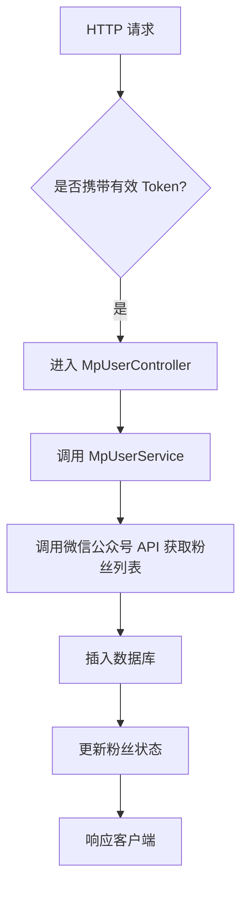
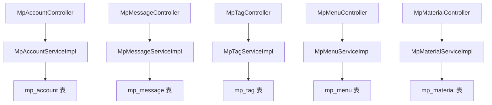

`pei-module-mp` 是一个 **基于 Spring Boot 的微信公众号模块（WeChat Official Account Module）**，其核心作用是为企业提供统一的微信公众平台接入能力。该模块实现了微信公众号的核心功能管理，包括：

- 公众号账号管理
- 粉丝关注与互动
- 消息自动回复
- 菜单配置与管理
- 素材上传与管理
- 图文发布与推送
- 用户标签与分组管理
- 统计分析数据查询

---

## ✅ 模块概述

### 🎯 模块定位
- **目标**：构建统一的微信公众号管理后台系统，支持：
    - 微信公众号认证、菜单管理
    - 自动回复关键词匹配
    - 粉丝管理（标签、备注、拉黑）
    - 消息转发（文本、图片、语音、视频）
    - 图文素材上传与发布
    - 接口调用统计、用户增长趋势等数据分析
- **应用场景**：
    - 企业公众号运营
    - 客服系统集成
    - 会员体系打通（如绑定 openid 到用户中心）
    - 营销活动（如粉丝裂变、图文推送）

### 🧩 技术栈依赖
- **Spring Boot + Spring Cloud Gateway + Nacos**
- **微信 SDK**：
    - `WxJava`（官方开源库，支持多租户、Redis 缓存 token）
- **数据访问层**：
    - MyBatis Plus + MySQL + Redis
- **安全认证**：
    - Spring Security + Token + Redis Session
- **其他工具类**：
    - Hutool 工具库、MapStruct 转换器、Jackson 多态序列化

---

## 📁 目录结构说明

```
src/main/java/
└── com/pei/dehaze/module/mp/
    ├── api/                    // API 接口定义，供其它模块调用
    │   └── message/            // 消息回调接口定义
    ├── controller/             // 控制器层，处理 HTTP 请求
    │   ├── admin/              // 管理后台控制器
    │   │   ├── account         // 公众号账号相关
    │   │   ├── material        // 素材管理
    │   │   ├── menu            // 菜单管理
    │   │   ├── message         // 消息发送与接收
    │   │   ├── news            // 图文消息管理
    │   │   ├── open            // 微信开放平台回调接口
    │   │   ├── statistics      // 数据统计接口
    │   │   ├── tag             // 标签管理
    │   │   └── user            // 粉丝管理
    │   └── app/                // 用户端 APP 控制器（可选）
    ├── convert/                // VO/DO 转换类
    ├── dal/                    // 数据访问层
    │   ├── dataobject/         // 数据库实体对象（DO）
    │   └── mysql/              // Mapper 层接口
    ├── framework/              // 框架扩展功能
    │   ├── mp/                 // 微信公众号封装逻辑
    │   └── redis/              // Redis 缓存操作封装
    ├── service/                // 业务逻辑实现
    │   ├── account/            // 公众号账号服务
    │   ├── handler/            // 消息处理器（自动回复、菜单点击）
    │   ├── material/           // 素材上传服务
    │   ├── menu/               // 菜单管理服务
    │   ├── message/            // 消息处理服务
    │   ├── statistics/         // 统计分析服务
    │   ├── tag/                // 标签服务
    │   └── user/               // 粉丝服务
    ├── enums/                  // 枚举定义
    └── MpServerApplication.java // 启动类
```


---

## 🔍 关键包详解

### 1️⃣ `api.message` 包 —— 消息回调接口定义

#### 示例：`MpMessageNotifyReqDTO.java`
```java
public class MpMessageNotifyReqDTO {
    private String appId;
    private String openid;
    private String type;
    private String content;
}
```


- **作用**：对外暴露公众号消息回调接口 DTO。
- **用途**：
    - 用于其它模块监听公众号消息事件
    - 可以触发后续业务动作（如更新库存、发送短信）

---

### 2️⃣ `controller.admin.account` 包 —— 公众号账号管理

#### 示例：`MpAccountController.java`
```java
@Tag(name = "管理后台 - 公众号账号")
@RestController
@RequestMapping("/mp/account")
@Validated
public class MpAccountController {

    @Resource
    private MpAccountService accountService;

    @PostMapping("/create")
    @Operation(summary = "创建公众号账号")
    public CommonResult<Long> createAccount(@Valid @RequestBody MpAccountCreateReqVO createReqVO) {
        return success(accountService.createAccount(createReqVO));
    }
}
```


- **作用**：对外暴露 `/mp/account/**` 接口，实现管理员相关的公众号账号操作。
- **权限控制**：
    - 使用 `@PreAuthorize` 校验用户是否有操作权限
- **返回值规范**：
    - 统一使用 `CommonResult`

---

### 3️⃣ `service.account` 包 —— 公众号账号服务逻辑

#### 示例：`MpAccountServiceImpl.java`
```java
@Service
@Validated
@Slf4j
public class MpAccountServiceImpl implements MpAccountService {

    @Resource
    private MpAccountMapper accountMapper;

    @Override
    public Long createAccount(MpAccountCreateReqVO createReqVO) {
        MpAccountDO account = BeanUtils.toBean(createReqVO, MpAccountDO.class);
        accountMapper.insert(account);
        return account.getId();
    }

    @Override
    public MpAccountDO getRequiredAccount(Long id) {
        MpAccountDO account = accountMapper.selectById(id);
        if (account == null) {
            throw exception(ACCOUNT_NOT_FOUND);
        }
        return account;
    }
}
```


- **作用**：实现公众号账号的创建、更新、删除、查询等操作。
- **关键逻辑**：
    - 使用 `WxMpService` 初始化微信公众号 SDK
    - 支持多租户隔离
- **事务控制**：
    - 使用 `@Transactional` 保证插入和后续操作的原子性

---

### 4️⃣ `dal.dataobject.account` 包 —— 公众号账号数据库映射对象

#### 示例：`MpAccountDO.java`
```java
@TableName("mp_account")
@KeySequence("mp_account_seq")
@Data
@EqualsAndHashCode(callSuper = true)
@ToString(callSuper = true)
@Builder
@NoArgsConstructor
@AllArgsConstructor
public class MpAccountDO extends TenantBaseDO {

    /**
     * 公众号名称
     */
    private String name;

    /**
     * 公众号账号
     */
    private String account;

    /**
     * 公众号 appid
     */
    private String appId;

    /**
     * 公众号密钥
     */
    private String appSecret;

    /**
     * 公众号token
     */
    private String token;

    /**
     * 消息加解密密钥
     */
    private String aesKey;

    /**
     * 二维码图片 URL
     */
    private String qrCodeUrl;

    /**
     * 备注
     */
    private String remark;
}
```


- **作用**：映射 `mp_account` 表。
- **字段说明**：
    - `appId`: 微信公众号唯一标识
    - `appSecret`: 微信公众号密钥
    - `token`: 验证签名时使用的 token
    - `aesKey`: 消息加密密钥
- **继承 TenantBaseDO**：包含基础字段如 `creator`, `createTime`, `updater`, `updateTime`, `deleted`, `tenantId`

---

### 5️⃣ `framework.mp.core.MpServiceFactory` 包 —— 微信公众号客户端封装

#### 示例：`DefaultMpServiceFactory.java`
```java
@Slf4j
@RequiredArgsConstructor
public class DefaultMpServiceFactory implements MpServiceFactory {

    private volatile Map<String, WxMpService> appId2MpServices;
    private volatile Map<Long, WxMpService> id2MpServices;
    private volatile Map<String, WxMpMessageRouter> mpMessageRouters;

    private final RedisTemplateWxRedisOps redisTemplateWxRedisOps;
    private final WxMpProperties mpProperties;

    private final MessageReceiveHandler messageReceiveHandler;
    private final KfSessionHandler kfSessionHandler;
    private final StoreCheckNotifyHandler storeCheckNotifyHandler;
    private final MenuHandler menuHandler;
    private final NullHandler nullHandler;
    private final SubscribeHandler subscribeHandler;
    private final UnsubscribeHandler unsubscribeHandler;
    private final LocationHandler locationHandler;
    private final ScanHandler scanHandler;

    @PostConstruct
    public void init() {
        List<MpAccountDO> accounts = accountService.getAccounts();
        for (MpAccountDO account : accounts) {
            WxMpService wxMpService = new WxMpServiceImpl();
            WxMpConfigImpl config = new WxMpRedisConfigImpl(redisTemplateWxRedisOps,
                    account.getAppId(), account.getAppSecret(), account.getToken(), account.getAesKey());
            wxMpService.setWxMpConfigStorage(config);
            registerHandlers(wxMpService);
            this.appId2MpServices.put(account.getAppId(), wxMpService);
            this.id2MpServices.put(account.getId(), wxMpService);
        }
    }

    private void registerHandlers(WxMpService wxMpService) {
        WxMpMessageRouter router = new WxMpMessageRouter(wxMpService);
        router.rule().async(false).handler(messageReceiveHandler).end();
        router.rule().event(WxConsts.EventType.SCAN).handler(scanHandler).end();
        router.rule().event(WxConsts.EventType.LOCATION).handler(locationHandler).end();
        router.rule().event(WxConsts.EventType.SUBSCRIBE).handler(subscribeHandler).end();
        router.rule().event(WxConsts.EventType.UNSUBSCRIBE).handler(unsubscribeHandler).end();
        router.rule().msgType(WxConsts.XmlMsgType.TEXT).handler(messageReceiveHandler).end();
        router.rule().msgType(WxConsts.XmlMsgType.IMAGE).handler(messageReceiveHandler).end();
        router.rule().msgType(WxConsts.XmlMsgType.VOICE).handler(messageReceiveHandler).end();
        router.rule().msgType(WxConsts.XmlMsgType.VIDEO).handler(messageReceiveHandler).end();

        wxMpService.setMessageRouter(router);
        this.mpMessageRouters.putIfAbsent(wxMpService.getWxMpConfigStorage().getAppId(), router);
    }
}
```


- **作用**：封装微信公众号 SDK，统一公众号服务初始化。
- **优势**：
    - 支持多个公众号实例共享 Redis 缓存 token
    - 支持消息路由注册（订阅、扫码、菜单点击）
- **使用场景**：
    - 在 Controller 中通过 `mpServiceFactory.getRequiredMpService(appId)` 获取公众号服务
    - 注册消息处理器（如自动回复、菜单点击）

---

### 6️⃣ `enums.message` 包 —— 消息类型枚举

#### 示例：`MpAutoReplyMatchEnum.java`
```java
@Getter
@AllArgsConstructor
public enum MpAutoReplyMatchEnum implements ArrayValuable<Integer> {

    ALL(1, "完全匹配"),
    LIKE(2, "模糊匹配");

    private final Integer match;
    private final String desc;

    public static MpAutoReplyMatchEnum of(Integer match) {
        return ArrayUtil.firstMatch(o -> o.getMatch().equals(match), values());
    }
}
```


- **作用**：统一管理自动回复匹配方式。
- **优势**：
    - 减少魔法数字
    - 提供静态方法简化判断逻辑

---

### 7️⃣ `service.user` 包 —— 粉丝管理服务逻辑

#### 示例：`MpUserServiceImpl.java`
```java
@Service
@Validated
@Slf4j
public class MpUserServiceImpl implements MpUserService {

    @Resource
    private MpUserMapper userMapper;

    @Resource
    private MpAccountService accountService;

    @Resource
    private MpServiceFactory mpServiceFactory;

    @Override
    public PageResult<MpUserRespVO> getUserPage(MpUserPageReqVO reqVO) {
        MpAccountDO account = accountService.getRequiredAccount(reqVO.getAccountId());
        WxMpService wxMpService = mpServiceFactory.getRequiredMpService(account.getAppId());

        try {
            WxMpUserList userList = wxMpService.getUserService().userListOpenidOnly(reqVO.getNextOpenid());
            List<WxMpUser> users = userList.getOpenids().stream()
                    .map(openid -> {
                        try {
                            return wxMpService.getUserService().userInfo(openid);
                        } catch (WxErrorException e) {
                            log.error("[getUserInfo][获取粉丝信息失败] openid={}", openid, e);
                            return null;
                        }
                    })
                    .filter(Objects::nonNull)
                    .toList();
            return new PageResult<>(convert(users), userList.getTotal());
        } catch (WxErrorException e) {
            throw exception(USER_LIST_FAIL, e.getError().getErrorMsg());
        }
    }

    @Override
    public void syncUser(Long accountId) {
        MpAccountDO account = accountService.getRequiredAccount(accountId);
        WxMpService wxMpService = mpServiceFactory.getRequiredMpService(account.getAppId());

        try {
            WxMpUserList userList = wxMpService.getUserService().userListOpenidOnly(null);
            for (String openid : userList.getOpenids()) {
                WxMpUser wxUser = wxMpService.getUserService().userInfo(openid);
                MpUserDO user = convert(wxUser, account);
                userMapper.insert(user);
            }
        } catch (WxErrorException e) {
            throw exception(USER_SYNC_FAIL, e.getError().getErrorMsg());
        }
    }
}
```


- **作用**：实现公众号粉丝的同步、查询、标签管理等操作。
- **字段说明**：
    - `openid`: 微信粉丝唯一标识
    - `unionId`: 微信生态全局唯一标识（可用于跨公众号识别同一用户）
    - `tagIds`: 所属标签编号列表
- **事务控制**：
    - 使用 `@Transactional` 保证插入和后续操作一致性

---

### 8️⃣ `controller.admin.open` 包 —— 微信公众号回调接口

#### 示例：`MpOpenController.java`
```java
@Tag(name = "管理后台 - 公众号回调")
@RestController
@RequestMapping("/mp/open")
@Validated
@Slf4j
public class MpOpenController {

    @Resource
    private MpServiceFactory mpServiceFactory;

    @Resource
    private MpAccountService mpAccountService;

    @PostMapping("/{appId}")
    public String handleMessage(@PathVariable("appId") String appId,
                                @RequestBody String content,
                                MpOpenHandleMessageReqVO reqVO) {
        MpAccountDO account = mpAccountService.getAccountFromCache(appId);
        Assert.notNull(account, "公众号 appId({}) 不存在", appId);

        try {
            MpContextHolder.setAppId(appId);
            return TenantUtils.execute(account.getTenantId(),
                    () -> handleMessage0(appId, content, reqVO));
        } finally {
            MpContextHolder.clear();
        }
    }

    private String handleMessage0(String appId, String content, MpOpenHandleMessageReqVO reqVO) {
        WxMpService wxMpService = mpServiceFactory.getRequiredMpService(appId);
        WxMpXmlMessage inMessage = WxMpXmlMessage.fromXml(content);
        WxMpXmlOutMessage outMessage = wxMpService.getMessageRouter().route(inMessage);
        return outMessage == null ? "" : outMessage.toXml();
    }
}
```


- **作用**：处理来自微信公众号的消息回调（如用户关注、取消关注、消息发送）。
- **设计模式**：
    - 使用 `WxMpMessageRouter` 实现消息路由
    - 支持多个公众号同时运行
- **日志追踪**：
    - 使用 `trace_id` 进行链路追踪

---

### 9️⃣ `service.material` 包 —— 素材上传服务逻辑

#### 示例：`MpMaterialServiceImpl.java`
```java
@Service
@Validated
@Slf4j
public class MpMaterialServiceImpl implements MpMaterialService {

    @Resource
    private MpAccountService accountService;

    @Resource
    private MpServiceFactory mpServiceFactory;

    @Override
    public MpMaterialDO uploadTemporaryMaterial(MpMaterialUploadTemporaryReqVO reqVO) throws IOException {
        MpAccountDO account = accountService.getRequiredAccount(reqVO.getAccountId());
        WxMpService wxMpService = mpServiceFactory.getRequiredMpService(account.getAppId());

        File file = File.createTempFile("wx-material-", ".tmp");
        FileUtils.writeFromStream(file, reqVO.getFile().getInputStream());

        WxMediaUploadResult result;
        try {
            result = wxMpService.getMaterialService().mediaUpload(reqVO.getType(), file);
        } catch (WxErrorException e) {
            throw exception(MATERIAL_UPLOAD_TEMPORARY_FAIL, e.getError().getErrorMsg());
        }

        MpMaterialDO material = MpMaterialConvert.INSTANCE.convert(result, account);
        material.setPermanent(false);
        materialMapper.insert(material);
        return material;
    }
}
```


- **作用**：实现临时/永久素材的上传、删除、查询等操作。
- **文件格式支持**：
    - 文本、图片、语音、视频、图文
- **存储策略**：
    - 本地缓存 + Redis 缓存素材元信息
    - 素材内容由微信服务器托管

---

### 🔟 `service.tag` 包 —— 标签服务逻辑

#### 示例：`MpTagServiceImpl.java`
```java
@Service
@Validated
@Slf4j
public class MpTagServiceImpl implements MpTagService {

    @Resource
    private MpTagMapper tagMapper;

    @Resource
    private MpAccountService mpAccountService;

    @Resource
    private MpServiceFactory mpServiceFactory;

    @Override
    public Long createTag(MpTagCreateReqVO createReqVO) {
        MpAccountDO account = mpAccountService.getRequiredAccount(createReqVO.getAccountId());
        WxMpService wxMpService = mpServiceFactory.getRequiredMpService(account.getAppId());

        WxUserTag wxTag;
        try {
            wxTag = wxMpService.getUserTagService().tagCreate(createReqVO.getName());
        } catch (WxErrorException e) {
            throw exception(TAG_CREATE_FAIL, e.getError().getErrorMsg());
        }

        MpTagDO tag = MpTagConvert.INSTANCE.convert(wxTag, account);
        tagMapper.insert(tag);
        return tag.getId();
    }

    @Override
    public void updateTagName(MpTagUpdateReqVO updateReqVO) {
        MpAccountDO account = mpAccountService.getRequiredAccount(updateReqVO.getAccountId());
        WxMpService wxMpService = mpServiceFactory.getRequiredMpService(account.getAppId());

        try {
            wxMpService.getUserTagService().tagUpdate(updateReqVO.getTagId(), updateReqVO.getName());
        } catch (WxErrorException e) {
            throw exception(TAG_UPDATE_FAIL, e.getError().getErrorMsg());
        }

        MpTagDO tag = tagMapper.selectById(updateReqVO.getId());
        tag.setName(updateReqVO.getName());
        tag.setTagId(updateReqVO.getTagId());
        tagMapper.updateById(tag);
    }
}
```


- **作用**：实现公众号标签的创建、更新、删除、同步等操作。
- **字段说明**：
    - `tagId`: 微信平台标签 ID
    - `count`: 标签下粉丝数量（需手动同步）
- **事务控制**：
    - 使用 `@Transactional` 保证更新一致性

---

## 🧠 模块工作流程图解

### 1️⃣ 粉丝同步流程



### 2️⃣ 消息自动回复流程
```mermaid
graph TD
    A[微信公众号回调] --> B[进入 MpOpenController]
    B --> C[解析请求体并验证签名]
    C --> D[调用 WxMpMessageRouter.route(...) 路由消息]
    D --> E[执行自动回复 Handler]
    E --> F[构造 XML 响应]
    F --> G[返回给微信公众号]
```


---

## 🧱 模块间关系图




---

## 🧩 模块功能总结

| 包名 | 功能 | 关键类 |
|------|------|--------|
| `api.message` | 消息回调接口定义 | `MpMessageNotifyReqDTO` |
| `controller.admin.account` | 公众号账号管理 | `MpAccountController` |
| `service.account` | 公众号账号服务 | `MpAccountServiceImpl` |
| `dal.dataobject.account` | 公众号账号数据 | `MpAccountDO` |
| `framework.mp.core.MpServiceFactory` | 微信公众号封装 | `DefaultMpServiceFactory` |
| `enums.message` | 消息类型枚举 | `MpAutoReplyMatchEnum` |
| `service.user` | 粉丝服务逻辑 | `MpUserServiceImpl` |
| `controller.admin.open` | 回调接口处理 | `MpOpenController` |
| `service.tag` | 标签服务逻辑 | `MpTagServiceImpl` |
| `service.menu` | 菜单服务逻辑 | `MpMenuServiceImpl` |

---

## 🧾 模块实现原理详解

### 1️⃣ 公众号账号初始化流程
- **步骤**：
    1. 用户提交公众号账号信息（appid、secret）
    2. 插入 `mp_account` 表
    3. 初始化 `WxMpService` 实例
    4. 注册消息路由器（订阅、扫码、菜单点击）
    5. 返回公众号服务实例

### 2️⃣ 消息自动回复流程
- **步骤**：
    1. 微信公众号回调 `/mp/open/{appId}`
    2. 解析请求体并验证签名
    3. 调用 `WxMpMessageRouter.route(...)` 路由消息
    4. 执行对应的 Handler（如自动回复、菜单点击）
    5. 构造 XML 响应并返回

### 3️⃣ 粉丝同步流程
- **步骤**：
    1. 用户点击【同步】按钮
    2. 调用 `wxMpService.getUserService().userListOpenidOnly(...)`
    3. 对比本地与远程粉丝列表
    4. 更新本地数据库中的粉丝状态（关注/取消关注）
    5. 记录日志与异常

---

## ✅ 延伸建议改进方向

| 改进点 | 描述 |
|--------|------|
| ✅ 多租户增强 | 当前仅支持单租户，未来需支持多租户数据隔离 |
| ✅ 异常日志增强 | 在 SQL 查询失败时记录详细日志，便于排查问题 |
| ✅ 性能优化 | 使用 `PreparedStatement` 替代 `queryForRowSet`，防止 SQL 注入 |
| ✅ 单元测试 | 当前代码未提供单元测试，建议补充测试用例 |
| ✅ 流程监控 | 增加粉丝增减统计、菜单点击率等指标统计 |

---

## 📌 总结

`pei-module-mp` 模块实现了以下核心功能：

| 功能 | 技术实现 | 用途 |
|------|-----------|------|
| 公众号账号 | MpAccountDO + MpAccountService | :::noindex:

</file_content>
