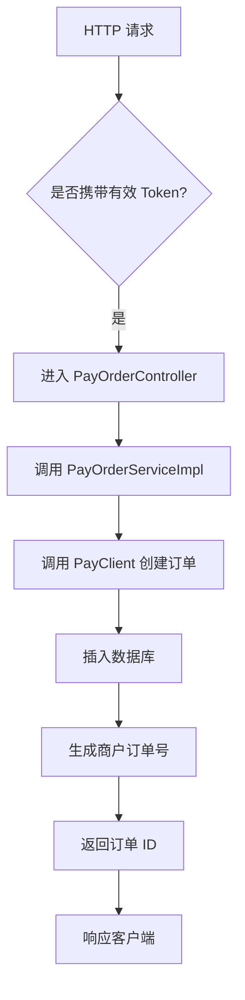
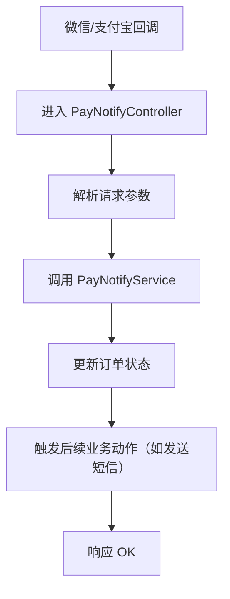
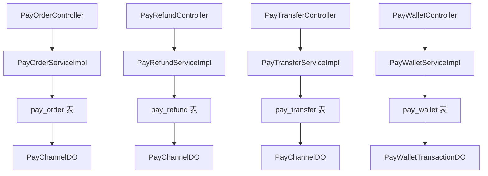

`pei-module-pay` 是一个 **基于 Spring Boot 的支付模块（Payment Module）**，其核心作用是为企业提供统一的支付、退款、转账等能力。该模块与主流支付渠道（如微信、支付宝、钱包支付）深度集成，并支持多租户、分布式事务、回调通知、异步处理等企业级功能。

---

## ✅ 模块概述

### 🎯 模块定位
- **目标**：构建统一的支付系统，支持：
    - 支付订单管理（创建、查询、状态变更）
    - 支付渠道管理（微信、支付宝、钱包）
    - 退款订单管理（申请、回调、状态更新）
    - 转账订单管理（提现、红包、佣金发放）
    - 异步回调通知机制（保证最终一致性）
- **应用场景**：
    - 用户充值（钱包余额、会员开通）
    - 商品购买（商城、虚拟商品）
    - 订单退款（售后退款流程）
    - 提现功能（用户提现、分销返佣）

### 🧩 技术栈依赖
- **Spring Boot + Spring Cloud Gateway + Nacos**
- **支付渠道 SDK**：
    - 微信支付 SDK（`com.github.binarywang.wxpay`）
    - 支付宝 SDK（`com.alipay.api`）
- **数据访问层**：
    - MyBatis Plus + MySQL + Redis
- **消息队列**：
    - RocketMQ + XXL-Job（用于定时任务和异步回调）
- **安全认证**：
    - Spring Security + Token + Redis Session
- **其他工具类**：
    - Hutool 工具库、MapStruct 转换器、Jackson 多态序列化

---

## 📁 目录结构说明

```
src/main/java/
└── com/pei/dehaze/module/pay/
    ├── api/                    // API 接口定义，供其它模块调用
    │   └── notify/             // 回调通知相关接口
    ├── controller/             // 控制器层，处理 HTTP 请求
    │   ├── admin/              // 管理后台控制器
    │   └── app/                // 用户端 APP 控制器
    ├── convert/                // VO/DO 转换类
    ├── dal/                    // 数据访问层
    │   ├── dataobject/         // 数据库实体对象（DO）
    │   └── mysql/              // Mapper 层接口
    ├── framework/              // 框架扩展功能
    │   ├── pay/                // 支付客户端封装逻辑
    │   └── redis/              // Redis 缓存操作封装
    ├── job/                    // 定时任务调度
    ├── service/                // 业务逻辑实现
    │   ├── order/              // 支付订单服务
    │   ├── refund/             // 退款订单服务
    │   ├── transfer/           // 转账订单服务
    │   └── wallet/             // 钱包服务
    ├── enums/                  // 枚举定义
    └── PayServerApplication.java // 启动类
```


---

## 🔍 关键包详解

### 1️⃣ `api.notify` 包 —— 回调通知接口定义

#### 示例：`PayOrderNotifyReqDTO.java`
```java
public class PayOrderNotifyReqDTO {
    private String merchantOrderId;
    private String payOrderId;
    private Integer status;
    private LocalDateTime successTime;
}
```


- **作用**：对外暴露支付回调接口 DTO。
- **用途**：
    - 用于其它模块监听支付完成事件
    - 可以触发后续业务动作（如更新库存、发送短信）

---

### 2️⃣ `controller.admin.order` 包 —— 支付订单管理

#### 示例：`PayOrderController.java`
```java
@Tag(name = "管理后台 - 支付订单")
@RestController
@RequestMapping("/pay/order")
@Validated
public class PayOrderController {

    @Resource
    private PayOrderService orderService;

    @PostMapping("/create")
    @Operation(summary = "创建支付订单")
    public CommonResult<Long> createOrder(@Valid @RequestBody PayOrderCreateReqVO createReqVO) {
        return success(orderService.createOrder(createReqVO));
    }
}
```


- **作用**：对外暴露 `/pay/order/**` 接口，实现管理员相关的支付订单操作。
- **权限控制**：
    - 使用 `@PreAuthorize` 校验用户是否有操作权限
- **返回值规范**：
    - 统一使用 `CommonResult`

---

### 3️⃣ `service.order` 包 —— 支付订单服务逻辑

#### 示例：`PayOrderServiceImpl.java`
```java
@Service
@Validated
@Slf4j
public class PayOrderServiceImpl implements PayOrderService {

    @Resource
    private PayAppService appService;
    @Resource
    private PayChannelService channelService;

    @Override
    public Long createOrder(PayOrderCreateReqVO createReqVO) {
        PayAppDO app = appService.getApp(createReqVO.getAppId());
        PayChannelDO channel = channelService.getChannel(app.getChannelId());

        // 创建支付订单
        PayOrderDO order = BeanUtils.toBean(createReqVO, PayOrderDO.class);
        order.setStatus(PayOrderStatusEnum.WAITING.getStatus());
        order.setExpireTime(LocalDateTime.now().plusMinutes(30));
        orderMapper.insert(order);

        return order.getId();
    }
}
```


- **作用**：实现支付订单的创建、更新、查询等操作。
- **关键逻辑**：
    - 使用 `PayClient` 调用第三方支付渠道
    - 支持多种支付方式（URL跳转、二维码、表单提交）
- **事务控制**：
    - 使用 `@Transactional` 保证插入和后续操作的原子性

---

### 4️⃣ `dal.dataobject.order` 包 —— 支付订单数据库映射对象

#### 示例：`PayOrderDO.java`
```java
@TableName("pay_order")
@KeySequence("pay_order_seq")
@Data
@EqualsAndHashCode(callSuper = true)
@ToString(callSuper = true)
@Builder
@NoArgsConstructor
@AllArgsConstructor
public class PayOrderDO extends BaseDO {

    /**
     * 应用编号
     */
    private Long appId;

    /**
     * 渠道编号
     */
    private Long channelId;

    /**
     * 商户订单编号
     */
    private String merchantOrderId;

    /**
     * 支付金额，单位：分
     */
    private Integer price;

    /**
     * 支付状态
     */
    private Integer status;

    /**
     * 订单失效时间
     */
    private LocalDateTime expireTime;

    /**
     * 支付成功的订单拓展单编号
     */
    private Long extensionId;
}
```


- **作用**：映射 `pay_order` 表。
- **字段说明**：
    - `appId`: 关联 `PayAppDO`，表示所属应用
    - `channelId`: 关联 `PayChannelDO`，表示支付渠道
    - `status`: 支付状态（枚举 `PayOrderStatusEnum`）
    - `price`: 支付金额（单位：分）
- **继承 BaseDO**：包含基础字段如 `creator`, `createTime`, `updater`, `updateTime`, `deleted`, `tenantId`

---

### 5️⃣ `framework.pay.core.client.impl.weixin.AbstractWxPayClient` 包 —— 微信支付封装

#### 示例：`AbstractWxPayClient.java`
```java
@Slf4j
public abstract class AbstractWxPayClient extends AbstractPayClient<WxPayClientConfig> {

    protected WxPayService client;

    public AbstractWxPayClient(Long channelId, String channelCode, WxPayClientConfig config) {
        super(channelId, channelCode, config);
    }

    protected void doInit(String tradeType) {
        WxPayConfig payConfig = new WxPayConfig();
        payConfig.setAppId(config.getAppId());
        payConfig.setMchId(config.getMchId());
        payConfig.setPrivateKey(config.getPrivateKey());
        payConfig.setCertPath(config.getCertPath());
        this.client = new WxPayServiceImpl(payConfig);
    }

    @Override
    public PayOrderRespDTO unifiedOrder(PayOrderUnifiedReqDTO reqDTO) {
        WxPayUnifiedOrderRequest request = new WxPayUnifiedOrderRequest();
        request.setOutTradeNo(reqDTO.getMerchantOrderId());
        request.setBody(reqDTO.getSubject());
        request.setTotalFee(reqDTO.getPrice());
        request.setSpbillCreateIp(reqDTO.getUserIp());
        request.setNotifyUrl(reqDTO.getNotifyUrl());

        try {
            WxPayUnifiedOrderResult result = client.unifiedOrder(request);
            return PayOrderConvert.INSTANCE.convert(result);
        } catch (WxPayException e) {
            log.error("[unifiedOrder][微信支付下单失败] reqDTO={}", toJsonString(reqDTO), e);
            throw exception(PAY_ORDER_SUBMIT_CHANNEL_ERROR, e.getReturnCode(), e.getReturnMsg());
        }
    }
}
```


- **作用**：封装微信支付 SDK，统一支付接口调用。
- **优势**：
    - 支持 V2/V3 版本
    - 支持签名验证、证书配置
- **使用场景**：
    - 用户支付完成后调用微信支付接口进行下单
    - 支付结果通过回调通知更新订单状态

---

### 6️⃣ `enums.order` 包 —— 支付订单枚举

#### 示例：`PayOrderStatusEnum.java`
```java
@Getter
@AllArgsConstructor
public enum PayOrderStatusEnum implements ArrayValuable<Integer> {

    WAITING(0, "待支付"),
    SUCCESS(1, "支付成功"),
    CLOSED(2, "已关闭");

    private final Integer status;
    private final String desc;

    public static PayOrderStatusEnum of(Integer status) {
        return ArrayUtil.firstMatch(o -> o.getStatus().equals(status), values());
    }
}
```


- **作用**：统一管理支付订单状态。
- **优势**：
    - 减少魔法数字
    - 提供静态方法简化判断逻辑

---

### 7️⃣ `service.refund` 包 —— 退款服务逻辑

#### 示例：`PayRefundServiceImpl.java`
```java
@Service
@Slf4j
@Validated
public class PayRefundServiceImpl implements PayRefundService {

    @Resource
    private PayProperties payProperties;

    @Resource
    private PayRefundMapper refundMapper;

    @Override
    public PayRefundDO getRefund(Long id) {
        return refundMapper.selectById(id);
    }

    @Override
    public PayRefundRespDTO unifiedRefund(PayRefundUnifiedReqDTO reqDTO) {
        // 调用渠道退款接口
        PayClient<AlipayPayClientConfig> client = getClient(reqDTO.getChannelId());
        return client.unifiedRefund(reqDTO);
    }

    @Override
    public void updateRefundPaid(String outTradeNo, String outRefundNo, Integer amount) {
        // 更新订单状态为“已退款”
        PayRefundDO refund = refundMapper.selectByNo(outTradeNo, outRefundNo);
        if (refund == null) {
            throw exception(REFUND_NOT_FOUND);
        }
        refund.setStatus(PayRefundStatusEnum.SUCCESS.getStatus());
        refund.setSuccessTime(LocalDateTime.now());
        refundMapper.updateById(refund);
    }
}
```


- **作用**：实现支付订单的退款、暂停、终止、查询等操作。
- **流程生命周期管理**：
    - 退款发起：`unifiedRefund(...)`
    - 退款回调：`updateRefundPaid(...)`
- **退款金额校验**：
    - 不可超过原订单金额
    - 不可在已有退款基础上重复退款

---

### 8️⃣ `framework.pay.core.client.PayClient` 包 —— 支付客户端抽象

#### 示例：`PayClient.java`
```java
public interface PayClient<Config> {

    Long getId();

    Config getConfig();

    PayOrderRespDTO unifiedOrder(PayOrderUnifiedReqDTO reqDTO);

    PayOrderRespDTO parseOrderNotify(Map<String, String> params, String body, Map<String, String> headers);

    PayOrderRespDTO getOrder(String outTradeNo);

    PayRefundRespDTO unifiedRefund(PayRefundUnifiedReqDTO reqDTO);

    PayRefundRespDTO parseRefundNotify(Map<String, String> params, String body, Map<String, String> headers);

    PayRefundRespDTO getRefund(String outTradeNo, String outRefundNo);

    PayTransferRespDTO unifiedTransfer(PayTransferUnifiedReqDTO reqDTO);

    PayTransferRespDTO parseTransferNotify(Map<String, String> params, String body, Map<String, String> headers);

    PayTransferRespDTO getTransfer(String outTransferNo);
}
```


- **作用**：支付渠道通用接口，所有支付客户端必须实现。
- **设计模式**：
    - 模板方法模式：定义统一支付接口
    - 策略模式：根据渠道类型选择不同实现类
- **支持的支付渠道**：
    - 微信支付（V2/V3）
    - 支付宝支付（RSA/证书）
    - 内部钱包支付（余额支付）

---

### 9️⃣ `service.wallet` 包 —— 钱包服务逻辑

#### 示例：`PayWalletRechargeServiceImpl.java`
```java
@Service
@Slf4j
public class PayWalletRechargeServiceImpl implements PayWalletRechargeService {

    @Resource
    private PayWalletRechargeMapper walletRechargeMapper;

    @Resource
    private PayOrderService orderService;

    @Override
    public Long createRechargeOrder(AppPayWalletRechargeCreateReqVO createReqVO) {
        PayOrderCreateReqDTO orderDTO = PayOrderConvert.INSTANCE.convert(createReqVO);
        orderDTO.setBizType(PayWalletBizTypeEnum.RECHARGE.getType());
        return orderService.createOrder(orderDTO);
    }

    @Transactional(rollbackFor = Exception.class)
    public void updateRechargePaid(String merchantOrderId, String payOrderId) {
        PayOrderDO order = orderService.getOrder(payOrderId);
        PayWalletRechargeDO recharge = walletRechargeMapper.selectByOrderId(order.getId());

        // 更新钱包余额
        PayWalletDO wallet = walletMapper.selectByUserId(order.getUserId());
        wallet.setBalance(wallet.getBalance() + order.getPrice());
        walletMapper.updateById(wallet);

        // 更新订单状态
        order.setStatus(PayOrderStatusEnum.SUCCESS.getStatus());
        order.setSuccessTime(LocalDateTime.now());
        orderMapper.updateById(order);
    }
}
```


- **作用**：实现钱包余额充值、消费、提现等功能。
- **字段说明**：
    - `balance`: 当前余额（单位：分）
    - `transactions`: 交易明细记录
- **事务控制**：
    - 使用 `@Transactional` 保证余额变动与订单状态更新一致性

---

### 🔟 `job` 包 —— 定时任务处理

#### 示例：`PayNotifyJob.java`
```java
@Component
@Slf4j
@RequiredArgsConstructor
public class PayNotifyJob {

    private final PayOrderService orderService;
    private final PayRefundService refundService;
    private final PayTransferService transferService;

    @XxlJob("payNotifyJobHandler")
    public void execute() {
        // 查询未通知的订单
        List<PayOrderDO> orders = orderService.getUnNotifiedOrders();
        for (PayOrderDO order : orders) {
            try {
                // 发送回调通知
                notifyService.sendOrderNotify(order);
                // 更新通知状态
                orderService.markOrderNotified(order.getId());
            } catch (Exception e) {
                log.error("[execute][订单通知失败] orderId={}", order.getId(), e);
            }
        }
    }
}
```


- **作用**：定时扫描未通知的支付订单，触发回调通知。
- **执行策略**：
    - 每 5 分钟执行一次
    - 最大重试次数为 3 次
- **日志追踪**：
    - 使用 `trace_id` 进行链路追踪

---

## 🧠 模块工作流程图解

### 1️⃣ 支付订单创建流程



### 2️⃣ 支付回调处理流程



---

## 🧱 模块间关系图




---

## 🧩 模块功能总结

| 包名 | 功能 | 关键类 |
|------|------|--------|
| `api.notify` | 支付回调接口定义 | `PayOrderNotifyReqDTO` |
| `controller.admin.order` | 支付订单管理 | `PayOrderController` |
| `service.order` | 支付订单服务 | `PayOrderServiceImpl` |
| `dal.dataobject.order` | 支付订单数据 | `PayOrderDO` |
| `framework.pay.core.client.impl.weixin` | 微信支付封装 | `AbstractWxPayClient` |
| `enums.order` | 支付订单枚举 | `PayOrderStatusEnum` |
| `service.refund` | 退款服务逻辑 | `PayRefundServiceImpl` |
| `framework.pay.core.client.PayClient` | 支付客户端接口 | `PayClient.java` |
| `service.wallet` | 钱包服务逻辑 | `PayWalletRechargeServiceImpl` |
| `job` | 定时任务处理 | `PayNotifyJob.java` |

---

## 🧾 模块实现原理详解

### 1️⃣ 支付订单创建流程
- **步骤**：
    1. 用户提交支付请求
    2. 进入 `PayOrderController`
    3. 调用 `PayOrderServiceImpl`
    4. 调用 `PayClient.unifiedOrder(...)`
    5. 插入 `pay_order` 表
    6. 返回前端支付链接或二维码

### 2️⃣ 支付回调处理流程
- **步骤**：
    1. 第三方支付平台回调 `/pay/notify/order/{channelId}`
    2. 解析请求体并验证签名
    3. 调用 `PayClient.parseOrderNotify(...)`
    4. 更新订单状态为 `SUCCESS`
    5. 触发后续业务动作（如更新库存、发送短信）

### 3️⃣ 钱包余额充值流程
- **步骤**：
    1. 用户提交钱包充值请求
    2. 创建支付订单（关联钱包业务类型）
    3. 支付成功后回调
    4. 更新钱包余额
    5. 记录交易明细

---

## ✅ 建议改进方向

| 改进点 | 描述 |
|--------|------|
| ✅ 多租户增强 | 当前仅支持单租户，未来需支持多租户数据隔离 |
| ✅ 异常日志增强 | 在 SQL 查询失败时记录详细日志，便于排查问题 |
| ✅ 性能优化 | 使用 `PreparedStatement` 替代 `queryForRowSet`，防止 SQL 注入 |
| ✅ 单元测试 | 当前代码未提供单元测试，建议补充测试用例 |
| ✅ 流程监控 | 增加支付成功率、回调成功率等指标统计 |

---

## 📌 总结

`pei-module-pay` 模块实现了以下核心功能：

| 功能 | 技术实现 | 用途 |
|------|-----------|------|
| 支付订单 | PayOrderDO + PayOrderService | 管理支付订单生命周期 |
| 支付渠道 | PayClient + Alipay/WxPay 实现类 | 支持微信、支付宝、钱包等多种支付方式 |
| 退款订单 | PayRefundDO + PayRefundService | 管理退款订单生命周期 |
| 转账订单 | PayTransferDO + PayTransferService | 支持提现、红包、佣金等转账场景 |
| 钱包余额 | PayWalletDO + PayWalletService | 支持余额充值、消费、提现 |
| 异步回调 | PayNotifyTask + PayNotifyLog | 保证支付状态最终一致性 |
| 支付渠道管理 | PayChannelDO + PayChannelService | 支持多个支付渠道配置 |
| 支付订单展示 | PayOrderDisplayModeEnum | 支持 URL、二维码、表单等多种展示方式 |

它是一个轻量但功能完整的支付模块，适用于电商、社交、CRM、ERP 等需要支付、退款、转账的场景。如果你有具体某个类（如 `PayOrderServiceImpl`、`PayWalletRechargeServiceImpl`）想要深入了解，欢迎继续提问！
